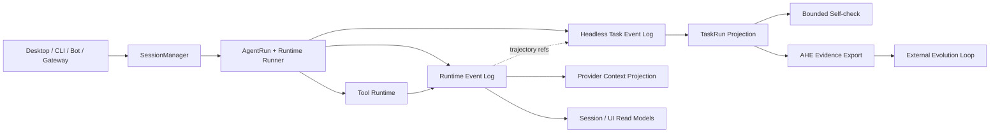

[中文](./ARCHITECTURE.md)

# Maka Backend Architecture

> This is the entry point for Maka Agent backend architecture. It does not repeat each deep-dive article. It establishes the system spine and helps readers reach the right chapter by engineering question. The current series covers Runtime, tools and context, durable Headless tasks, Self-check, and the AHE self-iteration boundary.

## Architecture in one sentence

Maka is a **log-first, projection-driven** Agent Runtime. Execution facts enter append-only logs; Session state, model context, TaskRun, Self-check, and evolution evidence are projections of those facts for different consumers.

Read left to right. Entry points hand user intent to Runtime; model and tool execution produce facts; those facts are projected into model context, interactive views, durable task state, and evolution evidence. Providers, concrete storage implementations, and UI components are omitted so the diagram can preserve the backend spine shared by this series.

## A three-layer mental model

### 1. Execution facts

An Agent Run produces model messages, Tool Calls, Tool Results, permission decisions, and termination facts. Runtime Event Log is the canonical source for those interaction semantics. Context pruning and Compaction may change what the model sees next, but cannot rewrite facts that already occurred.

Relevant chapters: 1, 2, and 3.

### 2. Durable tasks

When a task outlives one Turn or process, Headless uses an independent task identity, Task Event Log, and TaskRun projection to preserve progress across Attempts. Self-check provides bounded feedback inside that task loop but does not own final fact authority.

Relevant chapters: 4 and 5.

### 3. Evolution

AHE organizes outcomes and traces from multiple TaskRuns into evolution evidence bound to target identity. It remains outside the interactive Runtime and advances system changes through a constrained change surface, falsifiable manifests, candidate evaluation, and rollback lineage.

Relevant chapter: 6.

## Six-chapter index

| Chapter | Core question | Implementation status | Read |
|---|---|---|---|
| 1. Log Is the Runtime | How does Maka preserve and replay the state space of an Agent Run? | Current | [English](./docs/architecture/runtime-core-architecture-draft.en.md) · [中文](./docs/architecture/runtime-core-architecture-draft.zh-CN.md) |
| 2. Evidence Before Compression | How can a large Tool Result leave Turn-level evidence without exhausting active context? | Current + Target | [English](./docs/architecture/turn-evidence-tools-active-prune-draft.en.md) · [中文](./docs/architecture/turn-evidence-tools-active-prune-draft.zh-CN.md) |
| 3. Compaction Is a Projection | How can the LLM forget old context without losing historical facts? | Current | [English](./docs/architecture/llm-compaction-events-log-projection-draft.en.md) · [中文](./docs/architecture/llm-compaction-events-log-projection-draft.zh-CN.md) |
| 4. The Durable Task Loop | How does Maka continue a task that outlives a Turn, Run, or process? | Current + Target | [English](./docs/architecture/durable-task-loop-headless-draft.en.md) · [中文](./docs/architecture/durable-task-loop-headless-draft.zh-CN.md) |
| 5. Self-Check Is Not Self-Trust | How can an Agent inspect and repair its work without turning self-report into authority? | Current + Target | [English](./docs/architecture/self-check-bounded-feedback-loop-draft.en.md) · [中文](./docs/architecture/self-check-bounded-feedback-loop-draft.zh-CN.md) |
| 6. Self-Iteration Happens Outside the Runtime | How does Maka turn run experience into falsifiable and reversible system improvement? | Current + Target | [English](./docs/architecture/ahe-self-iteration-boundary-draft.en.md) · [中文](./docs/architecture/ahe-self-iteration-boundary-draft.zh-CN.md) |

**Current + Target** means the article covers verified implementation and visibly labeled target direction. It does not mean Target sections are implemented. The `implementation_status` and `last_verified` fields in each article's front matter are the more precise status source.

## Choose a reading path by problem

### Entering Runtime for the first time

Read `1 → 2 → 3`. Start with the fact log, then move to tool evidence and context projections.

### Changing Tools, Context, or Compaction

Read `1` for the canonical-fact boundary, then `2 → 3`. Add `4` if the change affects evidence consumed by durable tasks.

### Changing Headless or task recovery

Read `1 → 4 → 5`. Chapter 3 adds context recovery, while Chapter 2 adds the Tool Result evidence boundary.

### Changing Self-check or completion conditions

Read `4 → 5`, then revisit Chapter 2's rule that context pruning must not delete evidence.

### Changing AHE or self-iteration

Read `1 → 4 → 5 → 6`. Chapter 6 depends on the Event Log, TaskRun projection, and authority boundaries established earlier.

## Code boundaries

| Area | Primary responsibility |
|---|---|
| `packages/core` | Pure contracts for Session, Runtime Event, AgentRun, and permission |
| `packages/storage` | File-backed stores for sessions, settings, and run ledgers |
| `packages/runtime` | SessionManager, AgentRun, model adapters, tool execution, context, and recovery |
| `packages/headless` | TaskRun, Autonomous Loop, Self-check, result export, and AHE protocol |
| `apps/desktop/src/main` | Electron main-process composition, IPC, and product-entry adapters |

The “code map” in each deep-dive article is the preferred implementation entry point. Earlier design and evolution material remains available in:

- [`docs/runtime-kernel.md`](./docs/runtime-kernel.md)
- [`docs/runtime-v2-architecture-evolution.md`](./docs/runtime-v2-architecture-evolution.md)
- [`docs/runtime-v2-implementation-notes.md`](./docs/runtime-v2-implementation-notes.md)

Those documents provide historical design context and implementation notes. The six chapters indexed here are the narrative entry point for current backend mechanisms.

## Documentation layout

`docs/architecture/` currently remains flat. One mechanism owns one stable slug with separate `.zh-CN.md` and `.en.md` counterparts. While the collection is still easy to scan, avoiding another `chapters/` level keeps links and counterpart paths shallow.

Maintenance rules:

- Every new deep dive needs a stable `doc_id`, implementation status, verification date, and owner;
- Chinese and English counterparts must preserve scope, Current/Target boundaries, diagrams, and limitations;
- This index stores one-sentence questions and links; mechanism details remain in the deep dives;
- Adding, renaming, or publishing an article requires updating both architecture indexes;
- The `-draft` filename suffix must agree with front matter `document_status`; publication should remove the suffix and update all index links in the same change.
