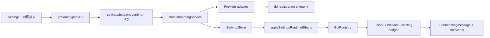
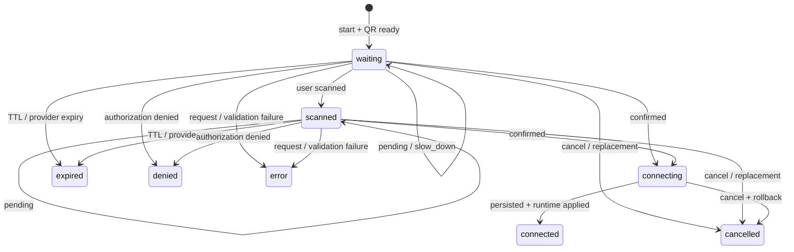

# Maka IM 扫码接入 runtime architecture

状态：V1 implemented and verified（2026-07-18）

## 1. 目标与边界

Maka 的 IM 接入同时支持两条路径：

- 快捷接入：用户扫描平台二维码，平台完成应用或机器人注册，Maka 自动取得 credential、启用 channel 并启动 runtime bridge。
- 手动配置：保留 provider-specific App ID、Secret、Token 或本地 bridge 配置，作为平台能力不可用时的 fallback。

V1 快捷接入覆盖钉钉、飞书、Lark、企业微信和微信。飞书与 Lark 共享一个 `feishu` channel，通过 domain 区分账号区域。IM onboarding 是独立的 main-process capability，不进入 MCP manager，也不建立第二套 bot runtime。

V1 不包含：

- 平台侧撤销或删除已创建应用；取消只停止本地 polling，并阻止 credential 落盘。
- 多账号管理和同一 provider 的并行 onboarding；每个 provider 同时只有一个 current session。
- credential 的 Keychain-backed at-rest encryption。当前沿用 owner-only settings store，renderer 只能收到 masked value；Keychain migration 属于后续安全增强。
- 远程消息 pairing 审批。现有 `allowedUserIds` 继续作为 runtime allowlist。

## 2. 组件与数据流

职责划分：

- `@maka/core/bot-onboarding`：provider、brand、state 和 renderer-safe snapshot contract；不包含 I/O。
- Desktop main `BotOnboardingService`：session authority、HTTP polling、credential persistence、rollback 和 runtime effect。
- Desktop preload：暴露 narrow start/poll/cancel/open API，不暴露任意 HTTP 或 provider response。
- Renderer modal：只显示 QR、状态、非敏感 identity 和操作按钮。
- `@maka/runtime/bots`：credential 生效后的长连接、消息映射、allowlist 和发送能力。
- `SettingsStore.updateIf`：把 compare 与 write 放进同一 write queue，为取消 rollback 提供原子 compare-and-set。

## 3. Provider flow

| Provider | registration flow | credential mapping | runtime transport |
| --- | --- | --- | --- |
| 钉钉 | `oapi.dingtalk.com/app/registration/{init,begin,poll}` | `client_id` → `appId`；`client_secret` → `appSecret` | 已有 Stream bridge |
| 飞书 | `accounts.feishu.cn/oauth/v1/app/registration` | `client_id` → `appId`；`client_secret` → `appSecret`；domain=`feishu.cn` | official Channel WebSocket |
| Lark | `accounts.larksuite.com/oauth/v1/app/registration` | 同飞书；domain=`larksuite.com` | official Channel WebSocket |
| 企业微信 | `work.weixin.qq.com/ai/qc/{generate,query_result}` | `botid` → `appId`；`secret` → `appSecret` | official AI Bot WebSocket |
| 微信 | `ilinkai.weixin.qq.com/ilink/bot/*` | bot token、base URL、bot identity | existing iLink polling bridge |

所有 outbound request 由 main process 发出。单次请求 timeout 为 15 秒；provider 给出的 polling interval 会 clamp 到 1–30 秒。`slow_down` 每次增加 5 秒 backoff，最大仍为 30 秒。

QR payload 有两种来源：

- provider 返回 verification URL：main 使用 `qrcode` 生成 data URL。
- provider 直接返回 image data：main 原样放进 renderer-safe snapshot。

## 4. Session contract 与状态机

Renderer 只能持有 opaque `sessionId`，不能持有 device code、poll token、client secret、bot secret 或完整 provider response。

Snapshot 字段固定为：

- `sessionId`, `provider`, optional `brand`
- `state`
- optional QR data URL、expiry、next poll delay
- `canOpenInBrowser`
- optional non-sensitive identity `{ id, displayName }`
- redacted user-facing error

`poll()` 对同一 session 的并发调用共享一个 in-flight promise，避免 duplicate provider polling。新建同 provider session 会 abort 旧 session；不同 provider 可以独立进行。

## 5. Credential commit 与取消语义

confirmed 后执行一个受 current-session fence 保护的 commit sequence：

1. 读取 previous channel snapshot。
2. 把 provider credential 映射为 channel patch，并设置 `enabled: true`、`readiness: configured`。
3. 原子写入 settings。
4. 调用 `applySettingsRuntimeEffects`，让 `BotRegistry` reconcile channel。
5. 读取 runtime identity，并把非敏感字段投影给 renderer。

每个 await 边界后都重新检查 `currentByProvider` 与 `AbortSignal`。如果用户在 settings write 或 runtime effect 期间取消，service 只回滚本次 onboarding 拥有的字段。

Rollback 使用 `SettingsStore.updateIf(predicate, patch)`：只有 current channel 的 owned fields 仍等于本次 onboarding 写入值时才应用 previous values。用户同时进行的手动 credential 编辑不会被旧 onboarding rollback 覆盖。rollback 生效后再次调用 runtime effect，使 bridge 与持久化状态一致。

平台没有统一的 server-side cancel contract，因此取消不承诺删除平台侧已完成的注册；它只保证：

- 停止本地请求或忽略迟到 response。
- 不把迟到 credential 写入 settings。
- 已跨过 settings commit window 时执行 guarded rollback。
- 已启用的短暂 bridge 会在 rollback reconcile 后停止。

## 6. Runtime bridge lifecycle

### Feishu / Lark

`FeishuBotBridge` 使用 official Channel API 的 WebSocket transport。handshake timeout 为 15 秒。消息先由 SDK 标准化，再映射为 Maka `BotIncomingMessage`；raw payload 不跨 runtime boundary。

首次 handshake 尚未成功时，SDK 的 high-level `disconnect()` 不会关闭 raw socket。因此 stop、failure 和 restart 路径必须先调用 `rawWsClient.close({ force: true })`，再执行 high-level disconnect 和 subscription cleanup，避免后台 reconnect。

### 企业微信

`WeComBotBridge` 使用 official AI Bot SDK。认证等待有独立 15 秒 timeout。临时 `authenticated/error` listener 在 success、failure 或 timeout 时都会移除；failure 和 stop 都先 `removeAllListeners()` 再 `disconnect()`，避免 synchronous disconnect event、late authentication 和 listener retention。

### Registry reconciliation

`BotRegistry.applySettings()` 串行化 settings batch；不同 provider 在一个 batch 内并行 reconcile。credential、domain 或 enabled 变化会 stop old bridge、清理 old registry listeners、创建 new bridge。仅 allowlist 变化时，支持的 bridge可原地更新 policy。

## 7. 安全边界

- Device code、poll token 和 final credential 只存在于 main process session。
- IPC start input 只接受 closed provider enum；`brand` 只允许用于 Feishu channel。
- 外部浏览器只允许打开当前 session 的 HTTPS verification URL。
- Provider error 经过固定 user-facing projection，不把 response body、URL query、credential 或 raw stack 返回 renderer。
- Settings read IPC 会 mask `token` 与 `appSecret`；E2E 断言完整 renderer response 不包含原始 secret。
- QR modal unmount 必须 cancel current session；late async result 不能更新 React state 或持久化 credential。
- 正式 runtime 不提供 test adapter 注入入口给 renderer。deterministic adapter 只在 dev/test visual fixture 中由 main wiring 注入。

当前 at-rest boundary 是 owner-only settings file，不等同于 encrypted secret storage。迁移 Keychain 时，应保持 `SettingsStore` 的 channel projection 与 masked IPC contract 不变，只替换 secret authority。

## 8. UX contract

- Channel detail 默认展示“快捷接入（推荐）”，同时保留“手动配置”。
- Feishu channel 在快捷模式内提供飞书 / Lark brand 切换。
- Modal 明确区分生成中、等待扫码、已扫码、正在连接、已连接、过期、拒绝、取消和错误。
- 用户可刷新 QR、取消、在 HTTPS browser 中打开 verification URL；过期或失败后可重新生成。
- 成功状态只展示 non-sensitive bot identity，不展示 credential。
- QR frame 在 desktop viewport 居中，light/dark 与窄窗口保持同一 action hierarchy。

## 9. 验收标准

1. Unit tests 覆盖 input validation、poll dedupe、slow-down、expiry、cancel、runtime effect 和 credential rollback。
2. 并发测试证明 cancel 能跨过 runtime-effect commit window，且不会覆盖 concurrent manual edit。
3. Runtime tests覆盖 Feishu/WeCom message mapping，以及 failed-handshake cleanup 顺序。
4. Electron E2E 通过真实 renderer → preload → IPC → main session → settings persistence 路径验证：
   - 钉钉 waiting → scanned → connected。
   - renderer 不含 raw secret。
   - 微信 modal close 后迟到 credential 不落盘。
   - 企业微信 expiry 与 restart。
   - Feishu / Lark brand selection。
5. light/dark、wide/narrow visual capture 无 overflow，QR 和 modal 保持居中。
6. Runtime dependency 在 built Electron E2E 中可解析。仓库目前没有 ASAR/notarized packaging pipeline；引入 packager 时必须新增 packaged-app launch smoke，不能用 source-tree E2E 代替。

## 10. 后续工作

- 把 bot secret 从 settings file 迁移到 Keychain-backed credential store。
- 增加 pairing approval 与 remote permission profile policy。
- 为 provider registration 增加 bounded retry telemetry 和可诊断但不泄密的 health events。
- 增加 packaged Electron artifact smoke，验证 native architecture、ASAR module resolution 和 SDK resource inclusion。
- 评估已创建 platform app 的显式 revoke/delete flow；在平台支持前继续保持诚实的 local-cancel copy。
