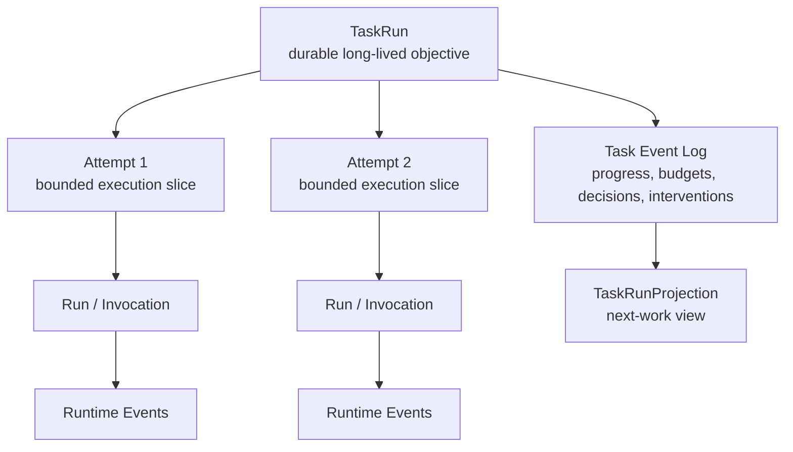
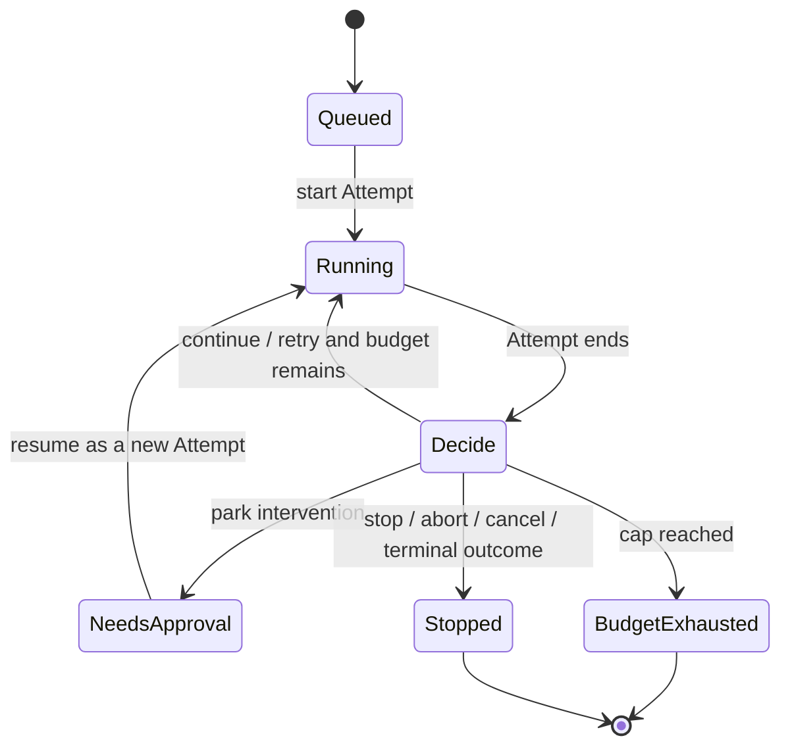
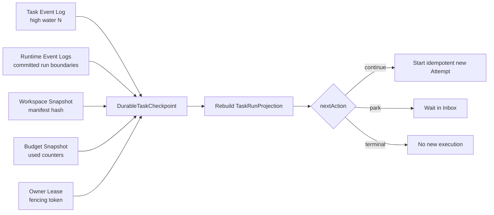

# Chapter 4: The Durable Task Loop—Inside Maka Headless

> This chapter answers one question: when a task outlives a Turn, a Run, or even the process that started it, how does Maka preserve stable identity, progress, budgets, and interruption boundaries? Headless introduces `TaskRun`: each Agent execution becomes a bounded Attempt, cross-Attempt task facts enter an append-only Task Event Log, and the next execution receives a projected working state from that log. **A task is longer than a turn; durability begins by giving the task its own log.**

This chapter is for Runtime engineers changing Headless orchestration, TaskRun, Autonomous Loop, Heavy-task progress, or recovery. The first half establishes the long-running-task mental model. The second half examines the event protocol, Attempt boundaries, budgets, permission parking, workspace continuity, and current recovery limits.

This chapter is only about how an Agent continues a long-running task in unattended or weakly interactive environments, and how Runtime preserves the public facts needed to answer “where should work continue?”

The chapter contains two lifecycle states:

- **Current**: behavior already implemented in `TaskAgentController`, `AutonomousAgentLoop`, `TaskRunStore`, Heavy-task, and Harbor Cell continuation;
- **Target**: the architecture required to converge those mechanisms into a general Durable Task Loop that another process can safely take over.

Target sections are not current guarantees. One distinction matters from the beginning: the TaskRun ledger is durable today, but workspace state, an in-flight Invocation, and scheduler ownership do not yet form one unified checkpoint protocol.

## Start with a task that cannot finish in one Turn

Suppose a user gives Maka this task:

> Read a large repository, migrate a legacy interface, fix build failures incrementally, and stop for approval before executing high-risk actions.

The task may unfold like this:

1. The first Turn only builds an inventory of the repository.
2. A Run ends at a tool-step cap even though the task is clearly unfinished.
3. The next execution must know which files were inspected and which todos remain open.
4. A command needs human approval, so the task must park.
5. A person returns hours later and approves it; the system should continue the task rather than treat it as an unrelated chat.
6. The process may restart, losing the in-memory loop counters and active backend.
7. The workspace may live in a local temporary directory, an external container, or a remote executor.

A Turn can identify one exchange. A Run can identify one concrete execution. A RuntimeEvent ledger can replay what the model and tools experienced. A long-running task still needs answers to another set of questions:

```text
What is the stable ID of this long-running objective?
How many Attempts have happened?
How much budget remains?
Which progress snapshots are still current?
Is the task running, waiting for approval, or stopped by a budget cap?
Which context should the next execution inherit?
Is the workspace still the one left by the previous Attempt?
Who is allowed to take ownership of the next step?
```

This is why Headless adds the TaskRun layer.

## The conclusion first: TaskRun is the durable envelope outside Runtime

Maka's execution identities form four layers:

| Identity | Question it answers | Typical lifetime |
|---|---|---|
| TaskRun | Which long-running objective exists from start to terminal state? | Across Attempts and executions |
| Attempt | Which bounded slice is advancing the task now? | One task-level try |
| Turn | Which input and response belong to this exchange? | One user/continuation exchange |
| Run / Invocation | How did this model-and-tool loop start and end? | One Runtime execution |



Read the diagram from top to bottom. `TaskRun` does not replace Runtime's Session, Run, or Invocation. It adds a longer durable envelope around them. Runtime Events preserve the semantic facts of each Agent execution; Task Events preserve facts that cross executions. Workspace is deliberately omitted because its lifecycle is not always as durable as TaskRun. A later section treats it separately.

The most important boundary is:

> **Headless does not reimplement Agent Runtime. It organizes Runtime executions into a long-running Task lifecycle.**

## Why a Session is not yet a TaskRun

A Session can span multiple Turns and preserve model history, but it primarily answers “which conversation contains these events?” TaskRun must also express:

- the number and outcomes of Attempts;
- the loop budget already consumed;
- whether work is parked for permission, budget, or external intervention;
- which progress and evidence remain cross-Attempt task state;
- which Attempt owns a workspace lease;
- whether the next action is continue, retry, stop, or abort;
- which task policies govern the long-running execution.

An ordinary interactive Session should not be forced to carry those task-control fields. Conversely, different Attempts in one TaskRun may currently create different Sessions and AgentRuns. Merging the concepts would entangle UI conversation state with durable orchestration state.

Current references therefore flow from Task Events to `sessionId` and `agentRunId`; Session headers do not become the source of truth for TaskRun.

## Current: the Task Event Log is the source of truth for the long-running control plane

`TaskRunStore` persists `TaskEvent` in append-only JSONL, one file per `taskRunId`. Within one process, a promise queue serializes appends to the same TaskRun.

Task events relevant to the long-running control plane include:

- TaskRun created, queued, started, and terminal events;
- Attempt started and completed;
- autonomous decisions and Runtime feedback;
- Heavy-task mode, inventory, todos, self-check, workspace observations, and compact evidence;
- isolation policy, workspace lease, and tool-executor identity;
- permission requests, grants, and decisions;
- inbox items, resolutions, and `needs_approval` parked state.

`projectTaskRun()` replays the events and computes `TaskRunProjection`: current status, Attempts, latest progress, evidence, permission facts, parked state, warnings, and references to Runtime executions.

The relationship matches earlier chapters:

```text
TaskRunProjection(t) = Project(TaskEvents[0..t])
```

The projection is not a second mutable source of Task truth. CLI inspection, resume planning, prompt replay, and exports should derive from Task Events.

### What exactly is durable?

The current implementation durably preserves:

- TaskRun identity;
- Task Events that have completed append;
- Attempt, progress, decision, permission, and lifecycle facts recorded in those events;
- references to Sessions, AgentRuns, RuntimeEvents, and artifacts.

The TaskRun ledger alone does not guarantee:

- every current byte in a temporary workspace;
- an in-progress provider stream;
- a live tool-process handle;
- an in-memory backend, abort controller, or loop closure;
- whether an external executor still owns the same workspace;
- automatic scheduler takeover after process restart.

This is the chapter's most important precision boundary: durable control facts do not mean the entire execution world has been checkpointed.

## Current: how one Attempt reuses the Runtime mainline

`TaskAgentController.runTaskOnce()` wraps one Attempt around Runtime. It currently advances through this sequence:

1. Validate backend isolation and task setup.
2. Resolve TaskRun/Attempt identities and intervention policy.
3. Read Heavy-task progress, self-check, and compact evidence from the existing TaskRun projection.
4. Append those bounded state projections to the instruction for this Attempt.
5. Append TaskRun mode, isolation, and existing permission-grant facts.
6. Prepare a workspace and record `WorkspaceLeaseFacts` and `ToolExecutorIdentity`.
7. Create a Session, `AgentRun`, and single-Run active-session shell.
8. Append `task_run_started` and `task_attempt_started`.
9. Execute `AgentRun → AiSdkFlow → RuntimeRunner`.
10. Turn Invocation references, budget usage, and tool activity into Task-level feedback.
11. Handle permission intervention or a bounded Heavy-task repair.
12. Append the next Attempt and TaskRun states.

This path bypasses the `SessionManager.sendMessage()` facade and assembles the Runtime core directly. Headless does not need another model loop. It needs a non-streaming `InvocationResult`, its own Task Event Log, an isolated backend lifecycle, and an Attempt post-processing boundary.

The current cost is partial duplication between `runRuntimeAttempt()` and the Turn shell in `RuntimeKernel`. A future shared runner must preserve Headless hooks for Task Events, intervention, and isolated lifecycle. A thin “send a message and return text” function would not be sufficient.

## An Attempt is a progress slice, not a synonym for failure

An Attempt is one advance with explicit budget and resource boundaries. It may end normally, fail during execution, remain incomplete, block on permission, exhaust a budget, be cancelled, or be aborted.

TaskRun may continue after an Attempt or enter a terminal state. The important property is not labeling every non-completion as a generic error. It is preserving enough structure for an outer policy to decide:

```text
continue  → advance the same objective, usually with a continuation instruction
retry     → try the current work again under a new execution slice
stop      → create no new Attempt
abort     → explicitly abandon further execution
```

`AutonomousAgentLoop` calls `runTaskOnce()` again for every Attempt. It does not resume an old `RuntimeRunner` instruction pointer or resurrect a tool process that already exited.

The accurate equation is therefore:

```text
Long task progress
  = sequence of bounded Attempts
  + durable Task Events between them
  + explicitly selected continuation state
```

It is not:

```text
Long task progress = one immortal Invocation
```

## Current: three budget layers give the loop a provable boundary

An unattended loop whose only condition is “continue until finished” has no safe terminal condition. Current `AutonomousLoopBudget` provides three caps:

| Budget | What it limits | When it is checked |
|---|---|---|
| `maxAttempts` | Maximum Attempts in the TaskRun | Before and after each Attempt |
| `maxRuntimeSteps` | Accumulated Runtime steps across Attempts | After each Attempt |
| `maxWallTimeMs` | Total wall time of the TaskRun loop | Before and after Attempts |

`LoopBudgetSnapshot` passes used and maximum values to the decision policy. Even if a custom policy requests continue or retry, `enforceCaps()` reapplies the hard limits.



This diagram shows long-running control states rather than the complete `TaskRunStatus` union. Every loop passes through an Attempt boundary and budget decision. Resuming `needs_approval` also creates a new Attempt. Runtime's internal Turn and Run states are omitted.

### How durable are the budgets?

Attempt count can be rebuilt from Task Events. Runtime steps also appear in Task feedback and execution output. The current loop's `startedAt`, accumulated counters, and decision closure, however, are primarily owned by the running `runAutonomousTask()` call.

Current state is auditable, but a generic TaskRun projection alone cannot restore every loop counter unambiguously at an arbitrary process-restart point. The Target section describes the budget checkpoint required for that guarantee.

## Current: progress is a bounded projection across Attempts

A long-running task should not continue by placing only the previous Attempt's final natural-language response into the next prompt. Heavy-task mode introduces structured, append-only progress facts.

### Inventory: what is the work surface?

`inventory_submit` records a complete inventory snapshot: files or artifacts, status, purpose, and open questions. It is not a patch. A newer inventory event becomes the projection's current inventory, while older snapshots remain in the log.

### Todos: what should happen next?

`todo_update` also submits a complete todo snapshot. Each item carries an ID, priority, status, content, and optional kind. The projection can locate the active todo while preserving its history.

### Compact Evidence: what was recently observed?

Headless captures bounded public evidence around Bash, Read, Grep, Write, Edit, Glob, and artifact paths. It preserves short summaries, truncation references, source links, and mutation metadata—not large stdout, complete file bodies, or raw diffs in the task prompt.

### Self-check: what public state does the Agent report?

Self-check preserves public reasons, command/artifact evidence, and execution hygiene. It is advisory task state, not hidden authority. Workspace observation and a bounded repair gate may request one additional repair Turn, but the gate limits repair count explicitly so dissatisfaction cannot create an infinite self-check loop.

When a later Attempt starts, `renderHeavyTaskProgressForPrompt()`, `renderHeavyTaskSelfCheckForPrompt()`, and `renderHeavyTaskEvidenceForPrompt()` build bounded text from the TaskRun projection: a subset of inventory/todos, recent evidence, and a limited number of command/artifact entries.

This is a projection of the Task Event Log:

```text
Full task history remains in Task Events
  → latest progress snapshots are selected
  → recent public evidence is bounded
  → next Attempt receives a continuation-oriented prompt view
```

It is not a complete replay and does not imply that omitted raw output remains in the prompt.

## Current: continuation has three different meanings

“Continue the task” currently refers to at least three mechanisms in Headless. They are not one resume protocol.

### 1. A new Turn inside one Harbor Cell

Harbor Cell continuation repeatedly calls `SessionManager.sendMessage()` within the same Session and container workspace. It currently continues only when the preceding Invocation ends because of a tool-step cap or incomplete Tool Calls.

The next Turn receives a fixed continuation prompt and is bounded by `maxTurns` and `maxTotalRuntimeSteps`. When enabled, the defaults allow up to three Turns and calculate the total Runtime-step default from 50 steps per Turn. The cell output combines Invocation events and retains per-Turn status, step-cap, and step summaries.

This path is the closest current mechanism to continued work on one workspace, but it still creates several new Invocations. It does not resume one Invocation at an internal instruction pointer.

### 2. A new Attempt in Autonomous Loop

Autonomous continue/retry calls `runTaskOnce()` again. Heavy-task state can be projected from Task Events into the new instruction. When `replayPriorAttemptRuntimeContext` is enabled, RuntimeEvents from earlier Attempts are explicitly appended to the next Runtime context.

That replay option is not mandatory by default. With it off, cross-Attempt continuation primarily depends on instruction feedback and TaskRun progress projection.

### 3. CLI resume for a parked permission

With intervention policy set to `park`, a permission request creates a `TaskPermissionRequest`, Inbox item, Attempt `needs_approval`, and TaskRun parked state.

Current `task resume` supports only this `needs_approval` state. It first resolves the Inbox item, then creates a new Attempt and writes grant facts to the Task Event Log.

A grant that arrives only after Runtime has emitted a handoff cannot retroactively authorize the old Tool Call. Current implementation explicitly rejects treating a post-hoc grant as though the interrupted Invocation had already been authorized. Resume supplies state to the next Attempt; it does not revive the old call stack.

## Current: Workspace Lease records ownership, not a Workspace Checkpoint

By default, local `runTaskOnce()` creates a fresh throwaway copy from the task fixture for each Attempt and removes it in `finally`. Fixture symlinks are rejected so the copied tree cannot retain an escape path into the host.

Task Events record `WorkspaceLeaseFacts`:

- lease ID;
- TaskRun and Attempt identity;
- source and actual workspace paths;
- writable flag;
- `cleanup_on_finally` policy;
- `createdAt`; the contract reserves optional `releasedAt`, but the current controller does not append a lease-release event during cleanup.

Recording a lease does not preserve workspace bytes. On the default local autonomous path, the next Attempt copies the fixture again. Changes from the previous Attempt do not reappear merely because `taskRunId` is unchanged.

External isolation may provide a stable `workspaceDir`, and Harbor Cell can share one workspace while the container remains alive. The current TaskRunStore, however, does not own a snapshot, lease-renewal, or fencing protocol for that external workspace. It cannot promise general cross-process continuity.

The boundary is:

> **Current TaskRun durability preserves control history; workspace continuity remains carrier-dependent.**

## Current: isolation is an explicit fact, not an illusion created by a path name

A throwaway directory isolates fixture mutation; it is not an OS security sandbox. A real model-backed backend must provide `RealBackendIsolation` naming an external boundary such as a Harbor container, Docker workspace, or remote executor.

The standard Headless tools route Bash and file operations through `IsolatedToolExecutor`. Before dispatch, they reject absolute paths, `..` escapes, and absolute glob patterns. Tool-executor identity and env/network/secret policy enter Task Events for later projection and audit.

Headless validates only the isolation record's shape and non-empty label. The external executor must implement real filesystem, network, process, and secret isolation. Writing `{ kind: "external" }` into an object is not security; it is an assertion the carrier must honor.

## Crash, corrupt tails, and current recovery capability

File TaskRunStore appends JSONL per TaskRun. During reads:

- valid newline-terminated events replay in order;
- complete but unparsable lines become `event_corrupt` and surface in projection warnings;
- a final non-newline-terminated partial tail is ignored;
- events with a mismatched TaskRun ID do not affect the valid projection;
- multiple terminal events produce a warning, and the current projection uses the last terminal event.

These rules let a restarted process rebuild durable task-control facts. They do not automatically restart execution.

Missing general capabilities include:

- a scheduler that enumerates and claims every non-terminal TaskRun;
- determining whether a `running` Attempt is alive or its owner died;
- leases and fencing for cross-process writers;
- recovery from a paired workspace snapshot and Runtime high water;
- idempotent replay of “prepare the next Attempt” without duplicate side effects;
- one protocol for resuming arbitrary parked, blocked, or budget states.

The accurate statement is: **Maka currently has durable, replayable Task state, but not a complete crash-resumable task executor.**

## Target: a true Durable Task Loop needs paired high waters

If another process must safely take over a long-running task, Task Event high water alone is insufficient. A recovery point must bind at least five classes of state:

```text
DurableTaskCheckpoint
  task
    taskRunId
    taskEventHighWater
    policyVersion
  runtime
    sessionId
    completedRunIds
    runtimeEventHighWaterByRun
  workspace
    snapshotId
    manifestHash
    carrierIdentity
  budget
    attemptsUsed
    runtimeStepsUsed
    elapsedAccounting
  control
    nextAction
    parkedInboxItemId?
    ownerLease / fencingToken
```

These are recovery invariants, not a commitment to final field names.

### Task high water and Runtime high water must agree

Task projection cannot claim that an Attempt's progress is recorded while the corresponding RuntimeEvent is not durable. Nor may it treat a terminal Runtime Run as unstarted. A checkpoint must reference committed Run and RuntimeEvent boundaries explicitly.

### Workspace snapshot must pair with the same boundary

If a workspace snapshot is older than the progress event, the next Attempt believes in changes that do not exist. If the snapshot advances but the Task Event does not commit, a new owner may repeat side effects already performed. Snapshot ID, manifest hash, and event high water need an atomic association or a convergent two-phase protocol.

### Budget must recover instead of restarting its clock

A process restart cannot reset Attempts, steps, or wall-time policy. Elapsed accounting must also distinguish active execution, parked time, and scheduler downtime. That is a policy decision, not something `Date.now() - newProcessStart` should decide accidentally.

### Ownership requires fencing

The current in-process promise queue serializes appends only inside one process. Multiple schedulers, or a stale owner returning late, require a lease epoch or fencing token to prevent duplicate Attempts and conflicting terminal writes.



Read this target diagram left to right. Recoverability comes from consistently binding several high waters, not from writing another continuation prompt. It does not attempt to revive a provider socket or tool process. A new idempotent Attempt remains the primary recovery unit.

## Current and Target boundary

| Capability | Current | Target |
|---|---|---|
| Task identity | Durable `taskRunId` | Preserve |
| Task state | Append-only Task Events plus projection | Versioned checkpoint and scheduler read model |
| Attempt continuation | New Attempt with bounded prompt projection | Idempotent new Attempt plus explicit resume plan |
| Runtime history | References; optional replay of earlier Attempt events | Checkpointed Runtime high water |
| Progress | Heavy-task snapshots and evidence | Versioned domain-neutral task-state envelopes |
| Workspace | Local throwaway lease or carrier-owned directory | Durable snapshot, manifest, and lease fencing |
| Permission | Fail closed or park; `needs_approval` can resume as a new Attempt | General parked-state protocol and capability-scoped grants |
| Budget | In-loop counters that can be observed | Durable accounting across process ownership |
| Concurrency | Per-process append queue | Cross-process lease, CAS, and fencing |
| Crash recovery | Rebuild `TaskRunProjection` | Scheduler claim and safe continuation |

## What the Durable Task Loop is not

### It is not one infinitely large Turn

A Turn should retain a clear input and terminal boundary. A long-running task advances through bounded Attempts instead of holding one provider stream open forever.

### It does not repeatedly send complete history back to the model

Cross-Attempt state should come from bounded progress and evidence projections. Raw RuntimeEvents replay only when a policy selects them explicitly.

### It is not a Memory system

TaskRun state serves one concrete long-running objective. Cross-task user preferences and long-term knowledge have different lifecycles and governance boundaries.

### It is not the Workspace itself

The Task Event Log may reference a workspace lease or snapshot, but it cannot replace file bytes, an external container, or a remote volume.

### It is not hot recovery of the same Invocation

Current continuation and the recommended future recovery unit both create a new Turn or Attempt. Recovering a provider stream or live tool process is a stronger and more fragile protocol; this chapter does not make it the default target.

## Architectural invariants the current system must protect

1. **Stable task identity**: every Attempt for one long-running objective shares `taskRunId`.
2. **Bounded attempts**: every Agent execution has its own Attempt, Run, and Invocation boundaries.
3. **Append before project**: Task state comes from appended events; mutable projections do not write truth backward.
4. **Explicit continuation**: continue, retry, park, and resume leave Task Events instead of relying on an invisible in-process loop.
5. **Budget caps dominate policy**: a custom decision cannot bypass a hard cap.
6. **No post-hoc authorization**: a late grant cannot change the permission facts that governed an earlier Tool Call.
7. **Progress is bounded and source-bearing**: later prompts receive finite projections with Task, Attempt, and source references.
8. **Workspace claims are explicit**: without snapshot or lease evidence, the system cannot claim cross-Attempt workspace continuity.
9. **Runtime facts remain separate**: Task Events reference Runtime executions; they do not copy or rewrite RuntimeEvent truth.
10. **Conflicts are observable**: corrupt lines, mismatched TaskRun IDs, and multiple terminal events produce warnings.

The Target should add owner fencing, idempotent Attempt creation, checkpoint CAS, and durable budget accounting.

## Costs and reevaluation conditions

TaskRun adds another event protocol and projection. The cost is more identities and more states, plus references that must remain consistent between Task Events and Runtime Events. Placing those facts in Session messages or Run headers would bind long-running orchestration to interactive Runtime and create a greater cost.

`TaskAgentController` currently duplicates part of the Kernel shell in exchange for a non-streaming Invocation result and independent task hooks. If Headless, Desktop automation, and a scheduler later require the same capabilities, Maka should reevaluate and extract a shared Attempt runner.

Heavy-task progress is currently domain-specific. Inventory and todos fit engineering work well but may not fit every long-running Agent. When a second independent domain appears, Maka should consider lowering generic envelopes, source references, and projection windows while leaving concrete schemas in task profiles.

Local throwaway workspaces isolate Attempts but conflict with true continuation. The trigger for durable workspace snapshots should be a product need for cross-process recovery, long parking, or multi-worker scheduling—not merely longer execution time.

## Code map and test entry points

Core implementation locations:

1. `packages/headless/src/task-contracts.ts`: TaskRun/Attempt states, Task Events, permission, Inbox, workspace, and progress contracts;
2. `packages/headless/src/task-run-store.ts`: append-only JSONL and `projectTaskRun()`;
3. `packages/headless/src/task-agent-controller.ts`: single-Attempt orchestration and Runtime assembly;
4. `packages/headless/src/autonomous-agent-loop.ts`: Attempt loop, budgets, and decisions;
5. `packages/headless/src/heavy-task-progress.ts`: inventory/todo recorder and prompt projection;
6. `packages/headless/src/heavy-task-evidence.ts`: bounded public evidence;
7. `packages/headless/src/heavy-task-self-check.ts`: advisory self-check state;
8. `packages/headless/src/heavy-task-self-check-gate.ts`: bounded repair gate;
9. `packages/headless/src/isolation.ts`: external-isolation assertion, workspace, and executor facts;
10. `packages/headless/src/tools.ts`: isolated tool surface;
11. `packages/headless/src/harbor-cell.ts`: same-Session, multi-Turn continuation;
12. `packages/headless/src/cli.ts`: TaskRun inspection, parked resume, and command routing.

Important tests:

- `task-run-store.test.ts`: event ordering, projection, corrupt tails, permission/Inbox state, and terminal conflicts;
- `task-agent-controller.test.ts`: RuntimeRunner path, progress, bounded repair, permission fail-closed/park, and Runtime references;
- `autonomous-agent-loop.test.ts`: multiple Attempts, RuntimeEvent replay, hard caps, and budget parking;
- `heavy-task-progress.test.ts`, `heavy-task-evidence.test.ts`, and `heavy-task-self-check.test.ts`: cross-Attempt state projection;
- `harbor-cell.test.ts`: same-workspace continuation, Turn/step caps, and combined events;
- `tools.test.ts`: isolated file/tool semantics, path escape protection, and concurrent writes;
- `cli.test.ts`: TaskRun inspection and `needs_approval` resume.

## Summary

The center of Maka Headless is not “no UI.” It organizes open-ended Agent work into bounded, observable execution slices:

```text
TaskRun
  → Task Event Log
  → Attempt
  → Run / Invocation
  → Runtime Events
  → bounded progress and evidence projection
  → decision under budget
  → next Attempt, park, or terminal state
```

The current implementation already provides the skeleton of a long-running task: stable `taskRunId`, append-only Task Events, Attempt lifecycle, three budget layers, Heavy-task progress and evidence, permission Inbox, and distinct paths for same-Session multi-Turn and cross-Attempt continuation.

Durability must remain precise. What is durable today is primarily control history and projection sources—not every workspace byte, in-flight process, or scheduler owner. A truly cross-process Durable Task Loop still needs one recovery protocol binding Task high water, Runtime high water, workspace snapshot, budget accounting, and owner fencing.

This also explains “Loop” in the title. It is not an endless `while` loop. It is a sequence of bounded Attempts connected by a log. Every execution may end; the task still knows where the next one should begin.
