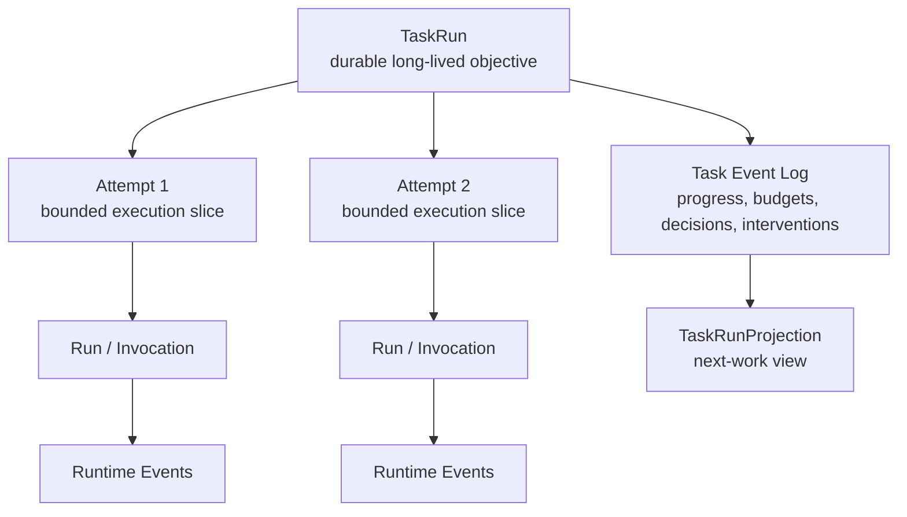
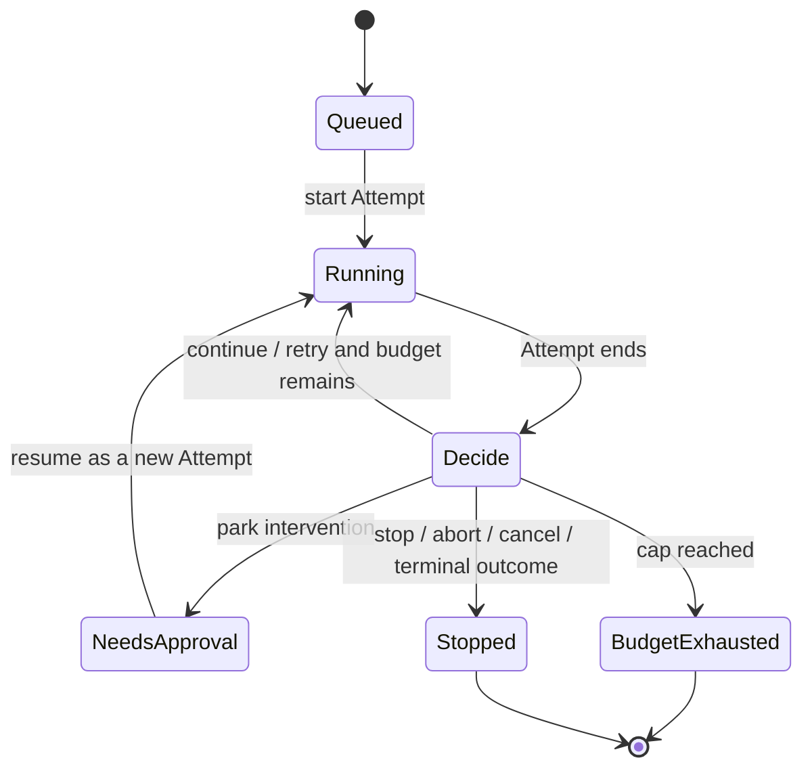
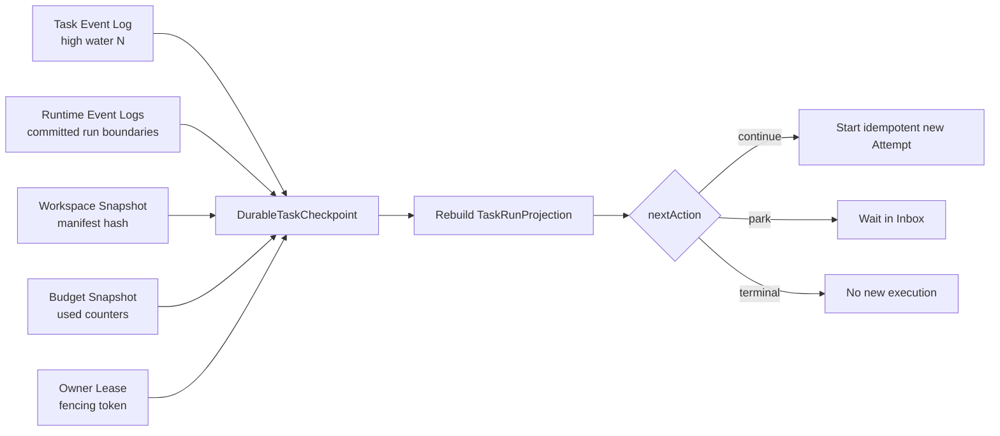

# 第四章：The Durable Task Loop——Inside Maka Headless

> 本章回答一个核心问题：当一个任务长于单次 Turn、Run，甚至长于一个进程的存活时间时，Maka 如何为它保留稳定身份、进度、预算和中断边界？Headless 的答案是引入 `TaskRun`：让每次 Agent 执行成为一个 bounded Attempt，把跨 Attempt 的任务事实写入 append-only Task Event Log，再从日志投影出下一步需要的工作状态。**A task is longer than a turn; durability begins by giving the task its own log.**

本文面向需要理解或修改 Headless orchestration、TaskRun、Autonomous Loop、Heavy-task progress 或恢复机制的 Runtime 工程师。前半部分建立长程任务的心智模型；后半部分进入事件协议、Attempt 边界、预算、权限暂停、workspace continuity 和当前恢复限制。

本文只讨论 Agent 如何在无人值守或弱交互环境中持续推进一个长程任务，以及 Runtime 如何保存“接下来从哪里继续”所需的公开事实。

本文同时包含两类内容：

- **Current**：当前 `TaskAgentController`、`AutonomousAgentLoop`、`TaskRunStore`、Heavy-task 与 Harbor Cell continuation 已经实现的行为；
- **Target**：把这些能力收敛成可跨进程、安全接管的通用 Durable Task Loop 所需的架构方向。

Target 部分不是现有保证。尤其需要先说清：当前 TaskRun ledger 是 durable 的，但 workspace、in-flight Invocation 和 scheduler ownership 还没有形成一个统一 checkpoint 协议。

## 从一个无法在一轮里完成的任务开始

假设用户给 Maka 一个任务：

> 阅读一个大型代码库，迁移旧接口，逐步修复构建问题，并在需要高风险权限时停下来等待确认。

这类任务可能经历：

1. 第一个 Turn 只完成代码库 inventory；
2. 一次 Run 因 tool-step cap 结束，但任务显然尚未完成；
3. 第二次执行需要知道哪些文件已经检查、哪些 todo 仍然开放；
4. 中途遇到需要人工批准的命令，任务必须 park；
5. 人几小时后回来批准，系统需要继续，而不是把整个任务当成一次新聊天；
6. 进程可能重启，内存中的 loop counter 和 active backend 都已经消失；
7. workspace 可能由本地临时目录、外部 container 或远程 executor 持有。

如果只有 Turn，系统能表达“一轮问答”。如果只有 Run，系统能表达“一次具体执行”。如果只有 RuntimeEvent ledger，系统能回放模型与工具经历过什么。但长程任务还需要回答另一组问题：

```text
这个长期目标的稳定 ID 是什么？
已经尝试过几次？
当前预算还剩多少？
哪些 progress snapshot 仍然有效？
任务是在运行、等待批准，还是已经因为预算停止？
下一次执行应该继承哪些上下文？
workspace 是否仍然是上一 Attempt 离开时的那个 workspace？
谁有权接管下一步？
```

这就是 Headless 引入 TaskRun 层的原因。

## 先说结论：TaskRun 是 Runtime 外面的 Durable Envelope

Maka 的执行身份可以分成四层：

| 身份 | 回答的问题 | 典型生命周期 |
|---|---|---|
| TaskRun | 这个长程目标从开始到终止是谁？ | 跨 Attempt、可跨多次执行 |
| Attempt | 这一次有预算边界的推进是谁？ | 一次 task-level try |
| Turn | 这一次送给 Agent 的输入和回复是哪一轮？ | 一次用户/continuation exchange |
| Run / Invocation | 这次模型与工具循环如何开始和结束？ | 一次 Runtime execution |



从上向下读这张图。`TaskRun` 不取代 Runtime 的 Session、Run 或 Invocation；它在外面提供一个更长的 durable envelope。Runtime Events 保存每次 Agent 执行的语义事实，Task Events 保存跨执行的任务事实。图中刻意没有画 workspace，因为当前 workspace lifecycle 并不总是与 TaskRun 一样 durable，后文会单独讨论。

最重要的边界是：

> **Headless 没有重新实现 Agent Runtime。它把 Runtime execution 组织成长程 Task lifecycle。**

## 为什么 Session 还不等于 TaskRun

Session 可以跨多个 Turn，也能保留模型历史，但它仍然主要回答“这些对话属于谁”。TaskRun 还必须表达：

- Attempt 数量与每次 Attempt 的 outcome；
- loop budget 已使用多少；
- 当前是不是因为权限、预算或外部介入而暂停；
- 哪些 progress/evidence 是跨 Attempt 的任务状态；
- workspace lease 属于哪个 Attempt；
- 下一次执行是 continue、retry、stop 还是 abort；
- 哪些 task policy 在这次长程执行中生效。

一个 Session 也可能承载普通交互式对话，不应该被迫拥有这些 task-control 字段。相反，一个 TaskRun 的不同 Attempt 当前可以创建不同 Session 和 AgentRun。把两者合并，会让 UI conversation state 与 durable orchestration state 互相污染。

因此当前引用方向是：Task Events 保存 `sessionId` 与 `agentRunId`，而不是让 Session header 反过来成为 TaskRun 真相。

## Current：Task Event Log 是长程控制面的事实源

`TaskRunStore` 以 append-only JSONL 保存 `TaskEvent`。文件路径按 `taskRunId` 分开，进程内对同一个 TaskRun 的 append 通过 promise queue 串行化。

当前长程控制面相关事件包括：

- TaskRun created、queued、started 与 terminal events；
- Attempt started、completed；
- autonomous decision 与 runtime feedback；
- heavy-task mode、inventory、todos、self-check、workspace observation 和 compact evidence；
- isolation policy、workspace lease 与 tool-executor identity；
- permission request、grant、decision；
- inbox item、resolution 与 `needs_approval` parked state。

`projectTaskRun()` 从头读取事件，计算 `TaskRunProjection`：当前状态、Attempts、latest progress、evidence、permission facts、parked state、warnings，以及与 Runtime execution 的 refs。

关系与前几章一致：

```text
TaskRunProjection(t) = Project(TaskEvents[0..t])
```

Projection 不是另一份可独立修改的 Task truth。CLI inspect、resume planning、prompt replay 与 export 都应该从 Task Events 派生。

### Durable 的究竟是什么

当前明确 durable 的是：

- TaskRun identity；
- 已经 append 的 Task Events；
- 事件中记录的 Attempt、progress、decision、permission 与 lifecycle facts；
- 指向 Session、AgentRun、RuntimeEvents 和 artifact 的 refs。

当前不能由 TaskRun ledger 单独保证的包括：

- 临时 workspace 的所有当前 bytes；
- 正在运行中的 provider stream；
- tool process 的 live handle；
- 内存中的 backend、abort controller 和 loop closure；
- 外部 executor 是否仍持有同一个 workspace；
- 进程重启后是否有 scheduler 自动接管。

这一区分是本章最重要的精度要求：durable control facts 不等于整个执行世界已经 checkpointed。

## Current：一个 Attempt 怎样复用 Runtime 主链

`TaskAgentController.runTaskOnce()` 负责把一个 Attempt 包在 Runtime 外面。它当前按以下顺序推进：

1. 校验 backend isolation 与 task setup；
2. 解析 TaskRun/Attempt identity 和 intervention policy；
3. 从既有 TaskRun projection 读取 Heavy-task progress、self-check 和 compact evidence；
4. 把这些 bounded state projection 追加到本次 instruction；
5. append TaskRun mode、isolation 与已有 permission grant facts；
6. 准备 workspace，并记录 `WorkspaceLeaseFacts` 与 `ToolExecutorIdentity`；
7. 创建 Session、`AgentRun` 和单 Run active-session shell；
8. append `task_run_started` 与 `task_attempt_started`；
9. 运行 `AgentRun → AiSdkFlow → RuntimeRunner`；
10. 把 Invocation refs、budget 和 tool activity 转成 Task-level feedback；
11. 处理 permission intervention 或 bounded Heavy-task repair；
12. append Attempt 与 TaskRun 的下一状态。

这条路径绕过 `SessionManager.sendMessage()` facade，直接组装 Runtime 核心组件。原因不是 Headless 需要另一套模型循环，而是它需要一个非 streaming 的 `InvocationResult`、自己的 Task Event Log、isolated backend lifecycle 和 Attempt 后处理边界。

当前代价是 `runRuntimeAttempt()` 与 `RuntimeKernel` 的 Turn shell 存在部分重复。未来如果抽 shared runner，必须保留 Headless 注入 TaskRun events、intervention 与 isolated lifecycle 的能力，不能只抽一个“发消息并返回文本”的薄函数。

## Attempt 是进度切片，不是失败的同义词

一个 Attempt 是有明确预算和资源边界的一次推进。它可以因为多种原因结束：正常停止、执行失败、信息不完整、权限阻塞、预算耗尽、取消或中止。

TaskRun 可以在一个 Attempt 后继续，也可以进入 terminal state。关键不在于把所有非完成结果都叫 error，而是保留足够结构，让外层 policy 决定：

```text
continue  → 延续同一目标，通常补充 continuation instruction
retry     → 重新尝试当前工作策略
stop      → 停止创建新 Attempt
abort     → 明确放弃继续执行
```

`AutonomousAgentLoop` 每次调用 `runTaskOnce()` 创建一个新 Attempt。它不是从旧 `RuntimeRunner` 的某个 instruction pointer 恢复，也不会复活已经退出的 tool process。

因此更准确的式子是：

```text
Long task progress
  = sequence of bounded Attempts
  + durable Task Events between them
  + explicitly selected continuation state
```

而不是：

```text
Long task progress = one immortal Invocation
```

## Current：三层预算给循环一个可证明的边界

无人值守循环如果只有“继续直到完成”，就没有安全的 terminal condition。当前 `AutonomousLoopBudget` 提供三层 cap：

| Budget | 限制什么 | 检查时机 |
|---|---|---|
| `maxAttempts` | TaskRun 最多启动多少个 Attempt | 每次 Attempt 前后 |
| `maxRuntimeSteps` | 所有 Attempt 累计 Runtime steps | 每次 Attempt 后 |
| `maxWallTimeMs` | TaskRun loop 的总 wall time | Attempt 前后 |

`LoopBudgetSnapshot` 把 used 与 max 一起交给 decision policy。即使自定义 policy 请求 continue/retry，`enforceCaps()` 也会重新应用硬上限。



这张图只展示长程控制状态，不是 `TaskRunStatus` 全量枚举。重点是每个回环都必须经过 Attempt boundary 和 budget decision；`needs_approval` 的恢复同样创建新 Attempt。图中省略了 Runtime 内部的 Turn/Run states。

### Budget durable 到什么程度

Attempt 数量可以从 Task Events 重建，Runtime steps 也被记录进 Task feedback 和执行结果。但当前 loop 的 `startedAt`、累计 counters 与 decision closure 主要由正在运行的 `runAutonomousTask()` 持有。

所以当前可以审计预算使用，却不能仅凭通用 TaskRun projection 在任意进程重启点无歧义恢复所有 loop counters。Target 部分会说明需要怎样的 budget checkpoint。

## Current：Progress 是跨 Attempt 的 bounded projection

长程任务不能只把上一 Attempt 的最终自然语言回复塞回 prompt。Heavy-task 模式引入几类结构化、append-only 进度事实。

### Inventory：我们面对的工作面是什么

`inventory_submit` 提交一个完整 inventory snapshot，包括文件或 artifact、状态、用途与开放问题。它不是 patch，而是 latest-state snapshot；新的 inventory event 覆盖 projection 中的“当前 inventory”，旧 snapshot 仍留在 log 中。

### Todos：下一步具体做什么

`todo_update` 同样提交完整 todo snapshot。每项携带 ID、priority、status、content 和可选 kind。Projection 可以稳定找到 active todo，也能保留历史变化。

### Compact Evidence：最近观察到了什么

Headless 在普通 Bash、Read、Grep、Write、Edit、Glob 与 artifact 路径周围捕获 bounded public evidence。它只保存有限摘要、truncation ref、source link 与 mutation metadata，不把大 stdout、文件正文或 raw diff 全量写入任务 prompt。

### Self-check：Agent 的公开自检状态

Self-check 保存公开 reason、command/artifact evidence 与 execution hygiene。它是 advisory task state，不是隐藏权威。Workspace observation 与 bounded repair gate 可以要求一次额外 repair Turn，但当前 gate 明确限制 repair 次数，避免“自检不满意就无限自循环”。

后续 Attempt 启动时，`renderHeavyTaskProgressForPrompt()`、`renderHeavyTaskSelfCheckForPrompt()` 与 `renderHeavyTaskEvidenceForPrompt()` 从 TaskRun projection 生成有界文本：最多展示部分 inventory/todos、最近 evidence 和有限 command/artifact 条目。

这正是 Task Event Log 的 projection：

```text
Full task history remains in Task Events
  → latest progress snapshots are selected
  → recent public evidence is bounded
  → next Attempt receives a continuation-oriented prompt view
```

它不是完整 replay，也不声称省略的 raw output 仍在 prompt 中。

## Current：Continuation 有三种不同含义

“继续任务”在当前 Headless 中至少有三种机制，不能混成一个 resume。

### 1. 同一 Harbor Cell 内的新 Turn

Harbor Cell continuation 在同一 Session 和同一 container workspace 内循环调用 `SessionManager.sendMessage()`。当前只在上一个 Invocation 因 tool-step cap 或 incomplete tool calls 结束时继续。

下一 Turn 使用固定 continuation prompt，并受 `maxTurns` 与 `maxTotalRuntimeSteps` 限制。启用后默认最多 3 个 Turn，总 Runtime step 默认按每 Turn 50 计算。所有 Invocation events 最后被组合进 cell output，同时保留每 Turn 的 status、step-cap 与 steps summary。

这是当前最接近“同一 workspace 上继续工作”的路径，但它仍然是多个新 Invocation，而不是一个 Invocation 的 instruction-level resume。

### 2. Autonomous Loop 的新 Attempt

Autonomous continue/retry 会再次调用 `runTaskOnce()`。Heavy-task state 可以从 Task Events 投影到新 instruction；`replayPriorAttemptRuntimeContext` 打开时，旧 Attempt 的 RuntimeEvents 也会显式拼进下一次 Runtime context。

这个 replay 开关默认不是强制语义。关闭时，跨 Attempt continuation 主要依赖 instruction feedback 与 TaskRun progress projection。

### 3. Parked permission 的 CLI resume

当 intervention policy 为 `park`，permission request 会形成 `TaskPermissionRequest`、Inbox item、Attempt `needs_approval` 和 TaskRun parked state。

当前 `task resume` 只支持这种 `needs_approval` 状态。它先 resolve inbox item，再创建一个新的 Attempt，并把 grant facts写入 Task Event Log。

一个在 Runtime 已经发出 handoff 之后才出现的 grant，不能 post-hoc 授权旧 tool call。当前实现明确拒绝这种“事后把中断 Invocation 当作已经获批”的做法。Resume 是下一 Attempt 的新输入，不是旧调用栈复活。

## Current：Workspace Lease 记录归属，但不是 Workspace Checkpoint

默认本地 `runTaskOnce()` 会为每个 Attempt 从 task fixture 创建一个新的 throwaway copy，并在 `finally` 中清理。Fixture symlink 被拒绝，避免复制后留下指向 host 的逃逸路径。

Task Events 会记录 `WorkspaceLeaseFacts`：

- lease ID；
- TaskRun/Attempt identity；
- source workspace 与实际 workspace path；
- writable flag；
- `cleanup_on_finally` policy；
- `createdAt`；contract 预留可选 `releasedAt`，但当前 controller cleanup 时没有再 append lease-release event。

但记录 lease 不等于保存 workspace bytes。对默认本地 autonomous path 来说，下一 Attempt 会重新复制 fixture；上一 Attempt 的修改不会因为 TaskRun ID 相同就自动出现。

外部 isolation 可以提供稳定 `workspaceDir`，Harbor Cell 也能在 container 存活期间共享同一 workspace，但当前 TaskRunStore 不拥有该外部 workspace 的 snapshot、lease renewal 或 fencing protocol。因此它不能给出通用跨进程 continuity 保证。

这条边界可以总结为：

> **Current TaskRun durability preserves control history; workspace continuity remains carrier-dependent.**

## Current：隔离是显式事实，不是路径名字带来的幻觉

Throwaway directory 只隔离 task fixture mutation，不是 OS security sandbox。真实 model-backed backend 必须提供 `RealBackendIsolation`，声明一个外部边界，例如 Harbor container、Docker workspace 或远程 executor。

标准 Headless tools 通过 `IsolatedToolExecutor` 路由 Bash 与文件操作，并在 dispatch 前拒绝 absolute path、`..` escape 和 absolute glob。Tool executor identity 与 env/network/secret policy 会进入 Task Events，供后续 projection 与审计读取。

但 Headless 只验证 isolation record 的 shape 与非空 label。真正的 filesystem、network、process 和 secret 隔离由外部 executor 实现。把 `{ kind: "external" }` 写进对象不是安全本身；它是一份必须由 carrier 兑现的 assertion。

## Crash、corrupt tail 与当前恢复能力

File TaskRunStore 对每个 TaskRun append JSONL。读取时：

- newline-terminated 合法事件按顺序 replay；
-完整但无法解析的行被转换成 `event_corrupt`，进入 projection warnings；
- 最后一个未 newline-terminated 的 partial tail 被忽略；
- TaskRun ID 不匹配的事件不会进入有效 projection；
- 多个 terminal events 会产生 warning，当前 last terminal wins。

这些规则让进程重启后能够重建“已经 durable 的任务控制事实”。它们不等于自动恢复执行。

当前缺少的通用能力包括：

- 枚举并 claim 所有非终态 TaskRun 的 scheduler；
- 判断某个 `running` Attempt 是仍在执行还是 owner 已死亡；
- 对跨进程 writers 做 lease/fencing；
- 从 workspace snapshot 与 Runtime high water 恢复；
- 幂等重放“准备新 Attempt”而不重复产生副作用；
- 从任意 parked/blocked/budget state 按统一协议 resume。

所以准确说法是：**当前有 durable replayable Task state，但没有完整的 crash-resumable task executor。**

## Target：真正的 Durable Task Loop 需要成对的 High Water

如果未来要在另一进程安全接管一个长程任务，只保存 Task Event high water 不够。恢复点至少要把五类状态绑定在一起：

```text
DurableTaskCheckpoint
  task
    taskRunId
    taskEventHighWater
    policyVersion
  runtime
    sessionId
    completedRunIds
    runtimeEventHighWaterByRun
  workspace
    snapshotId
    manifestHash
    carrierIdentity
  budget
    attemptsUsed
    runtimeStepsUsed
    elapsedAccounting
  control
    nextAction
    parkedInboxItemId?
    ownerLease / fencingToken
```

这不是字段承诺，而是恢复不变量的集合。

### Task high water 与 Runtime high water 必须一致

Task projection 不能说“Attempt 已记录进度”，但对应 RuntimeEvent 尚未 durable；也不能把一个 terminal Runtime Run 当成未开始。Checkpoint 需要明确引用已经提交的 Run/RuntimeEvent boundary。

### Workspace snapshot 必须与同一个边界配对

如果 workspace snapshot 比 progress event 旧，下一 Attempt 会相信不存在的修改；如果 snapshot 更新但 Task Event 没提交，接管者可能重复执行已经完成的副作用。Snapshot ID、manifest hash 与 event high water 必须原子关联或通过两阶段协议收敛。

### Budget 必须可恢复而不是重新计时

进程重启不能让 attempts、steps 或 wall-time policy 清零。Elapsed wall time 还需要区分 active execution time、parked time 与 scheduler downtime，这是 policy decision，不应由 `Date.now() - newProcessStart` 偶然决定。

### Owner 必须有 fencing

当前 in-process promise queue 只能串行化同一进程里的 append。多 scheduler 或旧 owner 恢复后迟到写入，需要 lease epoch/fencing token 阻止双重 Attempt 和双写 terminal state。



从左向右读这张目标图。可恢复性来自多种 high water 的一致绑定，而不是多写一段 continuation prompt。图中没有尝试恢复 provider 的 socket 或 tool process；Target 仍以新的幂等 Attempt 为主要恢复单元。

## Current 与 Target 的边界

| 能力 | Current | Target |
|---|---|---|
| Task identity | Durable `taskRunId` | 保持 |
| Task state | Append-only Task Events + projection | 增加 versioned checkpoint 与 scheduler read model |
| Attempt continuation | 新 Attempt，bounded prompt projection | 幂等新 Attempt + explicit resume plan |
| Runtime history | refs；可选 replay prior Attempt events | checkpointed Runtime high water |
| Progress | Heavy-task snapshots/evidence | versioned domain-neutral task state envelopes |
| Workspace | local throwaway lease或 carrier-owned directory | durable snapshot + manifest + lease fencing |
| Permission | fail-closed 或 park；`needs_approval` 可新 Attempt resume | 通用 parked-state protocol 与 capability-scoped grants |
| Budget | loop 内 counters，可记录/审计 | durable accounting across process ownership |
| Concurrency | per-process append queue | cross-process lease、CAS 与 fencing |
| Crash recovery | 重建 TaskRunProjection | scheduler claim + safe continuation |

## 不要把 Durable Task Loop 误解成什么

### 它不是一个无限大的 Turn

Turn 仍然应该有清晰输入与 terminal boundary。长程任务通过多个 bounded Attempts 前进，而不是把一个 provider stream 永远保持打开。

### 它不是把完整历史反复塞回模型

跨 Attempt 状态应来自 bounded progress/evidence projection。Raw RuntimeEvents 只有在 policy 明确选择时才 replay。

### 它不是 Memory 系统

TaskRun state 服务一个具体长期目标。跨任务用户偏好与长期知识属于另一种生命周期和治理边界。

### 它不是 Workspace 本身

Task Event Log 可以引用 workspace lease 或 snapshot，但不能替代文件 bytes、外部 container 或远程 volume。

### 它不是同一个 Invocation 的热恢复

当前 continuation 与未来推荐恢复单元都是新的 Turn/Attempt。恢复 provider stream 或 live tool process 是更强、也更脆弱的协议，本文不把它当作默认目标。

## 当前必须保护的架构不变量

1. **Stable task identity**：同一长程目标的所有 Attempt 共享 `taskRunId`。
2. **Bounded attempts**：每次 Agent execution 都有独立 Attempt/Run/Invocation boundary。
3. **Append before project**：Task state 来自已 append events，不从可变 projection 反向写 truth。
4. **Explicit continuation**：continue/retry/park/resume 必须留下 Task Event，不靠进程内隐式循环。
5. **Budget caps dominate policy**：自定义 decision 不能绕过硬 cap。
6. **No post-hoc authorization**：迟到 grant 不能改写旧 tool call 当时的权限事实。
7. **Progress is bounded and source-bearing**：后续 prompt 只接收有限 projection，并保留 Task/Attempt/source refs。
8. **Workspace claims are explicit**：没有 snapshot/lease 证据时，不得声称跨 Attempt workspace continuity。
9. **Runtime facts remain separate**：Task Events 引用 Runtime execution，不复制或改写 RuntimeEvent truth。
10. **Conflicts are observable**：corrupt lines、mismatched TaskRun IDs 与多 terminal events 必须产生 warnings。

Target 还应增加：owner fencing、idempotent Attempt creation、checkpoint CAS 与 durable budget accounting。

## 代价与重新评估条件

TaskRun 层增加了另一套事件协议和 projection。代价是身份更多、状态更多，也必须维护 Task Events 与 Runtime Events 之间的 refs。但把这些事实塞进 Session message 或 Run header，会让长程 orchestration 绑死在交互式 Runtime 上，代价更高。

当前 `TaskAgentController` 复制部分 Kernel shell，换来了 non-streaming Invocation result 与独立 task hooks。如果未来 Headless、Desktop automation 和 scheduler 都需要同类能力，应重新评估并抽出 shared attempt runner。

Heavy-task progress 当前是领域化能力。Inventory/todos 很适合工程任务，但未必适合所有长程 Agent。第二个独立领域消费者出现时，应考虑把通用 envelope、source refs 与 projection window 下沉，把具体 schema 留给 task profile。

本地 throwaway workspace 适合隔离 Attempt，却与真正 continuation 存在张力。什么时候升级到 durable workspace snapshot，应由跨进程恢复、长时间 park 或多 worker scheduling 的产品需求触发，而不是仅因为任务执行时间变长。

## 代码地图与测试入口

核心实现入口：

1. `packages/headless/src/task-contracts.ts`：TaskRun/Attempt 状态、Task Events、permission、inbox、workspace 与 progress contracts；
2. `packages/headless/src/task-run-store.ts`：append-only JSONL 与 `projectTaskRun()`；
3. `packages/headless/src/task-agent-controller.ts`：单 Attempt orchestration 与 Runtime 组装；
4. `packages/headless/src/autonomous-agent-loop.ts`：Attempt loop、budgets 与 decisions；
5. `packages/headless/src/heavy-task-progress.ts`：inventory/todo recorder 与 prompt projection；
6. `packages/headless/src/heavy-task-evidence.ts`：bounded public evidence；
7. `packages/headless/src/heavy-task-self-check.ts`：advisory self-check state；
8. `packages/headless/src/heavy-task-self-check-gate.ts`：bounded repair gate；
9. `packages/headless/src/isolation.ts`：external isolation assertion、workspace 与 executor facts；
10. `packages/headless/src/tools.ts`：isolated tool surface；
11. `packages/headless/src/harbor-cell.ts`：same-Session multi-Turn continuation；
12. `packages/headless/src/cli.ts`：TaskRun inspect、parked resume 与 command routing。

重点测试：

- `task-run-store.test.ts`：event ordering、projection、corrupt tail、permission/inbox 与 terminal conflicts；
- `task-agent-controller.test.ts`：RuntimeRunner path、progress、bounded repair、permission fail-closed/park 与 Runtime refs；
- `autonomous-agent-loop.test.ts`：multi-Attempt、RuntimeEvent replay、hard caps 与 budget park；
- `heavy-task-progress.test.ts`、`heavy-task-evidence.test.ts`、`heavy-task-self-check.test.ts`：跨 Attempt 状态投影；
- `harbor-cell.test.ts`：same-workspace continuation、Turn/step caps 与 combined events；
- `tools.test.ts`：isolated file/tool semantics、path escape 与 concurrent writes；
- `cli.test.ts`：TaskRun inspect 与 `needs_approval` resume。

## 总结

Maka Headless 的核心不是“没有 UI”，而是把一次开放式 Agent 工作组织成多个有边界、可观察的执行切片：

```text
TaskRun
  → Task Event Log
  → Attempt
  → Run / Invocation
  → Runtime Events
  → bounded progress and evidence projection
  → decision under budget
  → next Attempt, park, or terminal state
```

当前实现已经给长程任务建立了关键骨架：稳定 `taskRunId`、append-only Task Events、Attempt lifecycle、三层预算、Heavy-task progress/evidence、permission Inbox，以及同 Session 多 Turn与跨 Attempt continuation 的不同路径。

但 durable 必须说得精确。现在 durable 的首先是控制历史和投影来源，不是所有 workspace bytes、in-flight process 与 scheduler ownership。真正跨进程可接管的 Durable Task Loop，还需要把 Task high water、Runtime high water、workspace snapshot、budget accounting 与 owner fencing 绑定成同一个恢复协议。

这也解释了标题中的 Loop：它不是一个永不结束的 while-loop，而是一串由日志连接起来的 bounded Attempts。每次执行都可以结束；任务本身仍然知道接下来从哪里继续。
