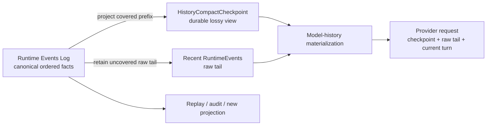
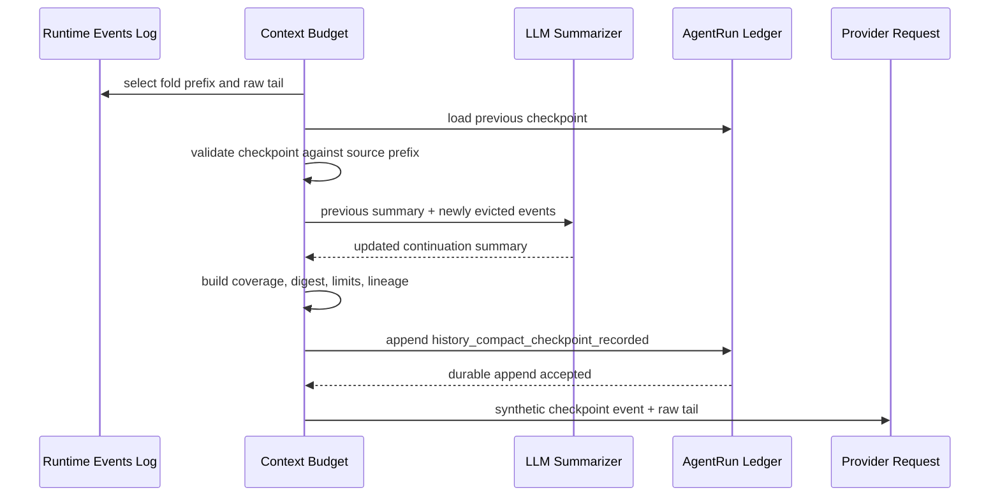
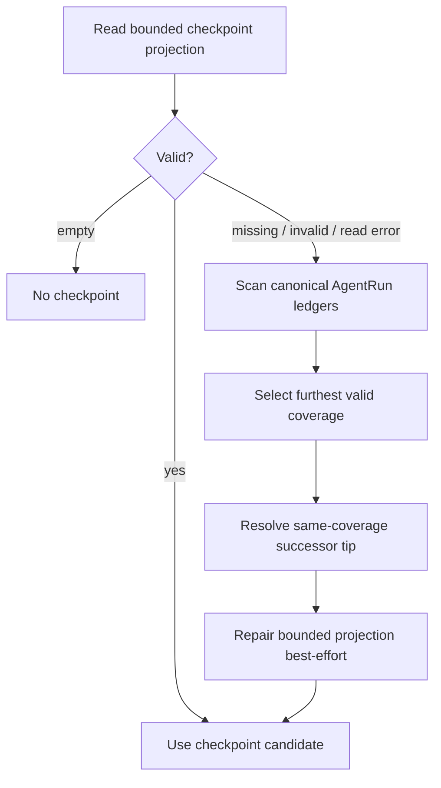

# Chapter 3: Compaction Is a Projection—How Maka Lets the LLM Forget Without Losing History

> This chapter answers one question: when the complete Agent history no longer fits in the model context, how can Maka reduce what the LLM sees without damaging the fact space needed for replay, audit, and future projections? The answer is not “replace the log with a summary.” It is: **define compaction as a lossy projection of the Runtime Events Log. The log preserves facts, a checkpoint preserves a continuation view with an explicit coverage boundary, and each provider request consumes only the projection appropriate at that moment.**

This chapter builds on Chapter 1's log-first Runtime and Chapter 2's distinction between compressing context and compressing evidence. It is for Runtime engineers changing history compaction, context budgets, checkpoint persistence, or recovery. The first half establishes the mental model. The complete chapter should let a reader locate V2 checkpoint generation, validation, rolling updates, replay, and failure recovery.

The primary subject is **prior-history LLM compaction**: an LLM generates `HistoryCompactCheckpoint.summary`, the checkpoint covers a prefix of older RuntimeEvents, and later requests use it in place of that prefix. The chapter does not fully cover active or stale pruning of individual Tool Results, and it does not treat current-Turn `semanticCompact` as the same mechanism. Both reduce provider messages, but their durable sources, lifecycles, and safety boundaries differ. A later section makes that distinction explicit.

This chapter describes the implementation current as of 2026-07-12. The V1 artifact-backed `HistoryCompactBlock` remains as a read-only compatibility path. The V2 ledger-backed `HistoryCompactCheckpoint` is the preferred main path.

## Start with a long-running Session

Imagine that a user has worked with Maka for two hours:

1. They explored the repository.
2. They ran tests and produced large outputs.
3. They changed several files.
4. They investigated and abandoned a wrong direction.
5. They completed the first fix.
6. They asked Maka to continue with the next failure.

The complete Runtime Events Log may now contain thousands of facts. Those facts still matter. An exact command, the Tool Result the model saw, a constraint the user emphasized, or even a clue that was dismissed too early all belong to the real history.

The next model call, however, neither needs nor may be able to reread all of it. It mainly needs to know:

- the current objective;
- what is already done;
- which decisions must remain in force;
- the current file and execution state;
- the next action;
- where to recover source facts when the summary is insufficient.

The dangerous implementation is to collapse those two requirements into one: generate a summary, then delete or overwrite the original events. That saves context in the short term but turns a fallible summary into an unverifiable second truth. If the model omits a constraint or misstates a Tool Result, no stable source remains to correct it.

Maka's problem is therefore not:

> How do we shorten a conversation?

It is:

> While retaining the complete event facts, how do we compute a smaller continuation view for the next model decision?

## The conclusion first: compaction is projection, not mutation

Maka's core relationship can be written as:

```text
Canonical history = RuntimeEvents[0..n]

Compact checkpoint = Project(
  RuntimeEvents[0..k],
  compaction policy,
  summarizer
)

Next model context = Materialize(
  compact checkpoint,
  RuntimeEvents[k+1..n],
  provider capabilities,
  current context budget
)
```

These are three different objects:

| Layer | What it preserves | Source of truth? | May lose detail? |
|---|---|---|---|
| Runtime Events Log | Semantic facts produced by the user, model, tools, and Runtime | Yes | No |
| History Compact Checkpoint | A continuation summary plus coverage for a validated event prefix | No; it is a durable projection | Yes |
| Provider Request Messages | The working context consumed by this LLM call | No; it is an ephemeral projection | Yes |



Read the diagram left to right. A successful compaction does not rewrite the log on the left. The checkpoint and raw tail in the middle jointly form the historical prefix for the next request. The lower branch shows that a debugger, history search, or future compactor can still consume the same log. The diagram omits the system prompt, tool schemas, and current user message. They also shape the final request, but they are outside history-compaction source coverage.

In database terms, the checkpoint is closer to a materialized view or snapshot than to WAL truncation. It can accelerate reads, carry a version, become invalid, and be rebuilt from its source log. It cannot declare the source log obsolete.

## Why “summary” is too weak a name

An ordinary summary contains only text. A safe compaction projection must also answer:

- Which Session does it belong to?
- How many ordered RuntimeEvents and Turns does it cover?
- At which `runId / turnId / runtimeEventId` does its covered prefix end?
- What is the digest of those source events?
- Which high-water decision produced it?
- Is it a legitimate successor to the previous checkpoint?
- Does it still fit the current token policy?

Maka therefore persists more than a string. It persists a `HistoryCompactCheckpoint`:

```text
HistoryCompactCheckpoint
  identity
    checkpointId
    sessionId
    createdAt
  high water
    highWaterName
    highWaterSeq
  coverage
    eventCount
    turnCount
    through { runId, turnId, runtimeEventId }
    sourceDigest
  projection
    summary
    limitations
    estimatedTokens
  lineage
    previousCheckpointId?
```

The model primarily sees `summary`, but `coverage` determines whether the checkpoint is allowed to replace history. A summary without coverage is only a note. A summary without a source digest cannot establish that it still corresponds to the current log. A summary without a replay-budget check may be less suitable for the current request than the working set it replaces.

## Current: every request still begins with RuntimeEvents

The prior-history path for a normal Send begins in `AiSdkBackend.buildPriorMessages()`. It does not reuse the provider messages assembled for an earlier request. Instead, it receives RuntimeEvents from earlier Runs and executes a projection pipeline:

1. Exclude the current `turnId` to obtain the prior Runtime context.
2. Prepare the context-budget policy.
3. Load the latest V2 checkpoint, falling back to V1 blocks only when needed.
4. Handle stale oversized Tool Results first.
5. Calculate the history-compaction high water and retained tail.
6. Validate whether an existing checkpoint exactly matches the source prefix.
7. If the old checkpoint does not cover the new fold, call an LLM to create a rolling successor.
8. Materialize the checkpoint as a synthetic RuntimeEvent and append the uncovered raw tail.
9. Apply history search, archive retrieval, or synthesis cache when configured.
10. Build the provider replay plan and only then materialize `ModelMessage[]`.

The ordering reveals two properties.

First, compaction happens inside **model-history projection**, not inside the RuntimeEvent append path. Events already produced by the model and tools do not change when a later context budget changes.

Second, the checkpoint is not itself a final provider message. Maka first turns it into a synthetic RuntimeEvent with `role=user, author=system`, then passes it through the same replay planning and provider capability gates as other projected events. The synthetic event exists only in the current projection. It is not written back to the RuntimeEvent ledger as though it were an original interaction fact.

## Triggering: high water decides when to project

Automatic history compaction is governed by `ContextBudgetPolicy`. The current default policy:

- derives the prior-history budget from the selected model's context window and reserves 16,384 tokens by default;
- uses a 32,000-token history budget for most providers when no context window can be resolved;
- enters compaction when compactable history exceeds `maxHistoryEstimatedTokens × highWaterRatio`;
- defaults `highWaterRatio` to `1`;
- targets a raw tail of no more than 16,384 estimated tokens;
- asks for at least three recent Turns, while token-capped tail selection may retain fewer when a Turn is very large;
- defaults to at most 1,024 estimated tokens for one checkpoint and 2,048 for the compact-projection budget.

These numbers are current policy defaults, not protocol constants. Environment variables and model metadata may change them. The stable semantics are:

```text
source log grows past high water
  → select an older prefix to fold
  → preserve a recent raw tail
  → accept projection only if checkpoint + tail fits current limits
```

Tail selection works backward over complete Turns to avoid splitting an ordinary Tool Call/Result pair. If the newest Turn alone exceeds the tail budget, the current implementation falls back to the latest complete function call/response pair in that Turn. If no pair exists, it retains at least the final event.

This boundary matters: `minRecentTurns` is a preference, not permission to violate the context cap.

## What the LLM does—and does not do

The LLM compactor produces a structured summary that another LLM can use to continue the task. The current summarizer prompt asks it to retain:

- Goal;
- Done and In Progress work;
- Key Decisions;
- Next Steps;
- Critical Context, including exact paths, function names, commands, results, and errors.

The summarizer sees newly folded user/model text and Tool Calls/Results. Thinking is intentionally omitted. Desktop reuses the Session's current connection and model and caps summary generation output at 4,096 tokens. The checkpoint builder then applies the current compact policy again to bound the final model-visible summary.

The LLM does not decide:

- which RuntimeEvents belong to the covered prefix;
- the source digest;
- whether the checkpoint may replace the current log;
- which raw tail must remain;
- whether the checkpoint is durable;
- whether the current provider request may still use it.

Deterministic Runtime code owns all of those decisions.

The LLM is therefore the generator of the projection value, not the projection authority. It decides how to summarize. Runtime decides what was summarized, whether the result may be used, and when it is invalid.

## Rolling checkpoints: do not repeatedly summarize the entire world

A long-lived Session crosses high water more than once. Resending all older events to the summarizer every time would make compaction itself increasingly expensive and repeatedly rewrite the interpretation of old facts.

V2 uses rolling checkpoints:

```text
Checkpoint N
  summary = S(events[0..k])

Newly evicted events = events[k+1..m]

Checkpoint N+1
  summary = S(Checkpoint N.summary, events[k+1..m])
  coverage = events[0..m]
  previousCheckpointId = Checkpoint N.checkpointId
```

The summarizer receives only the previous summary and newly folded events. Raw events already covered by the previous checkpoint are not sent to the LLM again. The new checkpoint nevertheless recalculates coverage and `sourceDigest` over the complete covered prefix.



Read this diagram from top to bottom. The critical commit point is `history_compact_checkpoint_recorded`. A new summary enters the same provider request as a replacement checkpoint only after the durable recorder succeeds. The diagram omits V1 artifact compatibility and final replay-plan materialization.

Rolling does not mean a summary can only advance forever. The same coverage may be explicitly rewritten, but the candidate must name the current checkpoint in `previousCheckpointId` and preserve the same source digest, through boundary, and Turn/Event counts. This is a compare-and-swap rewrite of one materialized view, not permission for an arbitrary late writer to overwrite it.

## Why coverage must be an ordered prefix

A checkpoint is not a search summary over an arbitrary event set. It covers an ordered prefix of compactable RuntimeEvents.

The prefix constraint gives Maka three properties:

1. Replay is simple: `checkpoint + uncovered raw suffix`.
2. High water moves forward, so “furthest coverage” is well defined.
3. A rolling update can identify newly folded events precisely.

`matchHistoryCompactCheckpointPrefix()` verifies:

- enough events exist for the claimed event count;
- the last covered event has the matching `runId / turnId / runtimeEventId`;
- the SHA-256 digest over stable ordered serialization matches exactly.

If any check fails, the checkpoint cannot replace the current source prefix. Maka reports `coverage_miss` or `source_hash_mismatch`; it does not accept a projection merely because it resembles the current history.

This also explains why a checkpoint ID alone is not proof of validity. The ID identifies a projection. Source coverage establishes the relationship between that projection and the canonical log.

## The durable projection is itself recorded in a log

Two related logs must remain distinct:

- the `RuntimeEvent` ledger preserves model-interaction and Runtime semantic facts and is the source for compaction;
- the `AgentRunEvent` ledger preserves Run-level operational facts, including `history_compact_checkpoint_recorded` for an accepted checkpoint.

In other words, **the projection is also persisted as an event**. This is not circular. The checkpoint event is not one of the source events it covers. It records the fact that the system accepted this projection during a particular Run. The original RuntimeEvents remain independently durable.

AgentRunStore also maintains a bounded event projection for fast checkpoint lookup. Its write order is intentional:

```text
append canonical AgentRunEvent
  → then update bounded checkpoint projection
```

If canonical append fails, the projection must not remain. If projection update fails, the canonical event is already durable and cold-start recovery can rebuild the projection from Run ledgers.

This is the familiar log-first rule: an index may be missing; it may not pretend that a fact was committed.

## Cold-start recovery: rebuild a damaged projection from the log

Runtime first attempts to read the bounded projection, avoiding enumeration of every Run ledger on the normal path.

If the projection is uninitialized, structurally invalid, or unreadable, recovery scans the Session's AgentRun events:

1. Find schema-valid `history_compact_checkpoint_recorded` events.
2. Prefer the checkpoint with the largest `coverage.eventCount`, not a later write with stale coverage.
3. For equal coverage, follow valid `previousCheckpointId` successor chains and choose their tip.
4. Resolve remaining ties by event timestamp and ID.
5. Repair the bounded projection on a best-effort basis.



This diagram explains checkpoint-lookup recovery; it does not imply that the RuntimeEvent ledger itself needs repair. Failure to repair the bounded projection does not remove the source of an already selected checkpoint. If the canonical ledger is also unreadable, however, Runtime does not continue by guessing from a damaged cache.

## Replay: current policy judges the checkpoint again

A checkpoint that was once valid is not guaranteed to fit every future request. The model may change, its context window may shrink, or an operator may tighten `maxBlockEstimatedTokens` or `maxEstimatedTokens`.

`evaluateHistoryCompactCheckpointReplay()` is the single policy gate through which a checkpoint enters model history. It recomputes the model-visible token estimate and checks that:

- the checkpoint is within the per-block limit;
- it is within the total compact-projection limit;
- checkpoint plus replay tail is within the current history budget.

A projection may replay only when both source matching and current-policy fit succeed.

During replay, the covered raw prefix does not enter the provider request. Uncovered folded events and retained recent events remain raw RuntimeEvents. The model sees:

```text
<maka_history_compact_checkpoint ...>
  summary: ...
  coverage: ...
  limitations: ...
</maka_history_compact_checkpoint>

+ uncovered raw events
+ recent raw tail
+ current user turn
```

The checkpoint's `limitations` state that it is only a replay-time summary of a covered RuntimeEvent prefix and that exact wording remains in the RuntimeEvent ledger.

## Failure semantics: less context is safer than false history

Compaction crosses token estimation, an LLM call, schema construction, durable append, source matching, and provider replay. Failure is a normal path, not an edge-case fantasy.

| Failure point | Current behavior | What must not happen |
|---|---|---|
| Below high water | Keep the existing projection or apply ordinary budget selection | Create an unsourced summary as a speculative optimization |
| LLM returns an empty summary | Record no new checkpoint; on the first compact, retain only a safe raw tail | Treat an empty projection as covered history |
| Rolling summarizer fails | Reuse the old checkpoint if it still matches and fits, then add the newest complete raw Turns that fit | Pretend the old checkpoint covers newly evicted events |
| Durable checkpoint append fails | Do not use the candidate; fall back to the old checkpoint or safe tail | Put an uncommitted projection into the model and later claim it is recoverable |
| Prefix or digest mismatch | Reject the checkpoint | Replace canonical events through approximate matching |
| Checkpoint exceeds current budget | Do not replay it | Bypass current policy because an earlier request accepted it |
| Bounded projection is damaged | Recover from canonical AgentRun ledgers and repair the projection | Treat the cache as the only source of truth |
| User stops manual compaction | Abort the summarizer/write path without poisoning the next Turn | Persist a late result or reuse aborted state |

Fail-open here does not mean “always send the complete raw history.” Once history exceeds the model budget, the full raw prefix may itself be impossible to send. An initial V2 summary failure keeps a bounded raw tail and emits one visible `context_compaction_failed_open` note. A rolling failure may reuse the old checkpoint, but it never expands that checkpoint's coverage claim.

The correct interpretation is:

> Fail open to a safe source-derived context, not to an invented summary.

The model may temporarily see fewer old details, but the source log remains intact. Maka can compact again, use history search, read archives, or build a new projection under another policy later.

## Manual compaction is also a Runtime operation

Desktop `sessions:compact` does not silently rewrite a database. It creates a Turn/Run and executes backend compaction through `RuntimeKernel.compactSession()`:

- it refuses to start while an ordinary Turn is active, avoiding concurrent high-water writes;
- it participates in the shared stop lifecycle;
- it does not write a fabricated user chat message;
- success or fail-open diagnostics become a token-usage Runtime fact;
- the Run ends through normal terminal events and completed/cancelled state;
- a new checkpoint still commits through the same `history_compact_checkpoint_recorded` path.

The manual policy lowers high water to almost zero and reduces the retained-tail target so even a small history can produce a projection. It changes the trigger, not source, coverage, durability, or replay invariants.

## V1 to V2: from per-source artifact fan-out to a bounded checkpoint

The older V1 `HistoryCompactBlock` stores a `sourceRef` for every folded RuntimeEvent and may create a separate artifact for each source event. Its provenance is explicit, but in real long Sessions the block JSON grows linearly with event count and can reach multiple megabytes. The projection itself is no longer bounded.

V2 `HistoryCompactCheckpoint` replaces that fan-out with fixed-size prefix metadata: Event/Turn counts, a through boundary, and one digest over the complete ordered prefix. The canonical ledger already preserves the original RuntimeEvents; a second fan-out JSON copy is not required to prove source identity.

The current state is:

- V2 checkpoints load first from the AgentRun ledger and its bounded projection;
- V1 artifact blocks are read only as a compatibility fallback;
- after a V2 checkpoint validates coverage over the same prefix, Runtime may validate and reclaim the corresponding legacy block/source artifacts;
- cleanup is reclaim-only and cannot affect replay on failure.

This evolution does not reduce provenance. It puts provenance at the correct layer: the RuntimeEvent ledger preserves source facts, while the checkpoint preserves only the bounded identity required to validate a source prefix.

## Do not collapse three kinds of “compact” into one feature

Maka currently has at least three context-reduction mechanisms:

| Mechanism | Source | When it runs | Durable result | Role in this chapter |
|---|---|---|---|---|
| History LLM compaction | Older RuntimeEvent prefix | Between Turns, while building prior history | V2 checkpoint recorded in the AgentRun event ledger | Primary subject |
| Active Tool Result Prune | Provider-visible Tool Result in the current Turn | Before the next step in the same Turn | Raw result is archived first; placeholder changes only current messages | Primary subject of Chapter 2 |
| `semanticCompact` | The completed middle span after the current-user head anchor and before the open protocol tail, plus available Turn RuntimeEvent refs | During `prepareStep` | V2 `SemanticCompactBlock` is a best-effort diagnostic record; accepted messages live in the current backend projection | Attention shaping; adjacent, not equivalent to V2 checkpoint |

They share the direction “do not mutate canonical source,” but their guarantees are not identical.

Current `semanticCompact` treats the original current-user message as an immutable head anchor. The Runtime selects only a contiguous completed span after that anchor, grouping complete assistant steps with all corresponding tool call/result pairs. The newest completed execution episode and the first incomplete provider episode plus everything after it remain an exact tail. The LLM emits only a bounded continuation delta: established findings, decisions, failed paths, partial work product, and the action in progress. It does not repeat the objective or constraints already carried by the exact head anchor. Attention compaction stays dormant until total active context exceeds 256K estimated tokens; only then must the completed span also cross its 4K threshold, and a rolling successor must cover 4K of newly completed raw history.

The exact head anchor remains a `user` message. The LLM-authored continuation projection is rendered as an `assistant` message, because it represents the model's own compressed execution history rather than a new user instruction. This avoids turning `head anchor + projection` into two consecutive user messages, which can cause OpenAI-compatible models to restart task discovery. No runtime-inferred state card is injected into this message.

Active tool-result pruning also preserves the complete results of the newest completed provider step. `prepareStep` runs before the first request that can expose those results to the model, so pruning them there would archive evidence before the model had ever consumed it. They become eligible only after a newer step completes; semantic compaction may still summarize the fresh result because its LLM projection carries the selected evidence forward.

Once a semantic projection has been accepted, later active pruning is only a representation change in its already-covered source. The Runtime matches a raw Tool Result and its archive placeholder by stable lineage identity (tool call, tool name, payload shape, and the original body hash), rather than requiring their provider-visible message bytes to remain equal. Every other source field remains exact-match. This keeps the accepted projection alive across pruning without allowing unrelated history mutations to masquerade as the same coverage.

The provider-visible continuation contains only the exact head anchor, the LLM-authored continuation delta, the newest completed execution episode, and the exact open protocol tail. Runtime-inferred state cards are not generated or rendered by `semanticCompact`. Coverage, source refs, archive refs, and preserved-tail indexes remain diagnostic side-channel data on `SemanticCompactBlock`; they are not injected into the continuation. When rolling forward from a legacy block, the Runtime re-renders its LLM summary and ignores any legacy state cards instead of replaying the stored provider message verbatim.

This mechanism deliberately pays for a prefix rewrite to shape model attention. Signed token savings, compact-call cost, and cache misses are diagnostics rather than rejection gates in attention mode. Source/head/protocol validation, non-truncated output, and the complete provider-visible projection budget are hard acceptance gates. A V2 block records the exact head identity, predecessor, new coverage, and cumulative digest, but recording remains best-effort: recorder failure does not roll back an invocation-local accepted projection. It is therefore still not the same protocol as V2 history checkpointing, where durable append succeeds before replacement replay.

If all LLM compaction is eventually unified under the “Events Log projection” model, the important work is not sharing one summarization prompt. Active-loop sources would need complete, stable, verifiable event coverage and an explicit durability contract. That is an architectural direction, not a claim about the current implementation.

## What compaction is not

### It is not Memory

A checkpoint continues one Session and covers a specific event prefix. Long-term user preferences, cross-Session knowledge, and explicit memory policies belong to another system.

### It does not delete history

Covered RuntimeEvents disappear only from the current provider working set, not from the canonical ledger.

### It is not lossless semantic encoding

A summary is inherently lossy. The coverage digest proves which source a checkpoint claims to cover; it does not prove that the natural-language summary omitted or misunderstood nothing.

### It is not bit-exact replay

The checkpoint does not fully snapshot the summarizer implementation, system prompt, tool schemas, provider options, and request bytes. The same RuntimeEvents preserve a reconstructable semantic source, but they do not guarantee regeneration of an identical summary byte for byte.

### It is not an official conclusion

If an LLM writes “tests passed” in a summary, that remains a projection of source events. The authority of an official verifier, Tool Result, or terminal fact does not increase or decrease because it appears in a checkpoint.

## Architectural invariants the current system must protect

Any history-compaction change must preserve these invariants:

1. **Source immutability**: compaction does not modify or delete canonical RuntimeEvents.
2. **Projection coverage**: every checkpoint binds to an ordered source prefix, through boundary, and digest.
3. **No durability, no replacement**: a new V2 checkpoint cannot replay as the accepted replacement before durable append.
4. **Monotonic high water**: a new checkpoint normally covers more events; an equal-coverage rewrite must be an explicit successor.
5. **Current-policy validation**: historical validity does not imply fitness for the current request.
6. **Raw recent tail**: the model retains the newest source-derived raw context allowed by the budget.
7. **No false coverage**: a rolling failure cannot let an old summary claim new events.
8. **Projection is rebuildable**: damage to a bounded cache or projection can be repaired from canonical ledgers.
9. **Failure is observable**: skips, fail-open paths, coverage mismatches, and token decisions enter diagnostics.
10. **Authority is preserved**: a summary does not change the authority of source events, Tool Evidence, verifiers, or terminal results.

These invariants are more stable than a prompt template or token default. Prompts can change, models can switch, and checkpoint schemas can evolve. As long as these invariants hold, compaction remains a projection instead of hidden data destruction.

## Costs and remaining boundaries

The design has real costs.

First, storage does not immediately shrink when the prompt becomes shorter. Maka keeps the source log and targets inference context rather than fact storage for savings.

Second, the system must maintain coverage, digests, lineage, policy gates, recovery projections, and diagnostics. A bare summary implementation is shorter but cannot provide the same auditability.

Third, current V2 checkpoints validate source identity, shape, and budget—not the semantic completeness of the summary. Non-empty, bounded, well-structured text is not necessarily correct. A future quality gate should use source-bearing checks and record validator output as projection metadata; it should not turn the validator into a new source of truth.

Fourth, V2 checkpoints do not currently record a complete summarizer model identity, prompt version, or request-shape hash. They are sufficient to replay an accepted projection safely, but not to promise deterministic regeneration. If Maka later needs compactor-version comparisons, offline regressions, or explanation of summary drift, those identities should enter an explicitly versioned projection manifest.

Fifth, rolling summaries can accumulate lossy error. The original log still allows a new projection to be generated from an earlier high water, but the main path currently favors incremental updates to control cost. Any future full re-compaction should be triggered by quality signals rather than an arbitrary interval.

## Code map and verification entry points

Read the current implementation from these locations:

1. `packages/runtime/src/context-budget.ts`: high water, prefix/tail selection, checkpoint replay, and policy gates;
2. `packages/runtime/src/history-compact-checkpoint.ts`: V2 schema, digest, prefix match, lineage, and synthetic RuntimeEvent;
3. `packages/runtime/src/history-compact-summarizer.ts`: LLM continuation-summary prompt and rolling input;
4. `packages/runtime/src/ai-sdk-backend.ts`: request-projection pipeline, manual compaction, writes, and fallback semantics;
5. `packages/runtime/src/agent-run.ts`: durable `history_compact_checkpoint_recorded` event;
6. `packages/runtime/src/history-compact-ledger.ts`: bounded-projection lookup, ledger recovery, and checkpoint selection;
7. `packages/runtime/src/runtime-kernel.ts`: serialized checkpoint writes, cache, and legacy-cleanup scheduling;
8. `packages/storage/src/agent-run-store.ts`: commit ordering between canonical append and bounded event projection;
9. `packages/runtime/src/history-compact-artifacts.ts`: V1 artifact-backed compatibility path;
10. `packages/runtime/src/history-compact-cleanup.ts`: legacy reclaim after V2 coverage validation;
11. `packages/runtime/src/context-budget-policy.ts`: default budgets, environment controls, and the manual lookup overlay;
12. `apps/desktop/src/main/main.ts`: Desktop model/summarizer and IPC wiring.

Important tests include:

- `history-compact-checkpoint.test.ts`: bounded 10K-event coverage, prefix digest, ledger recovery, and policy replay;
- `history-compact-summarizer.test.ts`: Tool-bearing summarizer input, failure, and rolling updates;
- `context-budget.test.ts`: high water, tail cap, Tool pair preservation, archive gates, and loaded blocks;
- `ai-sdk-backend.test.ts`: same-request replacement, V2 reuse, fail-open, manual compaction, and V1 fallback;
- `session-manager.test.ts`: manual-compaction Run lifecycle, stop, and concurrency;
- `agent-run-store.test.ts`: atomic ordering and repair safety for canonical events and bounded projections.

## Summary

Maka's LLM compaction is not a destructive rewrite of a conversation table. It is a projection chain rooted in the canonical Runtime Events Log:

```text
RuntimeEvent prefix
  → deterministic coverage and high-water selection
  → LLM continuation summary
  → durable HistoryCompactCheckpoint event
  → source/digest/current-policy validation
  → synthetic checkpoint RuntimeEvent + raw recent tail
  → provider-specific ModelMessage projection
```

The elegant part is not that an LLM can write a good summary. It is that the system never mistakes that summary for history itself.

The log answers “what happened.” The checkpoint answers “from this high water, how may the next inference continue?” The provider request answers “what does this model need to see for this call?” Each has a different lifecycle and explicit authority.

Therefore, **compaction is the Events Log's projection** is more than a design slogan. It means the source cannot be overwritten by a summary, a projection must carry coverage, accepted replacement must be durable, replay must pass current policy again, and every projection must be disposable, verifiable, or rebuildable from the log.
