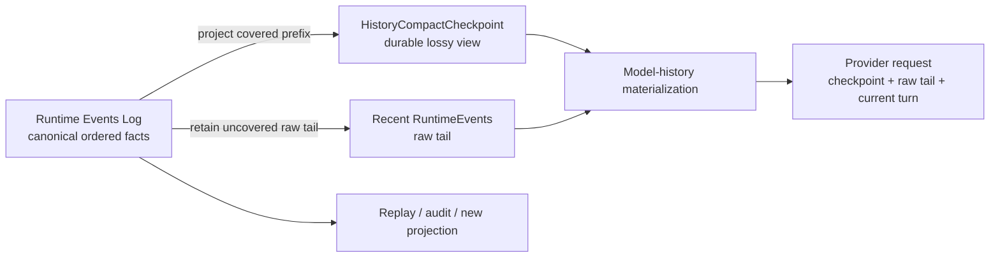
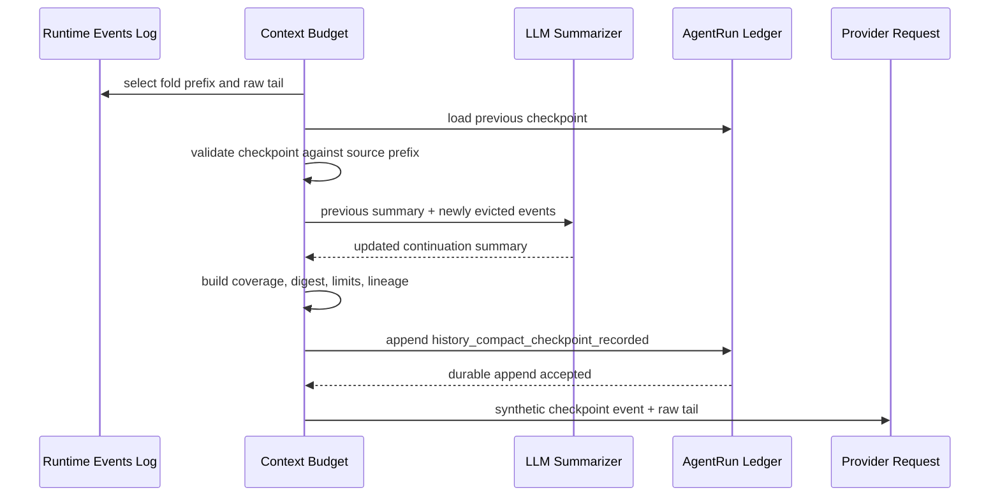
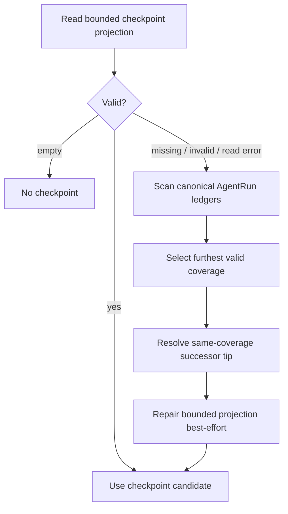

# 第三章：Compaction Is a Projection——Maka 如何让 LLM 忘记而不丢失历史

> 本章回答一个核心问题：当完整 Agent 历史已经大到无法继续放进模型上下文时，Maka 如何缩小 LLM 看到的历史，同时不破坏可以回放、审计和重新投影的事实空间？答案不是“用摘要替换日志”，而是：**把 compaction 定义成 Runtime Events Log 的一个有损投影。日志保存事实，checkpoint 保存一个带覆盖边界的 continuation view，provider request 只消费当下适用的投影。**

本文承接第一章的 log-first Runtime，也承接第二章“压缩上下文、不要压缩证据”的区分。本文面向需要修改 history compaction、上下文预算、checkpoint 持久化或恢复链路的 Runtime 工程师。读完前半部分，读者应该能建立正确心智模型；读完整章，应该能定位 V2 checkpoint 的生成、校验、滚动更新、回放与故障恢复路径。

本文主要讨论 **prior-history LLM compaction**：由 LLM 生成 `HistoryCompactCheckpoint.summary`，覆盖若干旧 RuntimeEvents，并在以后请求中替代该前缀。它不完整展开单个 Tool Result 的 active/stale prune，也不把当前 Turn 内的 `semanticCompact` 当作同一机制。二者都会缩小 provider messages，但 durable source、生命周期和安全边界不同，后文会专门区分。

本文描述截至 2026-07-12 的当前实现。V1 artifact-backed `HistoryCompactBlock` 仍作为只读兼容路径存在；V2 ledger-backed `HistoryCompactCheckpoint` 是首选主路径。

## 从一个长期会话开始

假设用户和 Maka 连续工作了两小时：

1. 先阅读项目结构；
2. 运行测试并得到大量输出；
3. 修改几个文件；
4. 讨论一个错误方向并回退；
5. 完成第一轮修复；
6. 又要求继续处理下一个失败案例。

完整 Runtime Events Log 也许有几千条事实。它们仍然有价值：某个精确命令、模型当时看到的 tool result、用户曾经强调的约束，以及一条被误判但后来可能重新有用的线索，都属于真实历史。

但下一次模型调用不需要、也未必能够重新读取全部历史。它真正需要的是：

- 当前目标是什么；
- 已完成什么；
- 哪些决策不能推翻；
- 当前文件与运行状态怎样；
- 接下来应该做什么；
- 如果摘要不够，去哪里找原始事实。

最危险的实现是把这两种需求混成同一件事：生成一段摘要，然后删除或覆盖原始事件。这样做短期看节省上下文，长期却让摘要变成无法核验的第二真相。模型漏掉一条约束、错误概括一次工具结果，系统就再也没有稳定来源纠正它。

Maka 的问题因此不是：

> 怎样把一段聊天压缩得更短？

而是：

> 怎样在保留完整事件事实的前提下，为下一次模型决策计算一个更小的 continuation view？

## 先说结论：Compaction 不是 mutation，而是 projection

Maka 的核心关系可以写成：

```text
Canonical history = RuntimeEvents[0..n]

Compact checkpoint = Project(
  RuntimeEvents[0..k],
  compaction policy,
  summarizer
)

Next model context = Materialize(
  compact checkpoint,
  RuntimeEvents[k+1..n],
  provider capabilities,
  current context budget
)
```

这里有三个不可互换的对象：

| 层 | 保存什么 | 是否是事实源 | 是否允许丢失细节 |
|---|---|---|---|
| Runtime Events Log | 用户、模型、工具与 Runtime 已经发生的语义事实 | 是 | 否 |
| History Compact Checkpoint | 一段已校验事件前缀的 continuation summary 与覆盖信息 | 否，是 durable projection | 是 |
| Provider Request Messages | 本次 LLM 调用实际消费的工作上下文 | 否，是 ephemeral projection | 是 |



这张图从左向右读。左侧的日志不会因为 compaction 成功而被改写；中间 checkpoint 与 raw tail 共同形成下一次请求的历史前缀。右下角说明同一日志仍可被调试器、历史搜索或未来的新 compactor 重新消费。图中省略了 system prompt、tool schema 和当前用户消息，它们同样参与最终 request，但不是 history compaction 的 source coverage。

用数据库语言说，checkpoint 更接近一个 materialized view 或 snapshot，而不是 WAL truncation。它可以加速读取，可以有版本，可以失效，也可以从 source log 重建；它不能反过来宣布 source log 不再重要。

## 为什么“摘要”这个词不够准确

普通摘要只有 text。安全的 compaction projection 至少还需要回答：

- 它覆盖哪一个 Session？
- 它覆盖多少条有序 RuntimeEvents、多少个 Turn？
- 覆盖前缀结束在哪个 `runId / turnId / runtimeEventId`？
- 这些源事件的 digest 是什么？
- 它由哪一个 high-water decision 产生？
- 它是否是上一 checkpoint 的合法 successor？
- 它在当前 token policy 下仍然能否进入 prompt？

所以，Maka 持久化的不是一个裸字符串，而是 `HistoryCompactCheckpoint`：

```text
HistoryCompactCheckpoint
  identity
    checkpointId
    sessionId
    createdAt
  high water
    highWaterName
    highWaterSeq
  coverage
    eventCount
    turnCount
    through { runId, turnId, runtimeEventId }
    sourceDigest
  projection
    summary
    limitations
    estimatedTokens
  lineage
    previousCheckpointId?
```

`summary` 是模型以后看到的主要内容，但 `coverage` 决定它有没有资格替代一段历史。没有 coverage 的摘要只是笔记；没有 source digest 的摘要无法证明自己仍对应当前日志；没有 replay budget 校验的摘要可能比它替代的工作集更不适合当前请求。

## Current：完整请求仍从 RuntimeEvents 开始

每次普通 Send 的 prior-history 路径从 `AiSdkBackend.buildPriorMessages()` 开始。它不会先读取上次已经拼好的 provider messages，而是优先接收此前 Run 的 RuntimeEvents，再执行一条投影流水线：

1. 排除当前 `turnId`，得到 prior Runtime context；
2. 准备 context budget policy；
3. 加载最新 V2 checkpoint，必要时才回退到 V1 blocks；
4. 先处理 stale oversized tool results；
5. 计算 history compact 的 high-water 与 retained tail；
6. 校验已有 checkpoint 是否恰好匹配 source prefix；
7. 如果旧 checkpoint 不足以覆盖新的 fold，调用 LLM 滚动生成 successor；
8. 把 checkpoint 临时物化成 synthetic RuntimeEvent，并拼接未覆盖 raw tail；
9. 在需要时做 history search、archive retrieval 或 synthesis cache；
10. 建立 provider replay plan，最后才物化成 `ModelMessage[]`。

这条顺序说明两件事。

第一，compaction 发生在 **model-history projection** 内，而不是 RuntimeEvent append path 内。模型和工具已经产生的事件不会因为以后预算变化而改变。

第二，checkpoint 也不是最终 provider message。它先被转换成一个 `role=user, author=system` 的 synthetic RuntimeEvent，再经过与其他事件相同的 replay planning 与 provider capability gate。synthetic event 只存在于当前投影，不会伪装成原始交互事件写回 RuntimeEvent ledger。

## 什么时候触发：High water 决定是否投影

自动 history compaction 由 `ContextBudgetPolicy` 驱动。当前默认策略会：

- 根据所选模型 context window 计算 prior-history budget，并默认预留 16,384 tokens；
- 无法得到 context window 时，多数 provider 使用 32,000 tokens 的默认 history budget；
- 当可 compact 的历史估算超过 `maxHistoryEstimatedTokens × highWaterRatio` 时进入 compaction；
- 默认 `highWaterRatio = 1`；
- 默认希望保留不超过 16,384 estimated tokens 的 raw tail；
- 请求至少保留 3 个最近 Turn，但 tail selection 以 token cap 为先，极大 Turn 可能使实际保留更少；
- 单个 checkpoint 默认最多 1,024 estimated tokens，compact projection 总预算默认最多 2,048。

这些数字是当前默认 policy，不是协议常量。环境变量和模型 metadata 可以改变它们。真正稳定的是触发语义：

```text
source log grows past high water
  → select an older prefix to fold
  → preserve a recent raw tail
  → accept projection only if checkpoint + tail fits current limits
```

Tail selection 按完整 Turn 从新到旧选择，避免把普通 tool call/result pair 从中间劈开。如果单个最新 Turn 本身已经超过 tail budget，当前实现会退而保留该 Turn 中最新的完整 function call/response pair；找不到 pair 时至少保留最后一条事件。

这是一条重要边界：`minRecentTurns` 是期望，不是允许突破上下文上限的承诺。

## LLM 在这里做什么，也不做什么

LLM compaction 的任务是生成一份“让另一个 LLM 继续工作”的结构化 summary。当前 summarizer prompt 要求保留：

- Goal；
- Done 与 In Progress；
- Key Decisions；
- Next Steps；
- Critical Context，包括精确路径、函数名、命令、结果和错误。

Summarizer 会看到被新折叠的用户/模型文本与 tool call/result。Thinking 被有意排除。桌面端复用当前 Session 的 connection 和 model，并把 summary output cap 设为 4,096 tokens；checkpoint builder 随后还会按当前 compact policy 对最终 model-visible summary 再做 bounded rendering。

但是 LLM 不决定以下事实：

- 哪些 RuntimeEvents 属于 covered prefix；
- source digest 是什么；
- checkpoint 是否能替代当前日志；
- 哪些 raw tail 必须保留；
- checkpoint 是否已 durable；
- 当前 provider request 是否仍允许使用它。

这些都由 deterministic Runtime code 决定。

因此，LLM 是 projection value 的生成器，不是 projection authority。它负责“怎样概括”；Runtime 负责“概括了什么、能否使用、何时失效”。

## Rolling checkpoint：不要反复总结整个世界

长期 Session 会多次越过 high water。如果每次都把所有旧事件重新发送给 summarizer，compaction 自身会变成越来越昂贵的请求，也会让旧事实被反复改写。

V2 使用 rolling checkpoint：

```text
Checkpoint N
  summary = S(events[0..k])

Newly evicted events = events[k+1..m]

Checkpoint N+1
  summary = S(Checkpoint N.summary, events[k+1..m])
  coverage = events[0..m]
  previousCheckpointId = Checkpoint N.checkpointId
```

Summarizer 只接收 previous summary 和 newly folded events；已经被 previous checkpoint 覆盖的 raw events 不会再次发送给 LLM。新 checkpoint 则重新对完整 covered prefix 计算 coverage 和 `sourceDigest`。



这张图从上向下读，关键提交点是 `history_compact_checkpoint_recorded`。新 summary 只有在 durable recorder 成功之后，才会作为 replacement checkpoint 进入同一次 provider request。图中省略了 V1 artifact compatibility 与后续 replay-plan materialization。

Rolling 并不意味着 summary 永远只进不退。同一 coverage 可以被明确重写，但 candidate 必须把当前 checkpoint 放在 `previousCheckpointId`，并保持相同 source digest、through boundary 与 Turn/Event 计数。这相当于对同一 materialized view 做 compare-and-swap，而不是让任意迟到写入覆盖它。

## Coverage 为什么必须是“有序前缀”

Checkpoint 不是对任意事件集合的搜索摘要。它覆盖的是 compactable RuntimeEvents 的一个有序前缀。

前缀约束带来三个好处：

1. replay 很简单：`checkpoint + uncovered raw suffix`；
2. high-water 只向前推进，容易比较谁覆盖得更远；
3. rolling update 可以明确知道哪些事件是 newly folded。

`matchHistoryCompactCheckpointPrefix()` 会检查：

- event count 是否足够；
- covered prefix 的最后一条 `runId / turnId / runtimeEventId` 是否匹配；
- 按稳定序列化计算的 SHA-256 digest 是否完全相同。

任何一项失败，都不能把 checkpoint 当成当前 source prefix 的替代物。系统会记录 `coverage_miss` 或 `source_hash_mismatch`，而不是“看起来像同一段历史”就继续使用。

这也解释了为什么 checkpoint ID 不能单独充当真实性证明。ID 标识一个 projection；source coverage 才建立它和 canonical log 的关系。

## Durable projection 也记录在 log 中

这里存在两种相关但不能混同的日志：

- `RuntimeEvent` ledger 保存模型交互与 Runtime 语义事实，是 compaction 的 source；
- `AgentRunEvent` ledger 保存 Run 级运行事实，其中 `history_compact_checkpoint_recorded` 记录一个已接受的 checkpoint。

换句话说，**projection 本身也以事件形式持久化**。这不是循环定义：checkpoint event 不是被它覆盖的 source event，它记录的是“在某次 Run 中，系统接受了这个 projection”。原始 RuntimeEvents 仍然独立存在。

AgentRunStore 还维护一个 bounded event projection，用于快速找到最近 checkpoint。写入顺序刻意遵守：

```text
append canonical AgentRunEvent
  → then update bounded checkpoint projection
```

如果 canonical append 失败，projection 不得保留。如果 projection 更新失败，canonical event 已经 durable，冷启动时可以从 Run ledgers 恢复。

这正是 log-first 系统常见的规则：索引可以缺失，事实提交不能由索引假装完成。

## 冷启动恢复：Projection 坏了就从 Log 重建

读取最新 checkpoint 时，Runtime 先尝试 bounded projection，避免每次枚举所有 Run ledger。

如果 projection 未初始化、格式无效或读取失败，恢复路径会扫描 Session 下的 AgentRun events：

1. 找出所有 schema-valid `history_compact_checkpoint_recorded`；
2. 优先选择 `coverage.eventCount` 最大的 checkpoint，而不是时间最新但 coverage 更旧的写入；
3. 对相同 coverage，沿合法 `previousCheckpointId` successor chain 找到 tip；
4. 再以 event timestamp 和 ID 解决剩余并列；
5. best-effort 修复 bounded projection。



这张图解释 checkpoint lookup 的恢复关系，不代表 RuntimeEvent ledger 本身需要修复。Projection repair 失败不会让已经选出的 checkpoint 失去来源；但如果 canonical ledger 也无法读取，系统不会凭损坏缓存继续猜测。

## Replay：Checkpoint 必须再次接受当前 policy 审判

一个曾经合法的 checkpoint 不保证永远适合所有请求。模型可能切换，context window 可能变小，operator 也可能收紧 `maxBlockEstimatedTokens` 或 `maxEstimatedTokens`。

`evaluateHistoryCompactCheckpointReplay()` 是 checkpoint 进入模型历史的统一 policy gate。它重新计算 model-visible checkpoint tokens，并检查：

- checkpoint 自身不超过单 block 上限；
- checkpoint 不超过 compact projection 总上限；
- checkpoint 与 replay tail 合计不超过当前 history budget。

只有 source match 与 current-policy fit 同时成立，projection 才能 replay。

Replay 时，covered raw prefix 不进入 provider request；未覆盖的 folded suffix 与 retained recent events 继续以 raw RuntimeEvents 存在。于是模型看到的是：

```text
<maka_history_compact_checkpoint ...>
  summary: ...
  coverage: ...
  limitations: ...
</maka_history_compact_checkpoint>

+ uncovered raw events
+ recent raw tail
+ current user turn
```

Checkpoint 的 `limitations` 会明确提醒：它只是 covered RuntimeEvent prefix 的 replay-time summary；精确措辞仍应回到 RuntimeEvent ledger。

## Failure semantics：宁可少看，也不要看一份假历史

Compaction 跨越 token estimation、LLM call、schema construction、durable append、source matching 和 provider replay，失败是正常路径而不是异常想象。

| 失败位置 | 当前行为 | 不允许发生的事 |
|---|---|---|
| 未超过 high water | 保持原投影或普通预算裁剪 | 为了“提前优化”制造无来源摘要 |
| LLM 返回空 summary | 不记录新 checkpoint；初次 compact 只保留安全 raw tail | 把空 projection 当作 covered history |
| Rolling summarizer 失败 | 若旧 checkpoint 仍匹配且符合当前限制，则复用它并拼接能容纳的最新完整 raw Turns | 假装旧 checkpoint 已覆盖 newly evicted events |
| Durable checkpoint append 失败 | 不使用 candidate；回退旧 checkpoint 或安全 tail | 让未提交 projection 进入模型后再声称可恢复 |
| Prefix 或 digest 不匹配 | 拒绝 checkpoint | 用近似匹配替代 canonical events |
| Checkpoint 超出当前 budget | 不 replay 它 | 因为过去接受过就绕过当前 policy |
| Bounded projection 损坏 | 从 canonical AgentRun ledger 恢复并修复 projection | 把缓存当成唯一事实源 |
| 用户停止 manual compaction | 中止 summarizer/write 链路，不污染下一 Turn | 让迟到结果写入或复用 abort state |

这里的 fail-open 不是“无论如何发送完整历史”。当历史已经超过模型预算时，完整 raw prefix 本身可能不可发送。V2 初次 summary 失败会保留 bounded raw tail，并写入一次可见的 `context_compaction_failed_open` note；rolling failure 可以复用旧 checkpoint，但绝不会扩大它的 coverage claim。

正确理解是：

> Fail open to a safe source-derived context, not to an invented summary.

模型可能暂时少看到一些旧细节，但 source log 没有丢。以后可以重新 compact、history search、读取 archive，或在不同 policy 下生成新 projection。

## Manual compaction 也是一次 Runtime operation

桌面端 `sessions:compact` 不会偷偷修改数据库。它创建一个新的 Turn/Run，通过 `RuntimeKernel.compactSession()` 执行 backend compaction：

- 有普通 Turn 正在运行时拒绝启动，避免并发 high-water 写入；
- 受统一 stop lifecycle 控制；
- 不写一条伪造的 user chat message；
- 成功或 fail-open diagnostics 进入 token-usage Runtime fact；
- Run 最终以正常 terminal event 与 completed/cancelled 状态收尾；
- 新 checkpoint 仍通过同一 `history_compact_checkpoint_recorded` durable path 提交。

Manual policy 把 high-water 降到接近零并把 retained tail 目标降到最小，使小历史也能主动产生 projection。它改变触发条件，不改变 source、coverage、durability 和 replay invariants。

## V1 到 V2：从“为每条来源复制 artifact”回到 bounded checkpoint

旧 V1 `HistoryCompactBlock` 为每条 folded RuntimeEvent 保存 `sourceRefs`，还可以为每个 source event 创建独立 artifact。它的优点是 provenance 显式，但真实长 Session 中 block JSON 会随 event count 线性膨胀，甚至达到数 MB；projection 自身不再 bounded。

V2 `HistoryCompactCheckpoint` 改成固定大小的 prefix metadata：event/Turn count、through boundary 和一个覆盖完整有序前缀的 digest。原始 RuntimeEvents 已经在 canonical ledger 中，不必为了证明来源再复制一份 fan-out JSON。

当前状态是：

- V2 checkpoint 优先从 AgentRun ledger 与 bounded projection 加载；
- V1 artifact blocks 只作为兼容 fallback 读取；
- 当 V2 checkpoint 已验证覆盖同一前缀时，Runtime 可以校验并回收对应 legacy block/source artifacts；
- cleanup 是 reclaim-only，失败不影响 replay。

这次演进不是减少 provenance，而是把 provenance 放回正确层次：source facts 由 RuntimeEvent ledger 保存，checkpoint 只保存验证 source prefix 所需的 bounded identity。

## 不要把三种“compact”混成一个功能

Maka 当前至少有三类上下文缩减：

| 机制 | Source | 发生时机 | Durable result | 本章定位 |
|---|---|---|---|---|
| History LLM compaction | 旧 RuntimeEvent prefix | Turn 之间、构建 prior history 时 | V2 checkpoint 记录进 AgentRun event ledger | 本章主体 |
| Active Tool Result Prune | 当前 Turn 的 provider-visible tool result | 同一 Turn 的下一 step 前 | raw result 先归档；placeholder 只改当前 messages | 第二章主体 |
| `semanticCompact` | 当前 active-loop messages，加可用的 Turn RuntimeEvent refs | `prepareStep` | `SemanticCompactBlock` 是 best-effort diagnostic record；accepted messages 保存在当前 backend projection | 相邻机制，不等同于 V2 checkpoint |

它们共享“不要修改 canonical source”的方向，但保证强度不同。

尤其是当前 `semanticCompact`：它会用 LLM 对 active provider-message span 生成结构化 summary，校验 coverage 与 savings，并在后续 AI SDK steps 复用 accepted projection；但其 source index 可以依赖 invocation-local `ModelMessage`，block recorder 失败也不会撤销已经接受的 provider projection。因此它不是 V2 history checkpoint 那种“durable append 成功后才进入 replay”的同一协议。

如果未来要把所有 LLM compaction 统一到“Events Log projection”模型，关键不是复用一个 summary prompt，而是让 active-loop source 也获得完整、稳定、可验证的 event coverage 与明确的 durability contract。这是架构方向，不应被描述成当前已经完成。

## Compaction 不是什么

### 它不是 Memory

Checkpoint 为继续当前 Session 服务，覆盖的是一段具体事件前缀。长期用户偏好、跨 Session 知识和显式 memory policy 属于不同系统。

### 它不是删除历史

Covered RuntimeEvents 只从本次 provider working set 中消失，不从 canonical ledger 中删除。

### 它不是语义无损编码

Summary 天生有损。Coverage digest 可以证明“它声称覆盖的是哪段 source”，不能证明自然语言 summary 没有遗漏或误解。

### 它不是 bit-exact replay

Checkpoint 没有完整快照 summarizer 模型实现、system prompt、tool schema、provider options 和所有 request bytes。相同 RuntimeEvents 可以重建语义来源，但不保证重新生成逐字相同 summary。

### 它不是官方结论

LLM 在 summary 中写“测试已通过”仍然只是对 source events 的概括。官方 verifier、tool result 和 terminal fact 的 authority 不会因为进入 checkpoint 而升级或降级。

## 当前必须保护的架构不变量

任何修改 history compaction 的实现，都必须保护以下不变量：

1. **Source immutability**：compaction 不修改或删除 canonical RuntimeEvents。
2. **Projection coverage**：每个 checkpoint 都绑定一个有序 source prefix、through boundary 和 digest。
3. **No durability, no replacement**：新 V2 checkpoint 未 durable append 时，不得作为 accepted replacement replay。
4. **Monotonic high water**：新 checkpoint 通常必须覆盖更多 events；同 coverage rewrite 必须是显式 successor。
5. **Current-policy validation**：历史上合法不代表当前 request 可以使用。
6. **Raw recent tail**：模型始终获得当前预算允许的最新 source-derived raw context。
7. **No false coverage**：rolling failure 不得让旧 summary 声称覆盖新 events。
8. **Projection is rebuildable**：bounded cache/projection 损坏时，可以从 canonical ledger 恢复。
9. **Failure is observable**：skip、fail-open、coverage mismatch 和 token decision 必须进入 diagnostics。
10. **Authority is preserved**：summary 不改变 source event、tool evidence、verifier 或 terminal result 的权威等级。

这十条比某个 prompt 模板或 token 默认值更稳定。Prompt 可以升级，模型可以切换，checkpoint schema 也可以演进；只要这些不变量仍成立，compaction 就仍然是 projection，而不是隐蔽的数据破坏。

## 代价与仍然存在的边界

这种设计的成本是真实的。

第一，存储不会因为 prompt 变短而立刻缩小。Maka 选择保留 source log，把节省目标放在推理上下文而不是事实存储。

第二，系统需要维护 coverage、digest、lineage、policy gate、recovery projection 与 diagnostics。一个裸 summary 实现更短，但无法提供相同的可审计性。

第三，当前 V2 checkpoint 只验证 source identity、shape 与预算，不验证 summary 的语义完备性。非空、bounded、结构清晰不等于内容正确。未来如果引入 summary quality gate，应当使用 source-bearing checks，并把 validator 结果作为 projection metadata，而不是把 validator 变成新的事实源。

第四，V2 checkpoint 当前没有完整记录 summarizer model identity、prompt version 或 request-shape hash。它足以安全 replay 已接受 projection，却不足以承诺确定性再生成。若未来需要比较 compactor 版本、做离线回归或解释摘要漂移，这些字段值得进入明确版本化的 projection manifest。

第五，rolling summary 会积累有损误差。原始日志仍然允许重新从更早 high water 生成新 projection，但当前主路径优先增量更新以控制成本。什么时候触发 full re-compaction，应由质量信号而不是任意时间间隔决定。

## 代码地图与验证入口

当前实现可以从以下位置阅读：

1. `packages/runtime/src/context-budget.ts`：high-water、prefix/tail selection、checkpoint replay 与 policy gate；
2. `packages/runtime/src/history-compact-checkpoint.ts`：V2 schema、digest、prefix match、lineage 与 synthetic RuntimeEvent；
3. `packages/runtime/src/history-compact-summarizer.ts`：LLM continuation-summary prompt 与 rolling input；
4. `packages/runtime/src/ai-sdk-backend.ts`：请求投影主链、manual compact、write/fallback 语义；
5. `packages/runtime/src/agent-run.ts`：`history_compact_checkpoint_recorded` durable event；
6. `packages/runtime/src/history-compact-ledger.ts`：bounded projection lookup、ledger recovery 与 checkpoint selection；
7. `packages/runtime/src/runtime-kernel.ts`：checkpoint write serialization、cache 与 legacy cleanup 调度；
8. `packages/storage/src/agent-run-store.ts`：canonical append 与 bounded event projection 的提交顺序；
9. `packages/runtime/src/history-compact-artifacts.ts`：V1 artifact-backed compatibility path；
10. `packages/runtime/src/history-compact-cleanup.ts`：V2 覆盖验证后的 legacy reclaim；
11. `packages/runtime/src/context-budget-policy.ts`：默认预算、环境开关与 manual lookup overlay；
12. `apps/desktop/src/main/main.ts`：桌面端 model/summarizer 与 IPC wiring。

重点测试包括：

- `history-compact-checkpoint.test.ts`：10K event bounded coverage、prefix digest、ledger recovery、policy replay；
- `history-compact-summarizer.test.ts`：tool-bearing summary input、failure 与 rolling update；
- `context-budget.test.ts`：high-water、tail cap、tool pair preservation、archive gate 与 loaded block；
- `ai-sdk-backend.test.ts`：same-request replacement、V2 reuse、fail-open、manual compact 与 V1 fallback；
- `session-manager.test.ts`：manual compaction 的 Run lifecycle、stop 与 concurrency；
- `agent-run-store.test.ts`：canonical event 和 bounded projection 的原子顺序与 repair safety。

## 总结

Maka 的 LLM compaction 不是一次对 conversation table 的 destructive rewrite。它是一条从 canonical Runtime Events Log 出发的投影链：

```text
RuntimeEvent prefix
  → deterministic coverage and high-water selection
  → LLM continuation summary
  → durable HistoryCompactCheckpoint event
  → source/digest/current-policy validation
  → synthetic checkpoint RuntimeEvent + raw recent tail
  → provider-specific ModelMessage projection
```

这条链的精妙之处不在于 LLM 能写出多漂亮的摘要，而在于系统从未把摘要误认为历史本身。

日志回答“发生过什么”；checkpoint 回答“在这个 high water 上，下一次推理可以怎样继续”；provider request 回答“这个模型在这一次调用里实际需要看到什么”。三者各自有不同生命周期，也各自有明确的 authority。

所以，**compaction is the Events Log's projection** 不只是一句设计口号。它具体意味着：source 不可被摘要覆盖，projection 必须带 coverage，accepted replacement 必须 durable，replay 必须重新通过当前 policy，而任何 projection 都应该能够被丢弃、校验或从日志重建。
