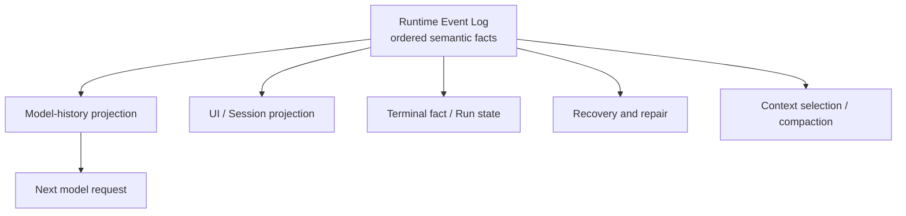
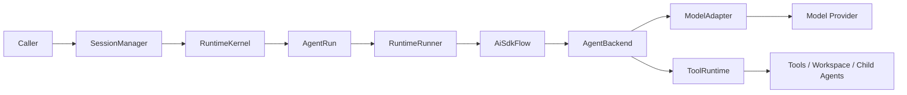
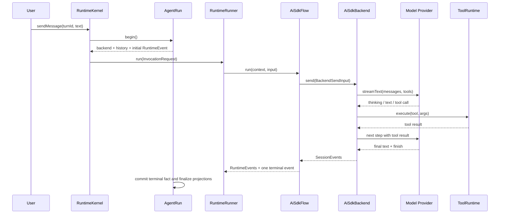

# Chapter 1: Log Is the Runtime—Replaying an Agent's State Space

> This chapter answers one question: how does Maka preserve the state space an agent execution actually traversed, then recover it in the next turn, after a process restart, or through a new projection? The answer is the Runtime Event Log. The model loop produces facts; the Event Log preserves them; Sessions, Runs, the UI, model context, and recovery are consumers or projections of that log.

This chapter is for engineers entering the Maka Runtime for the first time and maintainers changing its main execution path. The first half should give you a working map of the runtime boundaries. By the end, you should be able to locate the main implementation and understand the invariants that changes to termination, tools, or persistence must preserve.

The chapter describes the implementation on the production path as verified on 2026-07-12. Phase plans in historical design documents are not treated as current behavior.

## Start with a deceptively simple request

Suppose a user asks Maka:

> Find the failing tests in this project, fix the problem, and run the tests again.

In a chat application, the path might be only three steps: send text to a model, wait, and display the reply. An agent execution looks more like this:

1. The model inspects the project and test output.
2. It calls file, search, or terminal tools.
3. A tool may require user approval, temporarily parking execution.
4. A tool may stream output, fail, time out, or be cancelled.
5. The result goes back to the model, which chooses the next step.
6. The model-to-tool-to-model cycle may repeat many times.
7. The system must eventually decide whether the execution completed, failed, or was stopped by the user.

Meanwhile, the UI needs live text and tool activity. The next model turn needs trustworthy history. After a process crash, the session must not remain “running” forever. After the user presses Stop, a late provider event must not rewrite the result to “completed.”

The Runtime therefore solves a broader problem than calling an LLM API:

> It records an open-ended loop containing streams, tool side effects, user intervention, and process failure as a fact history that can be interpreted and replayed again.

## The conclusion first: state is a function of the log

The central design decision in the Maka Runtime is not its choice of model SDK or the number of layers in its execution path. It is this:

> **The Runtime Event Log is the semantic source of truth for agent interaction. System state at a point in time is a projection over that ordered log.**

The relationship can be written simply:

```text
State(t) = Project(RuntimeEvents[0..t], policy, runtime configuration)
```

Different consumers can interpret the same log into different forms of state:

- the Model History Projector builds the messages needed by the next model call;
- the Runtime Read Model builds the conversation, tool activity, and Turn state shown by the UI;
- the Terminal Fact Classifier determines the outcome of a Run;
- recovery determines which facts were durable before the process exited;
- context-budget and compaction policies build a smaller working context while preserving required semantics;
- a future debugger can stop at any event boundary and inspect the agent state space at that point.



Read this diagram from the center. The `Runtime Event Log` contains stable facts; every other node is a derived view that may evolve, be rebuilt, or be replaced. The event-production path is intentionally omitted and introduced later.

This differs fundamentally from an application log. An application log usually describes what the code did after business logic ran and primarily helps humans diagnose it. A RuntimeEvent is itself part of the business semantics. User messages, model responses, thinking, function calls, function responses, permission actions, usage, and terminal status enter the log as strongly typed facts. Remove the log, and the system loses the reliable basis for reconstructing interaction state.

## What one RuntimeEvent preserves

`RuntimeEvent` is more than `role + text`. It separates a fact into orthogonal dimensions:

| Dimension | Key fields | Meaning |
|---|---|---|
| Identity | `sessionId`, `invocationId`, `runId`, `turnId`, `branch` | Which conversation, call, execution attempt, and branch owns the fact |
| Ordering | `id`, `ts`, and ledger order | The fact's position in causal history |
| Source | `role`, `author` | Its lane in model history and the subsystem that produced it |
| Content | text, thinking, function call/response, error | The semantic content of the AI interaction |
| Actions | state delta, permission, artifact, usage, end invocation | The control-state change or side effect the Runtime must record |
| Correlation | tool call, provider event, step, and artifact refs | How the same operation is paired across subsystems |
| Lifecycle | `partial`, `status` | Whether it is a replaceable stream fragment, a durable fact, or a terminal fact |

This preserves the original semantics of model interaction rather than a UI-formatted transcript. In particular:

- thinking may carry a provider-required signature;
- tool calls and results are paired by stable IDs;
- a tool call can point to its assistant step;
- permission requests and decisions are actions, not text pretending to be chat;
- a terminal event closes an Invocation explicitly instead of relying on whether the last message looks like an answer.

Model history therefore does not need to reverse-engineer the UI transcript. It can select non-partial, model-visible RuntimeEvents, preserve their order, and materialize text-only or provider-native messages according to provider capabilities. The UI is likewise a projection rather than the source of truth.

## What “replaying the state space” means

Replay has three levels that should be distinguished precisely.

### Semantic replay: implemented today

Given a RuntimeEvent ledger, Maka can reconstruct user and model text, thinking, tool calls and results, permission actions, usage, and terminal facts. The next model history and the completed Session read model already prefer this ledger.

This lets the system answer: before a given event boundary, which interactions had the model seen? Which tools had it called? What had they returned? Which permissions had been requested or decided? Had the Invocation ended?

### Provider-native replay: capability-gated

Providers impose different requirements on tool history and signed thinking. Maka does not blindly feed every event back to every model. It first builds a replay plan that checks partials, tool call/result pairing, step IDs, thinking signatures, and provider support, then chooses provider-native replay, text-only replay, or an explicit degradation path.

Replay does not mean “send the JSONL unchanged to any model.” It means preserving facts rich enough for a projector to produce valid history for a particular provider while reporting any semantic loss.

### Bit-exact wire replay: not implied by the message log alone

RuntimeEvents preserve canonical message semantics for AI interaction, but they are not a full byte-level snapshot of every provider HTTP request. The system prompt, tool schemas, provider options, model implementation version, and context-selection or compaction policy still participate in the final request. The current system records some identities, diagnostics, and hashes for these inputs, but it does not copy the entire wire request into the RuntimeEvent ledger.

“State-space replay” in this chapter therefore means reconstructing interaction semantics and Runtime state first. A future promise of bit-exact deterministic replay would also require versioning or snapshotting runtime configuration, prompts, the tool catalog, projection policy, and provider request shape. This does not weaken the Event Log; it clarifies why the log is the correct foundation. Message facts remain stable while request materialization can evolve independently.

## Two lines of intellectual influence

The design has two explicit conceptual roots.

The first is Google ADK. ADK treats a Session as a fact container with a chronological sequence of Events. An Event carries content, author, invocation identity, partial state, and actions; Session state is updated from event state deltas, while working model context is selected and transformed from event history. Maka borrows the deeper principle rather than merely a similar field layout: **Session history is fact; working context is a computed projection.**

The second is the log-first tradition in distributed data systems. Database WALs, replicated logs, event sourcing, and Kafka share an intuition: do not let every downstream view become an independent truth. Preserve ordered, unambiguous change facts first, then let consumers rebuild their state. If order and commit boundaries are trustworthy, caches, indexes, search views, and even partially damaged state tables can be regenerated.

Maka is not implementing Kafka inside one process, nor does it claim that RuntimeEventStore is a distributed consensus log. The borrowed principle is more fundamental:

> **Log is the source of truth; state is a materialized view.**

That principle directly explains the most important terminal invariant later in this chapter: a Run header cannot declare completion on its own; a terminal RuntimeEvent must support it.

## Four identities that should not be collapsed

Before following the main path, separate four concepts that are often used interchangeably in casual discussion.

| Concept | Question it answers | Identity in the current implementation |
|---|---|---|
| Session | Which long-lived interaction owns these conversations and executions? | `sessionId` |
| Turn | Which user-visible exchange is this? | `turnId` |
| Run | Which concrete execution attempt is this, and what is its state? | `runId` / `AgentRun` |
| Invocation | What is the standard start-to-terminal boundary of one Flow call? | `invocationId` / `RuntimeRunner` |

On the default production path today, `AgentRun` creates a `runId` first and passes the same value to `RuntimeRunner` as the `invocationId`. The IDs are therefore usually equal, but the concepts remain distinct. A Run is a durable execution entity. An Invocation is the call boundary standardized by the Runner. Keeping both concepts leaves room for retries, scheduling, or multiple attempts without redefining the event protocol.

The key distinction is simple: **a Turn is not a Run, and chat messages are not execution state.** A user-visible exchange needs a system-visible execution envelope. Without one, the system can only say that some messages appeared; it cannot reliably say whether the execution actually ended.

## The execution path around the Event Log

The interactive and generic Headless paths currently share this runtime spine:



Read the diagram from left to right. The left side is closer to product entry points and long-lived Sessions. The right side is closer to one provider request and concrete tool side effects. Persistence projections and ledgers are omitted here and introduced separately below.

These layers do more than split a large function. More precisely, they divide responsibility for producing, normalizing, committing, and consuming the Event Log. Each protects a different kind of stability.

### `SessionManager`: the stable product entry point

`SessionManager.sendMessage()` is the public facade. It is now deliberately thin: public Session operations remain here, while execution is delegated to `RuntimeKernel.startTurn()`.

Desktop, CLI, bot, and Headless callers therefore do not need to understand the Run ledger, Flow, or terminal facts. Runtime internals can evolve while callers continue to express one stable operation: send a user message to a Session.

### `RuntimeKernel`: the control plane for active execution

`RuntimeKernel` turns a Session request into an active Run. It is responsible for:

- creating an `AgentRun`;
- creating or reusing the Backend bound to a Session;
- registering active Runs and maintaining the `turnId → runId` mapping;
- routing stop and permission responses to the active Backend;
- assembling `RuntimeRunner` and `AiSdkFlow`;
- persisting the RuntimeEvent before returning the original `SessionEvent` stream to the caller;
- ensuring `AgentRun.finalize()` runs when the Flow finishes.

It is an orchestration boundary, not the model loop. A Backend should not own the set of active Runs for a Session, and a product entry point should not decide whether a terminal RuntimeEvent is durable. The Kernel centralizes this cross-layer coordination.

### `AgentRun`: the durable execution envelope

`AgentRun` gives one execution a durable identity and lifecycle. At startup it:

1. creates an `AgentRunHeader` in `created` state;
2. writes the user message and a `running` Turn projection for a top-level Run;
3. writes the initial user `RuntimeEvent`;
4. locks the Session's connection configuration;
5. ensures a Backend exists and registers the active Run;
6. marks the Run as `running`;
7. builds model history from earlier RuntimeEvent ledgers.

While execution is active, `AgentRun` receives both legacy `SessionEvent`s and canonical `RuntimeEvent`s and writes each to the projection or ledger it belongs to. At the end, it unregisters the active Run, converges Session and Turn state, and commits the final Run state.

Think of `AgentRun` as the durable envelope around an execution. It does not choose which tool the model calls next. It guarantees which execution this is, which facts it produced, and how it ended.

### `RuntimeRunner`: uniform Invocation semantics

`RuntimeRunner` neither calls a provider nor executes a tool. It defines the protocol that every Flow must obey:

- a failed preflight must not start the Flow or pretend that an Invocation was admitted;
- the initial user RuntimeEvent must precede every Flow event;
- the Flow must produce a terminal RuntimeEvent;
- a thrown error, missing terminal event, denied permission, abort, or incomplete finish reason must produce a structured failure;
- a successful result must contain non-empty final model text.

The Runner returns an `InvocationResult` containing the ordered events, status, final output, or failure classification. This turns backend-specific streaming behavior into a stable invocation outcome.

The Runner exposes an injectable preflight gate, but the current production path assembled by `RuntimeKernel` does not inject one. Preflight is therefore an implemented Runner capability, not a separate admission stage on the current desktop path.

### `AiSdkFlow`: the bridge from legacy events to runtime facts

The current model/tool loop still emits renderer-facing `SessionEvent`s through `AgentBackend.send()`. `AiSdkFlow` wraps the Backend and maps each event to a canonical `RuntimeEvent`:

- model text and thinking become model content;
- `tool_start` and `tool_result` become function calls and responses;
- permission requests and decisions become first-class runtime actions;
- token usage becomes a runtime action;
- error, abort, and complete events become explicit failure or terminal facts.

It also enforces a crucial rule: **one Invocation exposes only one accepted terminal RuntimeEvent.** A Backend may emit `abort` followed by `complete(user_stop)` during cancellation. The Flow accepts the first terminal fact and silently drains late events, preventing double termination.

Despite its name, `AiSdkFlow` depends on the `AgentBackend` interface. It can wrap the production `AiSdkBackend` or another conforming Backend. It does not reimplement the model loop; it standardizes event semantics around it.

### `AgentBackend`: where the model/tool loop actually runs

For the default `AiSdkBackend`, the core loop remains inside `send()`. It:

1. resolves the model and prepares the tools visible in this turn;
2. constructs provider messages from RuntimeEvent history and applies context-budget policy;
3. combines the system prompt, current user input, and attachments;
4. starts AI SDK `streamText()` through `ModelAdapter`;
5. consumes text, thinking, step boundaries, finish reasons, and usage;
6. enters `ToolRuntime` when the model issues a tool call;
7. returns the tool result to the next model step;
8. repeats until the model finishes, reaches a limit, errors, or is aborted.

The default step limit is 50. If the model still requests tools at the cap, the Runtime retains the completed tool results and, when no closing text exists, adds a deterministic notice that tells the user how to continue in a new Turn. The UI is not left with an unexplained final tool row.

`ModelAdapter` isolates provider and AI SDK differences: model construction, stream startup, chunk normalization, usage normalization, and error classification. `ToolRuntime` isolates the high-risk side of execution: tool-availability enforcement, permissions, timeout and abort propagation, repeated-failure gating, output, telemetry, and artifact recording.

## How the loop advances

This sequence focuses on a normal execution that includes a tool call. It intentionally omits some telemetry and compatibility projections to show how control moves between the model and tools.



An AI SDK step is the natural beat of this loop. Maka persists assistant text and thinking per step rather than flattening a whole Turn into one final assistant message. Tool calls carry the corresponding step ID, allowing replay to reconstruct the original ordering among thinking, text, and tool calls.

The provider is silent while a tool runs. `ToolRuntime` pauses the model stream's idle watchdog because that silence is expected. Individual tools may still enforce their own timeouts, while an outer Run or evaluation layer remains the final backstop.

## Permission is runtime control flow, not a dialog box

When the model requests a tool that may cause side effects, `ToolRuntime` asks `PermissionEngine` to evaluate the call. The result is one of three kinds:

- **allow**: execute the tool immediately;
- **block**: record the denial and a synthetic tool error without running the implementation;
- **prompt**: emit a permission request, pause the watchdog, and wait for the user.

While waiting, the Session projects `waiting_for_user`, but the Invocation retains its execution identity. The decision is routed through `RuntimeKernel.respondToPermission()` to the active Backend. `ToolRuntime` records the permission decision and either continues execution or returns a denied tool result.

The important point is that permission is not a UI-only pause. Requests and decisions enter the runtime fact model, so replay, diagnostics, and recovery can explain why execution stopped and how control returned.

## One semantic truth, two supporting forms of state

Maka currently maintains three forms of durable data. They are not three equal sources of truth, nor do they store the same chat three times. `RuntimeEventStore` is the canonical semantic log of AI interaction; the other stores carry product projections and operational Run state.

| Store | Main contents | Question it answers best |
|---|---|---|
| `SessionStore` | `StoredMessage`s for users, assistants, tools, and Turn state | What should the UI and compatibility APIs display? What is the current in-flight projection? |
| `AgentRunStore` | `run.json` and operational `events.jsonl` | When did this Run start, what is its state, and at which model or tool stage did it fail? |
| `RuntimeEventStore` | canonical `runtime-events.jsonl` plus bounded partial snapshots | Which semantic facts occurred, and how should other state be rebuilt from them? |

The file-backed implementation organizes these around this layout:

```text
sessions/<sessionId>/
  ... session projection ...
  runs/<runId>/
    run.json
    events.jsonl
    runtime-events.jsonl
    runtime-partials/
```

`AgentRunStore` events act more like an operational index: model stream started, tool started, permission requested, usage recorded. They help diagnose and manage a Run but do not replace the model-interaction log. `RuntimeEventStore` contains the reconstructable semantic facts: user content, model content, function calls and responses, permission actions, and the terminal fact.

For completed Runs with a healthy ledger, reads and the next model replay prefer RuntimeEvents. `SessionStore` remains necessary for compatibility and in-flight projection, but it is no longer the only authority for completed runtime semantics.

Streaming text and thinking deltas are not appended forever to immutable JSONL. The file RuntimeEventStore keeps bounded, replaceable partial snapshots. A final non-partial event supersedes the snapshot. This preserves output that was visible before a crash without turning 10,000 deltas into 10,000 permanent ledger rows.

## The log-first invariant: terminal fact before terminal state

One of the hardest runtime failure classes is disagreement about whether an execution ended. For example:

- `run.json` says completed, but the RuntimeEvent ledger has no terminal event;
- the user stopped the Run, but a late complete event rewrites the Session to active;
- the Backend stream exhausts without saying whether it succeeded or failed;
- the terminal event is durable, but the process crashes before updating the Run header.

Maka protects this core invariant:

> A terminal Run must have exactly one valid terminal RuntimeEvent, and a terminal Run header must be supported by that terminal fact.

`AgentRun` therefore requires the terminal RuntimeEvent to be durable before committing a terminal Run header. A Flow without a terminal event becomes a `missing_terminal_event` failure. Duplicate terminal events are coalesced. Terminal events with a mismatched status, a different Run identity, or `partial: true` are rejected.

If the terminal RuntimeEvent exists but an interrupted header remains `running`, the read model can treat the event as the stronger fact and recovery can repair the header. In the opposite direction, if a header claims termination without a trustworthy terminal fact, the system does not blindly trust the header; it conservatively repairs the Run as a `missing_terminal_event` failure.

This invariant means recovery does not need to guess what the model intended to do next. It only needs to determine which facts are durable and converge all projections on one explainable outcome.

## How stop, errors, and crashes converge

### User stop

`RuntimeKernel.stopSession()` first marks active `AgentRun`s as stopped, then calls Backend `stop()`. `AiSdkBackend` aborts the provider stream, ends permission waits, and emits abort/complete events. Even if a provider later produces a complete or error event, `AiSdkFlow` and `AgentRun` do not allow it to overwrite the established aborted semantics. The stop source, such as the renderer stop button, is retained in the terminal fact and Run header for diagnostics.

### Provider or runtime error

An error is first normalized as non-terminal error content, followed by a failed terminal event that closes the Invocation. `RuntimeRunner` does not allow a later completed event to mask an error it has already observed. If the Backend throws directly or exhausts without a terminal event, the Runner and Flow produce a structured failure instead of leaving a dangling Run.

### Process crash and startup recovery

Startup recovery does not re-execute model requests or tool side effects. It scans non-terminal Runs and RuntimeEvent ledgers, identifies stale model streams, tool tails, permission waits, and corrupt operational events, then conservatively commits failure or cancellation and repairs Session and Turn projections.

This is state repair, not checkpoint resume. The current Runtime can retain partial output, recover a consistent terminal state, and provide the facts needed for future mid-run recovery. It does not automatically continue from the line after an interrupted tool call when the process restarts.

## What this design buys—and what it costs

### Capabilities gained

- Product entry points do not depend on a specific provider or tool-loop implementation.
- Different Backends can share Invocation and terminal semantics.
- UI events and model-replayable facts have explicit, separate roles.
- User stop, permissions, and tool side effects become diagnosable control flow.
- Crash recovery can converge state from durable facts.
- Headless runs, child agents, and future schedulers can reuse the same execution core.

### Current costs

- The migration period contains `SessionEvent`, `StoredMessage`, `RuntimeEvent`, and operational Run events, making event mapping expensive to maintain.
- `AiSdkBackend` remains large and coordinates history, context budgets, tool availability, the step loop, usage, and telemetry.
- `AiSdkFlow` is still a legacy-to-canonical adapter rather than consuming native RuntimeEvents from the Backend.
- `SessionStore` and RuntimeEvent projection must cooperate for active and in-flight reads.
- Startup recovery currently performs deterministic termination and repair, not arbitrary warm resume.
- The Runner's preflight seam exists, but the production Kernel does not yet connect a dedicated Runtime gate.

These are real architecture boundaries, not details to hide. Future Backend decomposition or checkpoint work must preserve request shape, tool visibility, event order, and the terminal invariant before optimizing for smaller files.

## Code-reading map

Read the current implementation in this order:

1. `packages/runtime/src/session-manager.ts`: public and recovery entry points.
2. `packages/runtime/src/runtime-kernel.ts`: active Run/Backend control and main-path assembly.
3. `packages/runtime/src/agent-run.ts`: durable lifecycle, history construction, and terminal commit.
4. `packages/runtime/src/runtime-runner.ts`: Invocation protocol and outcome classification.
5. `packages/runtime/src/ai-sdk-flow.ts`: `SessionEvent → RuntimeEvent` mapping and the single-terminal guarantee.
6. `packages/runtime/src/ai-sdk-backend.ts`: the AI SDK model/tool step loop.
7. `packages/runtime/src/model-adapter.ts`: provider stream adaptation.
8. `packages/runtime/src/tool-runtime.ts`: permissions, tool execution, and side-effect boundaries.
9. `packages/core/src/runtime-event.ts`: the canonical RuntimeEvent contract.
10. `packages/core/src/agent-run.ts` and `packages/storage/src/agent-run-store.ts`: file-backed Run and RuntimeEvent ledgers.

The most relevant tests are:

- `packages/runtime/src/__tests__/runtime-runner.test.ts`
- `packages/runtime/src/__tests__/ai-sdk-flow.test.ts`
- `packages/runtime/src/__tests__/session-manager.test.ts`
- `packages/runtime/src/__tests__/session-manager-terminal-ledger.test.ts`
- `packages/storage/src/__tests__/agent-run-store.test.ts`

## Summary

The core of the Maka Runtime is not one class, nor is it merely the AI SDK's multi-step tool loop. It is a Runtime Event Log that preserves and replays the state space of agent interaction. The execution protocol exists to produce, commit, and project those facts:

```text
model/tool stepping engine
  → canonical RuntimeEvents
  → durable semantic log
  → model history / UI / Run state / recovery projections
```

`SessionManager` stabilizes the entry point. `RuntimeKernel` controls active execution. `AgentRun` commits durable facts. `RuntimeRunner` defines Invocation semantics. `AiSdkFlow` translates Backend events into canonical facts. `AiSdkBackend`, `ModelAdapter`, and `ToolRuntime` advance the model/tool loop itself. They cooperate around the Runtime Event Log instead of each retaining a private local truth.

Together, these boundaries protect a simple promise: regardless of how many model steps, tool side effects, permission waits, and failures an agent task encounters, Maka first records what actually happened. As long as that ordered fact history remains, the system can reconstruct the interaction state, materialize new views, and let the next turn continue from trustworthy history.

## Further reading

- [Google ADK: Architecting an efficient context-aware multi-agent framework](https://developers.googleblog.com/architecting-efficient-context-aware-multi-agent-framework-for-production/)
- [Google ADK Python: Runner lifecycle and event persistence](https://github.com/google/adk-python/blob/main/AGENTS.md)
- [Apache Kafka Design: replicated logs, state machines, and event sourcing](https://kafka.apache.org/36/design/design/)
