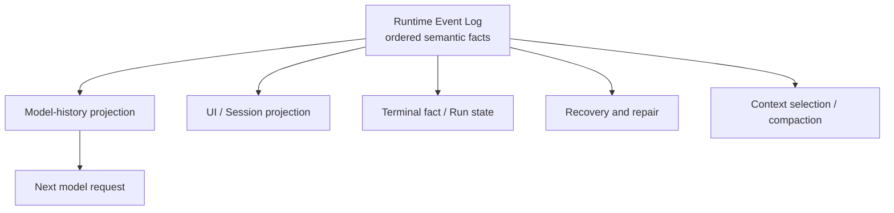
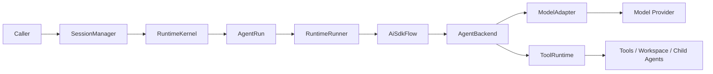
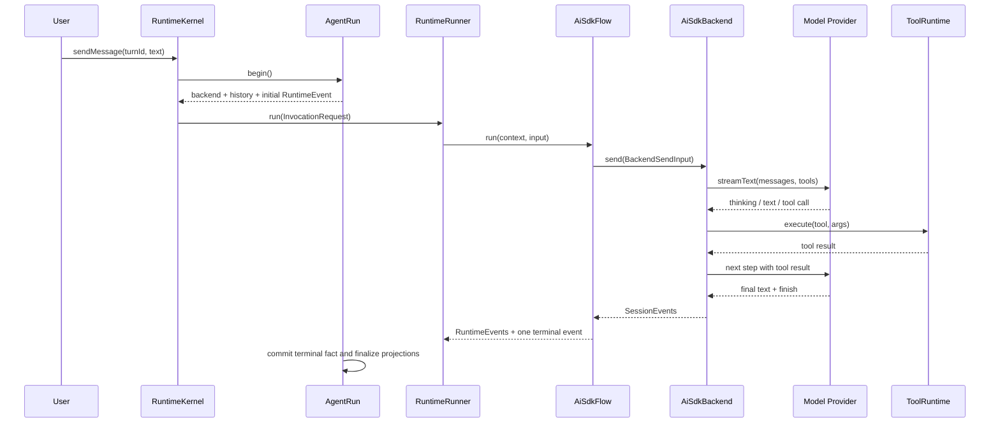

# 第一章：Log Is the Runtime——Maka 如何回放 Agent 的状态空间

> 本章回答一个核心问题：Maka 如何保存一次 Agent 运行真正经历过的状态空间，并在下一轮、进程重启或新投影中重新得到它？答案是 Runtime Event Log。模型循环负责产生事实；Event Log 保存事实；Session、Run、UI、模型上下文和恢复逻辑都是这份日志的消费者或投影。

本文面向第一次进入 Maka Runtime 的工程师，也面向需要修改运行主链的维护者。读完前半部分，你应该能说清一次运行经过哪些边界；读完整章，你应该能定位主链代码，并理解修改终止、工具或持久化逻辑时必须保护哪些不变量。

本文描述的是截至 2026-07-12 已在生产主链中落地的实现。历史设计文档中的阶段性计划不作为当前事实。

## 从一个看似简单的请求开始

假设用户对 Maka 说：

> 找出这个项目里失败的测试，修复问题，然后重新运行测试。

如果 Maka 只是一个聊天应用，执行路径可能只有三步：把文字发给模型、等待回复、把回复显示出来。但 Agent 的真实执行过程更像这样：

1. 模型先阅读项目和测试输出。
2. 模型调用文件、搜索或终端工具。
3. 某些工具需要用户授权，运行暂时停住。
4. 工具可能持续输出，也可能失败、超时或被取消。
5. 工具结果回到模型，模型决定下一步。
6. 这组“模型 → 工具 → 模型”的步骤重复多次。
7. 最后，系统必须明确判断这次运行究竟完成、失败，还是被用户中止。

过程中，界面需要实时显示文本和工具活动；下一轮模型需要读到可信历史；应用崩溃重启后，系统不能永远停在“运行中”；用户按下停止按钮后，迟到的 provider 事件也不能把状态重新写成“完成”。

所以，Runtime 真正解决的不是“怎样调用一次 LLM API”，而是：

> 如何把一个包含流式输出、工具副作用、用户介入和进程故障的开放式循环，记录成一段可以重新解释和回放的事实历史。

## 先说结论：状态不是一张表，而是日志的函数

Maka Runtime 最核心的设计判断，不是选择了哪个模型 SDK，也不是把执行逻辑拆成了多少层，而是：

> **Runtime Event Log 才是 Agent 交互的语义事实源。系统在某一时刻的状态，是这段有序日志经过某种投影之后的结果。**

可以把它写成一个简单的关系：

```text
State(t) = Project(RuntimeEvents[0..t], policy, runtime configuration)
```

同一段日志可以被不同消费者解释成不同状态：

- Model History Projector 得到下一次模型调用需要看到的 messages；
- Runtime Read Model 得到 UI 需要展示的对话、工具活动和 Turn 状态；
- Terminal Fact Classifier 得到一次 Run 的最终结果；
- Recovery 逻辑判断进程退出前哪些事实已经 durable；
- Context Budget 与 compaction 策略得到一个更小、但保留关键语义的工作上下文；
- 未来的调试器可以把读取位置停在任意事件边界，观察当时的 Agent 状态空间。



这张图从中间开始读：`Runtime Event Log` 是稳定事实，其余节点是可以演进、重建或替换的派生视图。它刻意省略了事件生产路径；事件由哪些组件产生，会在后文解释。

这与普通 application log 有本质区别。普通日志通常是在业务执行之后描述“代码做过什么”，主要供人排障；RuntimeEvent 本身就是业务语义的一部分。用户消息、模型回复、thinking、function call、function response、权限动作、usage 和 terminal status 都以强类型事实进入日志。删除这份日志，系统就失去了可靠重建交互状态的基础。

## 一条 RuntimeEvent 保存了什么

`RuntimeEvent` 不只是 `role + text`。它把一条事实拆成几组正交信息：

| 维度 | 关键字段 | 意义 |
|---|---|---|
| Identity | `sessionId`, `invocationId`, `runId`, `turnId`, `branch` | 这条事实属于哪段会话、调用、执行尝试和分支 |
| Ordering | `id`, `ts` 与 ledger 顺序 | 这条事实在因果历史中的位置 |
| Source | `role`, `author` | 它在模型历史中扮演什么角色，由谁产生 |
| Content | text, thinking, function call/response, error | AI 交互本身的语义内容 |
| Actions | state delta, permission, artifact, usage, end invocation | 它要求 Runtime 怎样改变控制状态或记录副作用 |
| Correlation | tool call、provider event、step 与 artifact refs | 怎样把跨系统的同一件事重新配对 |
| Lifecycle | `partial`, `status` | 它是可替换的流式片段，还是持久事实或终止事实 |

这种结构保留的不是 UI 已经格式化好的聊天文本，而是模型交互的原始语义。尤其是：

- thinking 可以带 provider 需要的 signature；
- tool call 与 tool result 通过稳定 ID 配对；
- tool call 还能指向它所属的 assistant step；
- permission request/decision 是 action，而不是一段伪装成聊天的文字；
- terminal event 明确关闭一次 Invocation，而不是靠“最后一条消息看起来像回答”来猜测。

因此，模型历史不需要从 UI transcript 反向解析。它可以从 RuntimeEvent 中选择 non-partial、model-visible 的事件，保持顺序，再根据 provider 能力物化成 text-only 或 provider-native messages。UI 同样不需要成为事实源，它只是另一种 projection。

## “回放状态空间”究竟意味着什么

这里的 replay 有三个层次，需要精确区分。

### 语义回放：当前已经成立

给定 RuntimeEvent ledger，Maka 可以重建用户/模型文本、thinking、工具调用与结果、权限动作、usage 和 terminal fact。下一轮模型历史与 completed Session read model 都已经优先从这份 ledger 构造。

这意味着我们能回答：在某个事件边界之前，模型已经看到了哪些交互？它调用过什么工具？工具返回了什么？哪些权限被请求或决定？一次 Invocation 是否已经结束？

### Provider-native 回放：有能力门控

不同 provider 对 tool history 和 signed thinking 的要求不同。Maka 不会把所有事件盲目塞回模型，而是先建立 replay plan：检查 partial、tool call/result 配对、step ID、thinking signature 和 provider 支持，再决定走 provider-native、text-only，还是明确降级。

这一步很重要。可回放不等于“把 JSONL 原样发给任何模型”；它意味着保留足够丰富的事实，让投影器能够为具体 provider 生成合法的历史，同时显式报告语义损失。

### Bit-exact wire replay：不能只靠 message log 宣称

RuntimeEvent 保存了 AI 交互的 canonical message semantics，但当前并不等于完整快照每次 provider HTTP 请求的原始字节。System prompt、工具 schema、provider options、模型实现版本以及 context selection/compaction policy 仍参与最终 request 的生成；当前系统记录了其中一些 identity、diagnostic 和 hash，但没有把整个 wire request 都复制进 RuntimeEvent ledger。

因此，本章所说的“状态空间回放”首先是**交互语义与 Runtime 状态的可重建性**。如果未来要承诺 bit-exact deterministic replay，还需要对运行配置、prompt、tool catalog、投影策略和 provider request shape 做版本化或快照化。这不是削弱 Event Log 的价值，反而说明它提供了正确的基础：message facts 保持稳定，request materialization 可以独立演进。

## 两条思想来源

这个设计有两条明确的思想脉络。

第一条来自 Google ADK。ADK 把 Session 看作带有时间顺序 Events 的事实容器；Event 同时承载 content、author、invocation identity、partial 标记与 actions，Session state 通过事件中的 state delta 更新，模型工作上下文则从事件历史选择和转换得到。Maka 借鉴的关键不是字段长得相似，而是：**Session history 是事实，working context 是计算出来的 projection。**

第二条来自分布式数据系统中的 log-first 思想。数据库 WAL、replicated log、event sourcing 和 Kafka 共享一个重要直觉：不要把每个下游视图都当作独立真相；先保存有序、不可含糊的变化事实，再让消费者重建自己的状态。只要事件顺序和提交边界可信，缓存、索引、搜索视图乃至部分损坏的状态表都可以重新生成。

Maka 并不是在进程内实现了 Kafka，也没有声称 RuntimeEventStore 是一个分布式共识日志。借鉴的是更基础的设计原则：

> **Log is the source of truth; state is a materialized view.**

这一原则直接解释了后文最重要的 terminal invariant：Run header 不能凭自己宣布完成，它必须得到 terminal RuntimeEvent 的支持。

## 四个不要混在一起的身份

理解主链之前，需要先分清四个经常被口语化混用的概念。

| 概念 | 它回答的问题 | 当前实现中的身份 |
|---|---|---|
| Session | 这些对话和运行属于哪段长期交互？ | `sessionId` |
| Turn | 用户界面中的这一轮问答是哪一轮？ | `turnId` |
| Run | 这一次具体执行尝试是谁？状态是什么？ | `runId` / `AgentRun` |
| Invocation | 一次 Flow 调用从开始到终止的标准边界是什么？ | `invocationId` / `RuntimeRunner` |

在当前默认生产路径中，`AgentRun` 已经先创建了 `runId`，随后把同一个值交给 `RuntimeRunner` 作为 `invocationId`。因此这两个 ID 目前通常相同，但概念上仍然不同：Run 是可持久化的执行实体，Invocation 是 Runner 所规范的一次调用边界。保留这层区分，使未来的重试、调度或多次尝试不必重新定义整条事件协议。

这里最重要的判断是：**Turn 不是 Run，聊天消息也不是执行状态。** 一个用户可见的回合需要一个系统可追踪的执行封套；否则，系统只能知道“出现过一些消息”，却无法可靠回答“这次执行是否真正结束”。

## 围绕 Event Log 运转的执行主链

当前交互式与通用 Headless 路径共用下面这条核心主链：



从左向右读这张图：越靠左，越接近产品入口和长期 Session；越靠右，越接近一次 provider 请求和具体工具副作用。图中省略了存储投影和事件账本，它们会在后文单独解释。

这不是为了把一个函数拆成很多类。更准确地说，这些组件分担了 Event Log 的生产、规范化、提交和消费责任；每一层都在保护一种不同的稳定性：

### `SessionManager`：稳定的产品入口

`SessionManager.sendMessage()` 是外部调用者看到的门面。它现在很薄：读取和管理 Session 的公共能力保留在这里，而真正的执行直接委托给 `RuntimeKernel.startTurn()`。

这个边界让桌面端、CLI、Bot 和 Headless 调用者不必理解 Run ledger、Flow 或 terminal fact。Runtime 内部可以演进，外部仍然只需要表达“给这个 Session 发送一条用户消息”。

### `RuntimeKernel`：活跃执行的控制面

`RuntimeKernel` 把一条 Session 请求组织成一次可运行的 Run。它负责：

- 创建 `AgentRun`；
- 创建或复用绑定到 Session 的 Backend；
- 注册活跃 Run，并维护 `turnId → runId` 映射；
- 把停止和权限响应路由到正在运行的 Backend；
- 组装 `RuntimeRunner` 与 `AiSdkFlow`；
- 让 RuntimeEvent 落盘后，再把原有 `SessionEvent` 流交还调用者；
- 在 Flow 收尾时确保 `AgentRun.finalize()` 被执行。

它是 orchestration boundary，而不是模型循环本身。Backend 不应该负责“这个 Session 目前有哪些活跃 Run”，产品入口也不应该负责“终止 RuntimeEvent 是否已经持久化”。这些跨层协调都收敛在 Kernel。

### `AgentRun`：一次执行的 Durable Envelope

`AgentRun` 让一次执行在持久世界里有身份和生命周期。开始运行时，它会：

1. 创建 `AgentRunHeader`，初始状态为 `created`；
2. 对顶层 Run 写入用户消息和 `running` Turn 投影；
3. 写入本轮初始用户 `RuntimeEvent`；
4. 锁定本 Session 的连接配置；
5. 确保 Backend 已创建并注册为活跃 Run；
6. 将 Run 标记为 `running`；
7. 从此前的 RuntimeEvent ledger 构造模型历史。

运行过程中，`AgentRun` 同时接收旧的 `SessionEvent` 与新的 `RuntimeEvent`，并把它们写入各自所属的投影或账本。结束时，它注销活跃 Run、收敛 Session/Turn 状态，并提交最终 Run 状态。

可以把 `AgentRun` 理解成一次执行的“耐久封套”：它不决定模型下一步调用哪个工具，但它保证这次执行是谁、发生了什么、最后以什么状态结束。

### `RuntimeRunner`：统一 Invocation 语义

`RuntimeRunner` 不调用 provider，也不直接执行工具。它规定任何 Flow 都必须遵守的调用协议：

- preflight 失败时，不得启动 Flow，也不得伪造一次已开始的调用；
- 初始用户 RuntimeEvent 必须排在所有 Flow 事件之前；
- Flow 必须产生 terminal RuntimeEvent；
- Flow 抛错、没有终态、权限被拒绝、被中止或出现不完整 finish reason，都要得到结构化失败结果；
- 成功结果必须包含非空的最终模型文本。

`RuntimeRunner` 返回的是 `InvocationResult`，其中包含完整事件序列、状态、最终输出或失败分类。这个结果把 Backend 的流式细节收敛成稳定的 invocation outcome。

Runner 已提供可注入的 preflight gate，但当前 `RuntimeKernel` 组装生产主链时没有注入 gate；因此这是已经实现的 Runner 能力，而不是当前桌面入口上的独立准入阶段。

### `AiSdkFlow`：旧事件流与 Runtime 事实之间的桥

当前模型/工具循环仍然由 `AgentBackend.send()` 产生 renderer-facing `SessionEvent`。`AiSdkFlow` 包住 Backend，并逐个映射成 canonical `RuntimeEvent`：

- 模型文本和 thinking 变成 model content；
- `tool_start` / `tool_result` 变成 function call / response；
- 权限请求和决定变成一等 runtime actions；
- token usage 变成 runtime action；
- error、abort 和 complete 变成明确的失败或终止事实。

它还有一个关键责任：**一条 Invocation 只向上游接受一个 terminal RuntimeEvent。** 例如 Backend 在中止时可能连续发出 `abort` 和 `complete(user_stop)`，Flow 会接受第一个终态并静默排空迟到事件，避免双重终止。

名字虽然叫 `AiSdkFlow`，它实际依赖的是 `AgentBackend` 接口。生产中可包装 `AiSdkBackend`，也可以包装其他遵守该接口的 Backend。它不重新实现模型循环，只规范事件语义。

### `AgentBackend`：模型与工具循环真正发生的地方

对默认的 `AiSdkBackend` 来说，核心循环仍在 `send()` 内部。它会：

1. 解析模型并准备本轮可见的工具集合；
2. 从 RuntimeEvent 历史构造 provider messages，并应用上下文预算策略；
3. 组合 system prompt、当前用户输入和附件；
4. 通过 `ModelAdapter` 启动 AI SDK `streamText()`；
5. 读取 text、thinking、step boundary、finish reason 和 usage；
6. 让 AI SDK 在模型发起 tool call 时进入 `ToolRuntime`；
7. 将工具结果交回下一步模型请求；
8. 重复模型/工具 step，直到模型结束、达到上限、发生错误或被中止。

默认 step 上限为 50。若模型在上限处仍要求继续调用工具，Runtime 会保留已经产生的工具结果，并在没有最终文本时补充一条确定性的提示，让用户可以在新 Turn 中继续，而不是留下一个没有收尾文本的界面。

`ModelAdapter` 隔离 provider 与 AI SDK 差异，包括模型创建、stream 启动、chunk 归一化、usage 归一化和错误分类。`ToolRuntime` 则隔离工具执行的高风险部分，包括工具可用性防守、权限、超时/中止传递、重复失败拦截、工具输出、遥测和 artifact 记录。

## 模型循环是怎样向前推进的

下面这张时序图聚焦一次包含工具调用的正常运行。它刻意省略了部分遥测和兼容投影，只展示控制权如何在模型与工具之间转移。



AI SDK 的 step 是这个循环的自然节拍。Maka 会按 step 持久化 assistant text/thinking，而不是把整个 Turn 压成一条最终 assistant message。工具调用会携带对应的 step ID，使 thinking、文本和工具调用在 replay 时仍能重新组成原来的执行顺序。

工具运行期间，模型 provider 不会继续输出。`ToolRuntime` 会暂停模型流的 idle watchdog，因为这段安静是预期行为；具体工具仍然可以有自己的超时，而更外层的 Run 或评测系统继续充当最终 backstop。

## 权限不是弹窗，而是 Runtime 控制流

当模型请求一个可能产生副作用的工具时，`ToolRuntime` 先让 `PermissionEngine` 评估调用。结果有三类：

- **allow**：直接执行工具；
- **block**：写入拒绝决定和合成的工具错误，不执行真实实现；
- **prompt**：发出权限请求，暂停 watchdog，并等待用户决定。

等待期间，Session 会投影为 `waiting_for_user`，但调用本身仍保留运行身份。用户的决定通过 `RuntimeKernel.respondToPermission()` 路由回当前 Backend，再由 `ToolRuntime` 写入 permission decision，随后继续执行或返回拒绝结果。

这个设计的关键是：权限不是 UI 自己暂停了一下。权限请求和决定都进入 Runtime 事实模型，因此重放、诊断和恢复能够知道运行为什么停住，以及控制权如何回来。

## 一份语义事实，两类辅助状态

Maka 当前同时维护三类持久数据。它们不是三个地位相同的“真相”，也不是重复保存同一份聊天。`RuntimeEventStore` 是 AI 交互的 canonical semantic log；另外两类存储承担产品投影与运行运维状态。

| 存储 | 主要内容 | 它最适合回答的问题 |
|---|---|---|
| `SessionStore` | 用户、assistant、工具和 turn-state 等 `StoredMessage` | UI 与兼容接口要展示什么？活跃流有哪些即时投影？ |
| `AgentRunStore` | `run.json` 与 operational `events.jsonl` | 这次 Run 何时开始、当前状态、在哪个模型或工具阶段失败？ |
| `RuntimeEventStore` | canonical `runtime-events.jsonl` 与有界 partial snapshots | Agent 交互发生过哪些语义事实，其他状态应如何重建？ |

在文件存储实现中，它们围绕下面的目录组织：

```text
sessions/<sessionId>/
  ... session projection ...
  runs/<runId>/
    run.json
    events.jsonl
    runtime-events.jsonl
    runtime-partials/
```

`AgentRunStore` 的事件更像 operational index：model stream 开始、tool started、permission requested、usage recorded。它帮助快速诊断和管理 Run，但不替代模型交互日志。`RuntimeEventStore` 的事件才是可重建的语义事实：用户内容、模型内容、function call/response、permission action 和 terminal fact。

对于已经完成且 ledger 完整的 Run，读取与下一轮模型 replay 优先依赖 RuntimeEvent。`SessionStore` 仍然承担兼容投影和 in-flight 展示，不能简单删除；但它不再是 completed runtime 语义的唯一权威。

流式 text/thinking partial 不会无限追加到 immutable JSONL。File RuntimeEventStore 会为可替换的流维护有界 partial snapshot，最终 non-partial 事件到达后覆盖其语义位置。这既保留崩溃时已经展示的部分输出，也避免 10,000 个 delta 变成 10,000 条长期账本记录。

## Log-first 的关键不变量：先有终止事实，再提交终止状态

Runtime 最容易出现的一类故障，是不同存储对“是否结束”给出不同答案。例如：

- `run.json` 写成 completed，但 RuntimeEvent ledger 没有 terminal event；
- 用户已经 stop，但迟到的 complete 又把 Session 写回 active；
- Backend 流耗尽，却从未说明它是成功还是失败；
- terminal event 已写入，但进程在更新 Run header 前崩溃。

Maka 当前保护的核心不变量是：

> 一个终止的 Run 必须有且只有一个有效 terminal RuntimeEvent；终止的 Run header 必须能够由这个 terminal fact 支撑。

因此，`AgentRun` 在提交 terminal Run header 前，先要求 terminal RuntimeEvent 成功落盘。没有终态的 Flow 会被合成为 `missing_terminal_event` 失败；重复终态会被 Flow 合并；状态不匹配、来自其他 Run 或标记为 partial 的 terminal event 都会被拒绝。

如果 terminal RuntimeEvent 已经存在，但 Run header 因中断仍是 `running`，read model 可以把 terminal event 作为更强事实来解释运行结果，并在恢复时修复 header。反过来，如果 header 声称已经结束却没有可信 terminal fact，系统不会盲目信任 header，而会保守地修复为 `missing_terminal_event` 失败。

这条不变量让恢复不必“猜模型当时准备做什么”。系统只需要判断哪些事实已经 durable，然后把各个投影收敛到同一个可解释终态。

## Stop、错误与崩溃如何收敛

### 用户停止

`RuntimeKernel.stopSession()` 会先把所有活跃 `AgentRun` 标记为 stopped，再调用 Backend 的 `stop()`。`AiSdkBackend` 会中止 provider stream、结束权限等待，并产生 abort/complete 事件。即使 provider 随后发送迟到的 complete 或 error，Flow 与 AgentRun 也不会允许它覆盖已经确定的 aborted 语义。停止来源，例如 renderer stop button，会进入 terminal fact 与 Run header，供诊断使用。

### Provider 或 Runtime 错误

错误首先被规范化为非终止 error content，随后由 failed terminal event 关闭 Invocation。`RuntimeRunner` 不允许后续的 completed event 掩盖之前已经观察到的错误。若 Backend 直接抛出异常或流没有终态，Runner/Flow 会产生结构化失败，而不是留下悬空运行。

### 应用崩溃和启动恢复

启动恢复不会重新执行模型请求或工具副作用。它扫描非终止 Run 与 RuntimeEvent ledger，识别 stale model stream、tool tail、permission wait、损坏的 operational event 等情况，然后保守地提交失败或取消状态，并修复 Session/Turn 投影。

这是“状态修复”，不是 checkpoint resume。当前 Runtime 可以保留部分输出、恢复一致的最终状态，并为以后真正的中点恢复提供事实基础；它不会在进程重启后自动从某个工具调用的下一行继续执行。

## 这套设计换来了什么，又付出了什么

### 得到的能力

- 产品入口不依赖具体 provider 或工具循环实现；
- 不同 Backend 可以共享 Invocation 与 terminal 语义；
- UI 事件与模型可重放事实被明确区分；
- 用户停止、权限和工具副作用进入可诊断的控制流；
- 崩溃后可以依据 durable facts 收敛状态；
- Headless、子 Agent 和未来调度可以复用同一执行核心。

### 当前代价

- 迁移期同时存在 `SessionEvent`、`StoredMessage`、`RuntimeEvent` 和 operational Run events，事件映射的维护成本较高；
- `AiSdkBackend` 仍然很重，同时组织 history、context budget、tool availability、step loop、usage 与 telemetry；
- `AiSdkFlow` 仍承担 legacy-to-canonical adapter 角色，而不是 Backend 原生产 canonical events；
- `SessionStore` 与 RuntimeEvent projection 需要在 active/in-flight 场景中协同；
- 当前 startup recovery 是确定性终结与修复，不是任意位置的 warm resume。
- Runner 的 preflight seam 已存在，但生产 Kernel 还没有接入独立的 Runtime gate。

这些不是应该隐藏的实现细节，而是当前架构的真实边界。未来拆分 Backend 或加入 checkpoint 时，首要目标不是减少文件行数，而是保持 request shape、工具可见性、事件顺序和 terminal invariant 不变。

## 代码阅读地图

建议按照下面的顺序阅读当前实现：

1. `packages/runtime/src/session-manager.ts`：公共入口与恢复入口。
2. `packages/runtime/src/runtime-kernel.ts`：Run/Backend 的活跃控制与主链组装。
3. `packages/runtime/src/agent-run.ts`：Durable lifecycle、历史构造和终态提交。
4. `packages/runtime/src/runtime-runner.ts`：Invocation 协议与结果分类。
5. `packages/runtime/src/ai-sdk-flow.ts`：`SessionEvent → RuntimeEvent` 映射与单终态保证。
6. `packages/runtime/src/ai-sdk-backend.ts`：AI SDK 模型/工具 step loop。
7. `packages/runtime/src/model-adapter.ts`：provider stream 适配。
8. `packages/runtime/src/tool-runtime.ts`：权限、工具执行和副作用边界。
9. `packages/core/src/runtime-event.ts`：canonical RuntimeEvent 契约。
10. `packages/core/src/agent-run.ts` 与 `packages/storage/src/agent-run-store.ts`：Run 与 RuntimeEvent 的文件账本。

对应的关键测试集中在：

- `packages/runtime/src/__tests__/runtime-runner.test.ts`
- `packages/runtime/src/__tests__/ai-sdk-flow.test.ts`
- `packages/runtime/src/__tests__/session-manager.test.ts`
- `packages/runtime/src/__tests__/session-manager-terminal-ledger.test.ts`
- `packages/storage/src/__tests__/agent-run-store.test.ts`

## 小结

Maka Runtime 的核心不在某一个类，也不只是 AI SDK 的多步工具循环。核心是一个可以保留并回放 Agent 交互状态空间的 Runtime Event Log；执行协议围绕这份日志产生事实、提交事实并构造派生状态：

```text
model/tool stepping engine
  → canonical RuntimeEvents
  → durable semantic log
  → model history / UI / Run state / recovery projections
```

`SessionManager` 稳住入口，`RuntimeKernel` 管理活跃执行，`AgentRun` 提交耐久事实，`RuntimeRunner` 规定 Invocation 语义，`AiSdkFlow` 把 Backend 事件翻译成 canonical facts，而 `AiSdkBackend`、`ModelAdapter` 与 `ToolRuntime` 真正推进模型和工具循环。它们都围绕 Runtime Event Log 协作，而不是各自保存一份局部真相。

这套结构最终保护的是一件很朴素的事：无论一次 Agent 工作经历多少模型 step、工具副作用、权限等待和异常，Maka 都要先忠实记录发生过什么。只要这份有序事实仍在，系统就能重新构造当时的交互状态，生成新的视图，并让下一轮从可信历史继续。

## 延伸阅读

- [Google ADK: Architecting an efficient context-aware multi-agent framework](https://developers.googleblog.com/architecting-efficient-context-aware-multi-agent-framework-for-production/)
- [Google ADK Python: Runner lifecycle and event persistence](https://github.com/google/adk-python/blob/main/AGENTS.md)
- [Apache Kafka Design: replicated logs, state machines, and event sourcing](https://kafka.apache.org/36/design/design/)
