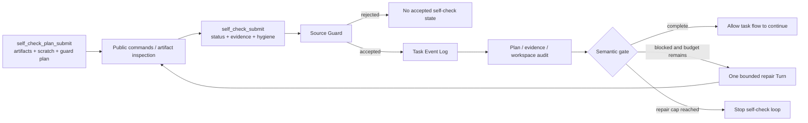
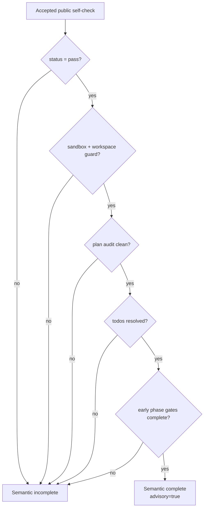

# Chapter 5: Self-Check Is Not Self-Trust—Maka's Bounded Feedback Loop

> This chapter answers one question: how can Maka let an Agent inspect its own work, find gaps, and attempt repairs without turning “I checked it” into self-authorization? The answer is not to ask the model “are you sure?” one more time. Self-check is a feedback loop with a declared plan, public evidence, workspace hygiene, durable state, and a hard repair bound. **Self-check can produce evidence and feedback; it cannot manufacture trust.**

The chapter builds on the Durable Task Loop from Chapter 4 but focuses only on the Heavy-task Self-check mechanism: `self_check_plan_submit`, `self_check_submit`, source guard, plan consistency audit, machine workspace observation, semantic completion, and the bounded repair gate.

It is written for engineers changing Headless Self-check, TaskRun projection, Heavy-task tools, or completion policy. The first half explains why Self-check must declare its boundary before submitting evidence. The complete chapter traces one Self-check from model Tool Call to Task Event, projection, gate, and repair Turn.

The chapter contains two lifecycle states:

- **Current**: schemas, guards, projections, workspace audits, and bounded repair already present on the Heavy-task Self-check mainline;
- **Target**: the direction required to upgrade model-reported claims into executor-owned Self-check evidence bound to explicit high waters.

Target sections are not current guarantees. Current Self-check is a strictly bounded advisory mechanism, not independent proof that a task is correct.

## Start with “I already checked it”

Suppose an Agent has just completed a complex migration and replies:

> Done. The code should work correctly now.

This statement has almost no engineering value. It does not answer:

- Which final artifacts were checked?
- Which public commands ran?
- What were their exit codes?
- Did temporary output remain inside a scratch directory?
- Did the check contaminate the final workspace?
- Is a new file a planned deliverable or an accidental side effect?
- Did the evidence come from task-visible information, or did it mix in material that must not enter model feedback?
- If the check fails, how many repairs may the system attempt?

An unconstrained reflection usually restates the model's intention instead of producing consumable task facts. An unlimited “check, repair, check again” sequence creates a second Agent loop with no budget boundary.

The real problem is:

> How can the model get a chance to find its own mistakes while Runtime constrains the inputs, evidence, side effects, and retry count of that inspection?

## The conclusion first: Self-check is a feedback plane, not an authority plane

Maka currently separates Self-check into five layers:

| Layer | Question it answers | Primary owner |
|---|---|---|
| Self-check Plan | What will be checked, and where should temporary output go? | Model submission, Runtime admission |
| Public Evidence | What was actually executed or observed? | Model submission with source refs |
| Source Guard | Do the submitted strings refer only to public task material? | Deterministic Runtime policy |
| Hygiene / Consistency Audit | Did the check escape scratch or create unplanned side effects? | Runtime rules plus partial machine observation |
| Repair Gate | Does current state need one additional check or repair Turn? | Deterministic Headless controller |



Read this diagram left to right. The model may produce a plan, evidence, and status. It cannot decide whether the guard accepts them or whether repair continues indefinitely. Ordinary Tool Runtime and the outer task flow are omitted; the diagram covers only the Self-check feedback plane.

In one sentence:

> **Model reports; Runtime admits, audits, and bounds.**

## Why a Self-check Plan must come first

Inspection itself creates side effects. Compilation may write object files, a parser may produce temporary JSON, a script may overwrite a deliverable, and even harmless validation output can change the workspace listing.

If an Agent explains only afterward that “those files were temporary,” Runtime cannot distinguish prior intent from post-hoc rationalization. Maka therefore provides `self_check_plan_submit`, which declares three classes of information before the final Self-check.

### Final Artifacts

`finalArtifacts` requires at least one item. Each item declares:

- `path`: the final output location;
- `purpose`: its role in the task;
- `publicReason`: why it belongs to public task output.

### Self-check Scratch

`selfCheckScratch` declares:

- a scratch root;
- optional expected generated paths;
- a public reason for using that scratch space.

The current gate prompt recommends `/tmp/maka-self-check/...`, separating inspection output from `/app` deliverables.

### Workspace Guard Plan

`workspaceGuardPlan` declares:

- the paths that will be checked;
- additions expected in the workspace;
- generated paths allowed outside scratch;
- a public reason those changes belong to the task.

The plan does not prove in advance that inspection will be safe. It gives the later audit a stable baseline:

```text
observed change
  → compare with accepted plan
  → planned final artifact, expected output, or unexplained side effect?
```

The recorder may accept a Self-check event even when no plan is available, but the strong-pass gate blocks it with `missing_self_check_plan`. This is deferred enforcement: the Tool layer records facts, while the gate decides whether they are sufficient for semantic completion.

## Current: schemas turn Self-check into a bounded object

`self_check_submit` is not free text. Its current schema requires:

- `status` to be one of `pass / fail / inconclusive`;
- non-empty `publicReason` of at most 2,000 characters;
- at least one command-evidence or artifact-evidence item;
- commands of at most 1,000 characters;
- output excerpts of at most 2,000 characters;
- no more than 25 command items and 25 artifact items;
- no more than 20 artifact references;
- paths of at most 500 characters;
- metadata with at most 30 keys, depth at most 3, and string values at most 500 characters.

Command evidence may carry:

```text
command
exitCode?
timedOut?
outputExcerpt?
artifactRefs?
```

Artifact evidence may carry:

```text
path
kind
exists?
sizeBytes?
hash?
bounded metadata?
```

These limits protect persistence and prompt safety, not evidence truth. The model currently submits most fields as Tool arguments. Schemas reject unbounded payloads and invalid shapes; by themselves, they do not prove that a command ran or that a hash came from the current bytes.

## Current: Source Guard controls what enters the feedback loop

Self-check should improve the Agent using public, task-derived information. It must not inject non-public material into the next model context.

`validateHeavyTaskPublicStrings()` walks almost every string in a plan and Self-check: reasons, commands, output excerpts, artifact paths, metadata keys and values, scratch paths, workspace-guard commands, and side-effect paths.

Current lexical categories reject material such as:

- hidden tests, hidden references, and hidden artifacts;
- private thresholds or scoring criteria;
- raw assertion-derived expected/actual material;
- evaluator-only files;
- private or official execution details;
- private benchmark identifiers.

The guard returns:

```text
HeavyTaskSourceGuardResult
  status: accepted | rejected
  checkedAt
  categories[]
  publicReason
```

The recorder appends `heavy_task_self_check_plan_recorded` or `heavy_task_self_check_recorded` only after guard acceptance. When TaskRun projection reads a Self-check event, it runs `isAcceptedHeavyTaskSelfCheck()` again. Older state that no longer satisfies the public guard is ignored and produces a warning.

### What Source Guard is not

It is a lexical admission filter, not an access-control system.

It cannot stop an Agent with overly broad Tool access from reading a private file; isolation, Tool exposure, and filesystem policy must solve that at an earlier boundary. Nor can it understand every natural-language implication. It guarantees only that known sensitive patterns do not become accepted public Self-check state through this structured channel.

## Current: accepted Self-check becomes a Task Event instead of overwriting old state

Accepted plans and checks become separate events:

- `heavy_task_self_check_plan_recorded`;
- `heavy_task_self_check_recorded`.

Each state carries `taskRunId`, optional `attemptId`, timestamp, source Tool Call identity, and an accepted guard.

`projectTaskRun()` preserves history arrays and projects the latest accepted state into:

- `latestHeavyTaskSelfCheckPlan`;
- `latestHeavyTaskSelfCheck`.

Self-check also becomes bounded compact evidence in the Heavy-task evidence window. A later Attempt can render the recent status, public reason, at most five command entries, at most five artifact entries, and a bounded hygiene summary from TaskRun projection.

```text
Self-check tool call
  → accepted Task Event
  → TaskRunProjection latest state
  → bounded continuation prompt
```

Older Self-checks remain unchanged. A new event changes only the “latest” projection. Operators can inspect how the Agent's own judgment evolved, and future freshness policies have an ordered source from which to compute validity.

## Current: Execution Hygiene makes inspection side effects part of the protocol

`executionHygiene` asks the Agent to report not only the result of inspection but also how inspection affected the workspace.

### Sandbox facts

Self-check may declare:

- sandbox root;
- a `scratch_dir / copied_inputs / read_only_deliverable_refs` strategy;
- input paths and command cwd;
- a `scratch_only / read_only_deliverable_refs` output policy.

Strong pass requires at least a sandbox root. Even status=`pass` remains blocked without sandbox evidence.

### Cleanup facts

Self-check may report whether scratch was used, the scratch path, whether cleanup ran, and `workspaceSideEffects`:

```text
none | cleaned | present | unknown
```

Any non-empty `remainingSideEffectPaths` blocks strong pass.

### Workspace Guard facts

The guard may report:

- `checked=true/false`;
- checked paths;
- before/after listing commands;
- added, modified, and removed paths;
- a public reason.

Strong pass requires `workspaceGuard.checked === true`. This turns “I did not contaminate the workspace” from an unstructured conclusion into at least a shaped inspection claim.

Precision still matters: the model currently submits most hygiene fields. Runtime performs consistency audits, but these fields are not executor-signed filesystem truth.

## Current: Plan Consistency Audit distinguishes planned outputs from accidental changes

`auditSelfCheckPlanConsistency()` compares the accepted plan with Self-check evidence and hygiene.

Its primary risk flags are:

| Risk | Meaning | Blocks strong pass? |
|---|---|---|
| `missing_self_check_plan` | No accepted plan exists | Yes |
| `planned_final_artifact_added` | The new path is a declared final artifact or expected addition | No; retained as a diagnostic |
| `unplanned_added_path` | Workspace Guard reports an undeclared new path | Yes |
| `scratch_escape` | Command/generated evidence points outside scratch, final artifacts, and allowed paths | Yes |

The audit normalizes paths and extracts possible generated-output locations from command `-o /app/...` or `-o /tmp/...`, generated artifacts, remaining side effects, and added paths.

This solves a subtle problem. A final artifact is often supposed to be new, so not every workspace delta is contamination. But “I happened to generate this file” must not automatically promote it to a deliverable. The distinction comes from whether a plan existed first and declared the path.

`hasBlockingHeavyTaskSelfCheckWorkspaceDelta()` allows `workspaceSideEffects=present` only when every addition is planned. Remaining paths, unplanned additions, and scratch escapes still block.

## Current: Machine Workspace Observation is neutral supporting evidence

Before the first gate evaluation, `TaskAgentController` attempts to obtain machine observations through `observeHeavyTaskWorkspace()`.

Current observation:

- runs only when an isolated executor exists;
- derives roots from parent directories of accepted final artifacts and Self-check checked paths;
- accepts only `/app/...` roots;
- caps roots at 12;
- lists only one level of file, directory, symlink, or other entries;
- uses a 30-second command timeout;
- records `heavy_task_workspace_observation_recorded` with `source.kind=system`.

Machine observation does not read file bodies or calculate a recursive manifest or hash. It contributes neutral facts—“what entries does the machine currently see?”—to a repair prompt.

It does not currently block an otherwise complete pass Self-check on its own. It is a diagnostic observation, not complete workspace attestation.

## Current: semantic completion requires several conditions at once

Self-check status=`pass` is only one condition. `evaluateHeavyTaskCompletionStatus()` reports semantic complete only when all of the following hold:

1. Heavy-task mode is enabled.
2. A latest accepted public Self-check exists.
3. Self-check status is `pass`.
4. Sandbox execution evidence exists.
5. Workspace Guard was executed.
6. No uncleaned or unplanned blocking workspace delta remains.
7. The accepted Self-check plan is consistent with evidence.
8. Latest todos exist and are non-empty.
9. Every todo is completed, or cancelled with nonblocking evidence.
10. Both `runnable_artifact` and `public_check` early phase-gate todos are completed.



Read this diagram from top to bottom. Any blocker keeps semantic status incomplete. The resulting state still carries `advisory: true`, preventing Self-check semantic completion from becoming a new authority.

## Current: the gate derives an Acceptance Checklist from visible contracts

`deriveHeavyTaskAcceptanceChecks()` converts current TaskRun state into a repair and inspection checklist.

Checklist sources include:

- final artifacts in the accepted Self-check plan;
- parse hints for `.json` and `.jsonl` artifacts;
- `runnable_artifact`, `public_check`, and `final_self_check` todos;
- visible task-family hints;
- a generic workspace-hygiene requirement.

Each check carries:

```text
id
kind
source
description
evidenceRequired
path?
commandHint?
```

The gate does not freely parse every required artifact from raw instruction text. That avoids turning a fragile natural-language heuristic into a hard contract. The model must structure final artifacts through the plan first.

Current required-artifact addressing has one explicit limit. When a plan declares several final artifacts, evidence text only has to mention at least one path or basename for the function to return true. It does not yet prove coverage of every declared final artifact. The Target should use per-check coverage instead of aggregate `some()`.

## Current: Bounded Repair allows correction without an infinite self-loop

`evaluateHeavyTaskSelfCheckGate()` has three effective outcomes:

```text
allow        → current Self-check may leave the feedback gate
repair       → generate one bounded repair prompt
cap reached  → create no more Self-check repair Turns
```

Current `TaskAgentController` fixes `maxRepairAttempts` at 1:

1. The main Invocation ends.
2. Machine workspace observation is recorded.
3. The gate evaluates and appends `heavy_task_self_check_gate_recorded`.
4. If action is repair, a new Turn and AgentRun start in the same Session and workspace.
5. The repair prompt includes blocker reason, public checklist, latest Self-check summary, and machine observation.
6. After the repair Turn, observation and gate evaluation run again.
7. `repairAttemptsUsed=1`, so the gate cannot create a third Turn.

```mermaid
sequenceDiagram
    participant A as Agent Turn
    participant T as Task Event Log
    participant O as Workspace Observer
    participant G as Self-check Gate
    participant R as Repair Turn

    A->>T: plan / self-check / evidence events
    A-->>G: main Invocation ends
    G->>O: observe visible workspace roots
    O->>T: workspace observation event
    G->>T: gate state
    alt self-check blocked and repair budget remains
        G->>R: bounded repair prompt
        R->>T: refreshed self-check facts
        G->>O: observe again
        O->>T: new observation event
        G->>T: final gate state; no further repair
    else self-check accepted
        G-->>A: leave feedback gate
    end
```

Read the sequence from top to bottom. Repair is a new Runtime Turn inside the same Task Attempt, not a new Task Attempt. The outer task flow is omitted; the diagram emphasizes forced convergence after one repair.

## Failure semantics: missing evidence should reduce confidence, not create facts

| Situation | Current behavior | Disallowed interpretation |
|---|---|---|
| Invalid Plan schema | Tool Call returns a validation error; no accepted plan is recorded | “The model probably meant the same thing” |
| Source Guard rejects | No accepted Self-check state is appended | Sensitive material is now public feedback |
| Self-check has no evidence | Schema rejects it | The string `pass` is evidence |
| status=`fail/inconclusive` | Semantic state remains incomplete; one repair may run | Self-check has value only when it pretends to pass |
| Missing sandbox/guard | Strong pass is blocked | Exit code 0 alone is sufficient |
| Unplanned path or scratch escape | Plan audit fails and repair receives diagnostics | Every new file is a deliverable |
| Machine observation fails | Error excerpt is recorded; other facts still drive evaluation | Observation failure means the workspace is clean |
| Repair Turn fails or remains incomplete | Final gate state is recorded; no infinite repair | Loop forever until the model claims success |
| Replayed Self-check no longer passes public revalidation | Projection ignores that state and adds a warning | The last event necessarily enters the latest projection |

A Self-check failure must not delete earlier RuntimeEvents, Tool Evidence, or Task Events. It only means the current feedback projection is insufficient for semantic completion.

## Current trust boundaries and known gaps

### Model-reported evidence is not yet executor-attested evidence

`commandEvidence.exitCode`, artifact hashes, and workspace-guard deltas currently arrive in the Tool submission payload. They have schemas, source `toolCallId`, and a public guard, but they are not uniformly linked to an actual Bash RuntimeEvent or filesystem snapshot.

### Self-check has no freshness high water

An accepted Self-check does not declare the RuntimeEvent or workspace-mutation boundary it covers. If Write/Edit happens later, the latest projection may still show the old pass until the Agent refreshes it.

### Workspace observation lists only one directory level

It can expose some unexpected paths and symlinks but cannot prove file content, recursive tree shape, hashes, or modification times.

### Source Guard is a known-pattern set

Regex categories catch explicit patterns; they cannot become a complete information-flow proof. New sensitive formulations require policy updates.

### Required-artifact coverage is currently any, not all

Mentioning one of several final artifacts satisfies the addressing check. This is an implementation limit, not a full-coverage guarantee.

## Target: Self-check Evidence should bind Runtime and Workspace high water

The next stage should not turn Self-check into a longer reflection prompt. It should upgrade claims into verifiable linkage.

A target envelope could express:

```text
SelfCheckEnvelope
  identity
    selfCheckId
    taskRunId
    attemptId
  plan
    planId
    requiredCheckIds[]
  coverage
    runtimeEventHighWater
    workspaceSnapshotId
    workspaceManifestHash
  observations
    commandResultRefs[]
    artifactRefs[]
    workspaceDeltaRef
  conclusion
    status
    publicReason
    advisory: true
  policy
    sourceGuardVersion
    gatePolicyVersion
```

### Command Evidence should be linked by Runtime

The model may choose commands, but exit code, timeout, and stdout artifact reference should derive from actual Tool Result and RuntimeEvent facts. Self-check should reference `toolCallId / runtimeEventId` instead of copying results.

### Workspace Guard should link a Snapshot Diff

An executor or workspace service should generate before/after manifests. The plan declares allowed changes, Runtime diff observes changes, and the audit computes planned versus unplanned results.

### Coverage must be calculated per item

Every Acceptance Check should have `covered / failed / missing / stale` status. Multiple final artifacts require all-item coverage, not aggregate string search.

### Mutation should invalidate an old Self-check

Any mutating Tool Result after `runtimeEventHighWater`, or a different `workspaceManifestHash`, should mark the old conclusion stale. Projection may preserve the historical pass but must not present it as current.

### Repair Policy must be versioned

Whether a task allows zero, one, or two repairs should belong to a task-profile policy and be recorded in the gate event. Runtime still enforces the hard cap; the model cannot choose it.

## Current and Target boundary

| Capability | Current | Target |
|---|---|---|
| Plan | Model-submitted structured plan | Versioned plan contract plus immutable check IDs |
| Evidence | Bounded model-submitted command/artifact facts | RuntimeEvent- and artifact-linked observations |
| Public guard | Lexical categories checked at record and projection | Versioned information-flow policy plus provenance |
| Workspace hygiene | Model-reported guard plus one-level system listing | Executor-owned before/after manifest diff |
| Coverage | Checklist plus aggregate text match | Per-check all-required coverage |
| Freshness | Latest accepted event | Runtime/workspace high-water invalidation |
| Repair | Fixed maximum of one additional Turn | Versioned profile policy with a hard cap |
| Conclusion | `pass/fail/inconclusive`, advisory | Remains advisory, with stale and coverage metadata |

## What Self-check is not

### It is not “think again”

Reflection without a plan, command/artifact evidence, and hygiene is not an accepted Self-check.

### It is not a hidden-information channel

Self-check consumes public, task-derived facts only. Source Guard exists specifically to prevent the feedback plane from gaining accidental authority.

### It is not an unlimited repair loop

Current policy permits at most one additional repair Turn. Self-check gains value from better bounded feedback, not unlimited computation.

### It is not workspace rollback

The audit can detect declared side effects; it cannot restore files automatically. Real rollback still requires a snapshot or explicit cleanup operation.

### It is not the final source of truth

Self-check status is the Agent's structured judgment over public evidence and remains advisory. RuntimeEvents, Tool Results, Task Events, and workspace artifacts retain their own fact boundaries.

## Architectural invariants the current system must protect

1. **Plan precedes trust**: without an accepted plan, `pass` cannot become a strong semantic pass.
2. **Evidence required**: Self-check carries at least one command or artifact item.
3. **Public-only admission**: rejected source material does not enter accepted Self-check projection.
4. **Append before project**: accepted plans and checks become Task Events before changing latest state.
5. **Advisory forever**: a Self-check conclusion never becomes independent authority.
6. **Hygiene is part of the check**: sandbox, Workspace Guard, and side effects are not optional footnotes.
7. **Planned is not accidental**: planned final artifacts and undeclared paths receive different treatment.
8. **Repair is bounded**: the model cannot request unlimited repair through Tool Calls.
9. **Machine facts stay neutral**: workspace observation supplies facts; a listing does not decide the conclusion.
10. **Invalid states remain observable**: rejection, audit risks, observation errors, and gate decisions enter diagnostics and events.

The Target must also add freshness invalidation, executor attestation, and per-check coverage.

## Costs and reevaluation conditions

This mechanism is heavier than one reflection prompt. It needs a plan schema, evidence schema, guard, audit, workspace observation, Task Events, and a repair Turn. In return, feedback becomes explainable: why it was blocked, what was checked, which side effects appeared, and why only one repair was allowed.

The current lexical Source Guard is simple, deterministic, and auditable, but it has false positives and false negatives. Maka should reduce regex dependence only when source metadata and access-control boundaries become mature enough to replace it.

Self-check Plan adds model overhead. Short or artifact-free tasks should not be forced into the Heavy-task protocol. The current gate preserves this boundary by allowing immediate flow when Heavy-task mode is disabled.

Upgrading machine observation to a recursive hash manifest would add I/O and container cost. Incremental manifests should follow concrete needs around workspace scale, mutation frequency, and recovery rather than scanning every tree unconditionally.

## Code map and test entry points

1. `packages/headless/src/heavy-task-self-check.ts`: schemas, recorder, Source Guard, plan audit, hygiene, and prompt projection;
2. `packages/headless/src/heavy-task-self-check-gate.ts`: acceptance checklist, semantic blockers, and bounded repair prompt;
3. `packages/headless/src/heavy-task-workspace-observation.ts`: system-owned one-level workspace facts;
4. `packages/headless/src/heavy-task-finalization.ts`: advisory semantic-completion derivation;
5. `packages/headless/src/task-contracts.ts`: plan, check, gate, and observation contracts;
6. `packages/headless/src/task-run-store.ts`: accepted Self-check projection and compact-evidence derivation;
7. `packages/headless/src/task-agent-controller.ts`: main Turn, observation, gate, and single repair-Turn wiring;
8. `packages/headless/src/heavy-task-evidence.ts`: Self-check projection into bounded evidence.

Important tests:

- `heavy-task-self-check.test.ts`: schema bounds, source rejection, plan audit, and continuation rendering;
- `heavy-task-self-check-gate.test.ts`: missing, weak, and pass states; workspace blockers; checklist; and repair cap;
- `heavy-task-workspace-observation.test.ts`: machine-owned directory facts;
- `heavy-task-finalization.test.ts`: semantic completion, todos, phase gates, and workspace hygiene;
- `task-agent-controller.test.ts`: one bounded repair Turn and observations before and after it;
- `task-run-store.test.ts`: accepted-only projection, warnings, and evidence derivation.

## Summary

Maka Self-check does not ask the model “are you sure?” It creates a Runtime-constrained feedback chain:

```text
declare plan
  → run public checks
  → submit bounded evidence and hygiene
  → source guard admission
  → append Task Events
  → audit plan, workspace, todos, and evidence
  → allow or request one bounded repair Turn
  → preserve advisory conclusion
```

The current implementation has moved Self-check from free-form reflection to structured, durable, projectable task state. The valuable design is not the `pass` field. It is plan-before-check, public-only guard, workspace hygiene, and the one-repair cap.

Its limits are equally clear: evidence and guards remain mostly model-reported, machine observation sees only shallow directory state, Self-check has no Runtime/workspace freshness high water, and multiple required artifacts do not yet receive per-item coverage.

That is why the chapter is titled **Self-Check Is Not Self-Trust**. An Agent should have the opportunity to inspect and repair its own work. The system should not mistake that opportunity for self-authorization.
