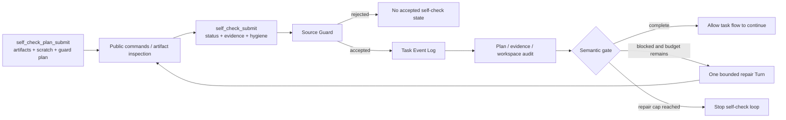
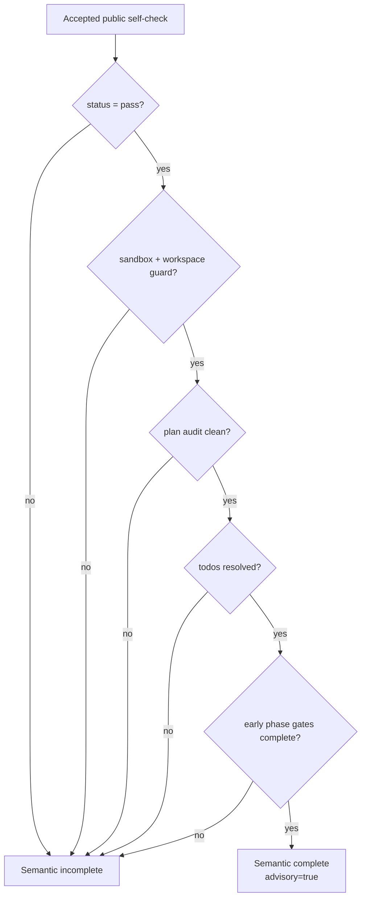

# 第五章：Self-Check Is Not Self-Trust——Maka 的有界自检循环

> 本章回答一个核心问题：Maka 如何允许 Agent 检查自己的工作、发现缺口并尝试修复，又不让“我检查过了”变成自我授权？答案不是再问模型一句“你确定吗”，而是把 Self-check 组织成一个有计划、有公开证据、有 workspace hygiene、可持久化、且修复次数受限的反馈循环。**Self-check can produce evidence and feedback; it cannot manufacture trust.**

本文承接第四章的 Durable Task Loop，但只聚焦 Heavy-task Self-check 机制：`self_check_plan_submit`、`self_check_submit`、source guard、plan consistency audit、machine workspace observation、semantic completion 与 bounded repair gate。

本文面向需要修改 Headless Self-check、TaskRun projection、Heavy-task tools 或 completion policy 的工程师。读完前半部分，读者应该能理解为什么 Self-check 必须“先声明检查边界，再提交证据”；读完整章，应该能定位一次 Self-check 从 model tool call 到 Task Event、projection、gate 和 repair Turn 的完整路径。

本文包含两类内容：

- **Current**：已经存在于 Heavy-task Self-check 主链中的 schema、guard、projection、workspace audit 和 bounded repair；
- **Target**：把模型提交的声明进一步升级为 executor-owned、high-water-bound Self-check evidence 所需的方向。

Target 不是当前保证。当前 Self-check 是一套严格受限的 advisory mechanism，不是对任务正确性的独立证明。

## 从一句“我已经检查过了”开始

假设 Agent 刚完成一个复杂迁移，并回复：

> 已经完成，代码应该可以正常工作。

这句话几乎没有工程价值。它没有回答：

- 检查了哪些最终 artifact？
- 执行了什么公开命令？
- command exit code 是什么？
- 是否只在 scratch 目录产生临时输出？
- 检查过程有没有污染最终 workspace？
- 新增文件是计划内 deliverable，还是意外 side effect？
- 证据来自当前任务可见信息，还是混入了不应该进入模型反馈的私有材料？
- 检查失败后，系统会允许多少次 repair？

如果只让模型自由写一段 reflection，它通常会复述自己的意图，而不是形成可消费的任务事实。如果让模型无限“检查—修复—再检查”，Self-check 又会变成没有 budget boundary 的第二个 Agent loop。

真正的问题是：

> 怎样让模型拥有发现自己错误的机会，同时把自检的输入、证据、副作用和重试次数放进 Runtime 可以检查的协议？

## 先说结论：Self-check 是 Feedback Plane，不是 Authority Plane

Maka 当前把 Self-check 拆成五层：

| 层 | 回答的问题 | 主要所有者 |
|---|---|---|
| Self-check Plan | 准备检查什么，临时输出应该放哪里？ | Model 提交，Runtime admission |
| Public Evidence | 实际执行或观察了什么？ | Model 提交，带 source refs |
| Source Guard | 这些字符串是否只引用公开任务材料？ | Deterministic Runtime policy |
| Hygiene / Consistency Audit | 检查是否越出 scratch、产生未计划 side effects？ | Runtime rules + 部分 machine observation |
| Repair Gate | 当前状态是否需要一次额外检查/修复 Turn？ | Deterministic Headless controller |



从左向右读这张图。Model 可以产生 plan、evidence 和 status，但不能决定 guard 是否接受，也不能决定 repair 是否无限继续。图中省略了普通 Tool Runtime 与后续外层流程；它只解释 Self-check feedback plane。

一句话概括：

> **Model reports; Runtime admits, audits, and bounds.**

## 为什么必须先有 Self-check Plan

检查本身也会产生副作用。编译可能写出 object files，解析命令可能生成临时 JSON，脚本可能覆盖 deliverable，甚至一个无害的“验证输出”也可能改变 workspace listing。

如果 Agent 完成检查后才解释“那些文件都是临时的”，Runtime 无法区分事先计划与事后合理化。因此 Maka 提供 `self_check_plan_submit`，要求在最终 Self-check 之前声明三组信息。

### Final Artifacts

`finalArtifacts` 至少包含一项。每项声明：

- `path`：最终产物位置；
- `purpose`：它在任务中的用途；
- `publicReason`：为什么它属于公开任务输出。

### Self-check Scratch

`selfCheckScratch` 声明：

- scratch root；
- 可选 expected generated paths；
- 使用这个 scratch 的公开理由。

当前 gate prompt 推荐使用 `/tmp/maka-self-check/...`，把检查生成物与 `/app` deliverables 分开。

### Workspace Guard Plan

`workspaceGuardPlan` 声明：

- 准备检查哪些 paths；
- 哪些新增 paths 是预期的；
- 哪些生成物允许出现在 scratch 之外；
- 为什么这些变化符合任务。

Plan 的作用不是提前证明检查一定安全，而是给后续 audit 一个稳定基线：

```text
observed change
  → compare with accepted plan
  → planned final artifact, expected output, or unexplained side effect?
```

没有 plan，Self-check 仍可被 recorder 接收并进入 Task Events，但 strong pass gate 会以 `missing_self_check_plan` 阻塞。这是一种 deferred enforcement：工具层允许记录事实，gate 层决定它是否足够支持语义完成。

## Current：Schema 先把 Self-check 变成有限对象

`self_check_submit` 不是自由文本。当前 schema 要求：

- `status` 只能是 `pass / fail / inconclusive`；
- `publicReason` 非空且最多 2,000 characters；
- 至少一项 command evidence 或 artifact evidence；
- command 最多 1,000 characters；
- output excerpt 最多 2,000 characters；
- command/artifact evidence 各自最多 25 项；
- artifact refs 最多 20 项；
- path 最多 500 characters；
- metadata 最多 30 keys、递归深度最多 3、string value 最多 500 characters。

Command evidence 可以携带：

```text
command
exitCode?
timedOut?
outputExcerpt?
artifactRefs?
```

Artifact evidence 可以携带：

```text
path
kind
exists?
sizeBytes?
hash?
bounded metadata?
```

这些限制解决的是可持久化性和 prompt safety，不是证据真实性。当前字段主要由模型通过 tool args 提交；schema 能阻止无界 payload 和错误 shape，却不能单独证明 command 真的执行过或 hash 真的来自当前 bytes。

## Current：Source Guard 控制哪些内容可以进入反馈循环

Self-check 的任务是基于公开、task-derived 信息帮助 Agent 改进，而不是把不可公开材料注入下一次模型上下文。

`validateHeavyTaskPublicStrings()` 会遍历 plan 和 Self-check 中几乎所有字符串：reason、command、output excerpt、artifact path、metadata key/value、scratch path、workspace guard commands 与 side-effect paths。

当前 lexical categories 会拒绝类似内容：

- hidden tests、hidden references、hidden artifacts；
- private thresholds 或 scoring criteria；
- raw assertion-derived expected/actual material；
- evaluator-only files；
- private/official execution details；
- private benchmark identifiers。

Guard 结果是：

```text
HeavyTaskSourceGuardResult
  status: accepted | rejected
  checkedAt
  categories[]
  publicReason
```

Recorder 只有在 guard accepted 时才 append `heavy_task_self_check_plan_recorded` 或 `heavy_task_self_check_recorded`。TaskRun projection 读取 Self-check event 时还会再次执行 `isAcceptedHeavyTaskSelfCheck()`；不再满足 public guard 的旧状态会被忽略并产生 warning。

### Source Guard 不是什么

它是 lexical admission filter，不是访问控制系统。

它不能阻止一个已经拥有过宽 Tool access 的 Agent 读取私有文件；隔离、tool exposure 和 filesystem policy 必须在更早边界解决。它也不能理解所有自然语言暗示。它只保证已知敏感模式不会通过这个结构化通道成为 accepted public Self-check state。

## Current：Accepted Self-check 成为 Task Event，而不是覆盖旧状态

Accepted plan 和 Self-check 分别形成：

- `heavy_task_self_check_plan_recorded`；
- `heavy_task_self_check_recorded`。

每个 state 都携带 `taskRunId`、可选 `attemptId`、timestamp、source tool-call identity 和 accepted guard。

`projectTaskRun()` 保留历史数组，并将最新 accepted state 投影为：

- `latestHeavyTaskSelfCheckPlan`；
- `latestHeavyTaskSelfCheck`。

Self-check 还会被转换成 bounded compact evidence，进入 Heavy-task evidence window；后续 Attempt 可以从 TaskRun projection 渲染最近的 status、public reason、最多 5 条 command evidence、最多 5 条 artifact evidence，以及有限 hygiene summary。

```text
Self-check tool call
  → accepted Task Event
  → TaskRunProjection latest state
  → bounded continuation prompt
```

旧 Self-check 没有被修改。新的 event 只改变“latest”投影。这让诊断者能够回看 Agent 的自我判断怎样变化，也让未来 freshness policy 有来源可以计算。

## Current：Execution Hygiene 把“检查副作用”纳入协议

`executionHygiene` 让 Agent 不只报告检查结果，还报告检查如何影响 workspace。

### Sandbox facts

Self-check 可以声明：

- sandbox root；
- `scratch_dir / copied_inputs / read_only_deliverable_refs` strategy；
- input paths 与 command cwd；
- `scratch_only / read_only_deliverable_refs` output policy。

Strong pass 要求至少存在 sandbox root。没有 sandbox evidence，即使 status=`pass` 也会被 gate 阻塞。

### Cleanup facts

Self-check 可以声明 scratch 是否使用、scratch path、cleanup 是否执行，以及 `workspaceSideEffects`：

```text
none | cleaned | present | unknown
```

如果 `remainingSideEffectPaths` 非空，strong pass 必然被阻塞。

### Workspace Guard facts

Guard 可以声明：

- `checked=true/false`；
- checked paths；
- before/after listing commands；
- added、modified、removed paths；
- public reason。

Strong pass 要求 `workspaceGuard.checked === true`。这把“我没有污染 workspace”从一句结论变成至少有 shape 的检查声明。

但必须保持精确：这些 hygiene 字段当前仍主要由模型提交。Runtime 会做 consistency audit，不能把它们当作 executor 签名的 filesystem truth。

## Current：Plan Consistency Audit 区分计划内产物与意外变化

`auditSelfCheckPlanConsistency()` 比较 accepted plan 与 Self-check evidence/hygiene。

当前主要 risk flags 是：

| Risk | 含义 | 是否阻塞 strong pass |
|---|---|---|
| `missing_self_check_plan` | 没有 accepted plan | 是 |
| `planned_final_artifact_added` | 新增 path 是已声明 final artifact 或 expected addition | 否，保留为 diagnostic |
| `unplanned_added_path` | workspace guard 报告了未声明新增 path | 是 |
| `scratch_escape` | command/generated evidence 指向 scratch、final artifact 和允许路径之外 | 是 |

Audit 会规范化 path，并从 command 的 `-o /app/...` 或 `-o /tmp/...`、generated artifact、remaining side effects 和 added paths 中提取可能的生成物位置。

这套逻辑解决一个很微妙的问题：final artifact 本来就应该新增，不能把所有 workspace delta 都当成污染；但“我刚好生成了一个新文件”也不能自动成为 final artifact。区别来自 plan 是否在前、path 是否被声明。

`hasBlockingHeavyTaskSelfCheckWorkspaceDelta()` 允许只有 planned additions 的 `workspaceSideEffects=present` 通过；任何 remaining path、unplanned addition 或 scratch escape 仍然阻塞。

## Current：Machine Workspace Observation 是中立旁证

在第一次 gate evaluation 前，`TaskAgentController` 会尝试通过 `observeHeavyTaskWorkspace()` 获取 machine observation。

当前 observation：

- 只在存在 isolated executor 时运行；
- roots 来自 accepted plan final-artifact parent directories 和 Self-check checked paths；
- 只接受 `/app/...` roots；
- 最多 12 个 roots；
- 每个 root 只列一层 file/directory/symlink/other entry；
- command timeout 为 30 seconds；
- 结果以 `source.kind=system` 写入 `heavy_task_workspace_observation_recorded`。

Machine observation 不读取文件正文，也不计算完整 manifest/hash。它的作用是把“当前目录里机器实际看见了什么”作为中立 facts 放进 repair prompt。

它当前不会单独阻塞一个其他条件都满足的 pass Self-check。换句话说，它是 diagnostic observation，不是完整 workspace attestation。

## Current：Semantic Completion 需要多项条件同时成立

Self-check status=`pass` 只是其中一项。`evaluateHeavyTaskCompletionStatus()` 只有在以下条件全部成立时才得到 semantic complete：

1. Heavy-task mode enabled；
2. 存在 latest accepted public Self-check；
3. Self-check status 是 `pass`；
4. 有 sandbox execution evidence；
5. workspace guard 已执行；
6. 没有未清理或未计划的 blocking workspace delta；
7. accepted Self-check plan 与 evidence 一致；
8. 存在 non-empty latest todos；
9. 所有 todo 已 completed，或 cancelled 且带 nonblocking evidence；
10. `runnable_artifact` 与 `public_check` 两类 early phase-gate todo 都已 completed。



从上向下读这张图。任何一个 blocker 都把 semantic status 保持为 incomplete。最终状态仍明确携带 `advisory: true`，避免把 Self-check semantic completion 误解成新的 authority。

## Current：Gate 从可见合同派生 Acceptance Checklist

`deriveHeavyTaskAcceptanceChecks()` 把当前 TaskRun state 转换成 repair/check checklist。

Checklist 来源包括：

- accepted Self-check plan 中的 final artifacts；
- `.json` / `.jsonl` artifact 的 parse hint；
- `runnable_artifact`、`public_check`、`final_self_check` todo；
- 可见 task-family hints；
- 通用 workspace hygiene requirement。

每个 check 带：

```text
id
kind
source
description
evidenceRequired
path?
commandHint?
```

Gate 不会尝试从 raw instruction 自由解析“所有 required artifacts”。这样可以避免用脆弱自然语言 heuristic 发明 hard contract；模型必须先通过 plan 把 final artifacts 结构化提交。

当前 required-artifact address check 还有一个明确限制：当 plan 声明多个 final artifacts 时，实现只要 evidence text 命中其中至少一个 path/basename 就返回 true。它还没有证明每一个 declared final artifact 都被覆盖。Target 应改成 per-check coverage，而不是 aggregate `some()`。

## Current：Bounded Repair 允许纠错，但不允许无限自循环

`evaluateHeavyTaskSelfCheckGate()` 的核心输出有三种语义：

```text
allow        → 当前 Self-check 足以结束 feedback gate
repair       → 生成一个 bounded repair prompt
cap reached  → 停止创建更多 Self-check repair Turns
```

当前 `TaskAgentController` 把 `maxRepairAttempts` 固定为 1：

1. 主 Invocation 结束；
2. 记录 machine workspace observation；
3. evaluate gate，append `heavy_task_self_check_gate_recorded`；
4. 若 action=repair，使用同一 Session、同一 workspace 创建一个新的 Turn/AgentRun；
5. repair prompt 包含 blocker reason、public checklist、latest Self-check summary 和 machine observation；
6. repair Turn 后再次 observation 与 gate；
7. 此时 repairAttemptsUsed=1，gate 不再创建第三个 Turn。

```mermaid
sequenceDiagram
    participant A as Agent Turn
    participant T as Task Event Log
    participant O as Workspace Observer
    participant G as Self-check Gate
    participant R as Repair Turn

    A->>T: plan / self-check / evidence events
    A-->>G: main Invocation ends
    G->>O: observe visible workspace roots
    O->>T: workspace observation event
    G->>T: gate state
    alt self-check blocked and repair budget remains
        G->>R: bounded repair prompt
        R->>T: refreshed self-check facts
        G->>O: observe again
        O->>T: new observation event
        G->>T: final gate state; no further repair
    else self-check accepted
        G-->>A: leave feedback gate
    end
```

这张图从上向下读。Repair 是同一 Task Attempt 内的新 Runtime Turn，不是新的 Task Attempt。图中省略后续 task flow，只强调 Self-check loop 在一次 repair 后强制收敛。

## Failure Semantics：缺失证据应降低信心，不应制造事实

| 情况 | 当前行为 | 不允许的解释 |
|---|---|---|
| Plan schema 无效 | Tool call 返回 validation error，不记录 accepted plan | “模型大概表达了同样意思” |
| Source guard rejected | 不 append accepted Self-check state | 敏感内容已经成为 public feedback |
| Self-check 无 evidence | Schema 拒绝 | `pass` 字符串本身就是 evidence |
| status=`fail/inconclusive` | Semantic incomplete，可触发一次 repair | Self-check 必须伪装成 pass 才有价值 |
| 缺 sandbox/guard | Strong pass blocked | 有 command exit 0 就足够 |
| Unplanned path/scratch escape | Plan audit fail，repair prompt 带 diagnostics | 所有新增文件都是 deliverable |
| Machine observation 失败 | 保存 error excerpt，Self-check 仍按其他 facts 评估 | 观察失败等于 workspace clean |
| Repair Turn 失败或仍不完整 | 记录最终 gate state，不再无限 repair | 一直循环直到模型自称通过 |
| Replayed Self-check 不再通过 public revalidation | Projection 忽略该 state并产生 warning | 最后一条 event 必然可进入 latest projection |

Self-check 的失败不应该删除之前的 RuntimeEvents、tool evidence 或 Task Events。它只说明当前 feedback projection 不足以支持 semantic completion。

## Current 的信任边界与已知缺口

### Model-reported evidence 还不是 executor-attested evidence

`commandEvidence.exitCode`、artifact hash 和 workspace guard delta 当前来自 tool submission payload。它们有 schema、有 source toolCallId、有 public guard，但没有统一绑定到实际 Bash RuntimeEvent 或 filesystem snapshot。

### Self-check 缺少 freshness high water

Accepted Self-check 没有声明“我覆盖到哪个 RuntimeEvent / workspace mutation”。如果 Self-check 之后又发生 Write/Edit，latest projection 仍可能显示旧 pass，除非 Agent 主动刷新。

### Workspace observation 只看一层目录

它能发现部分意外 paths 和 symlinks，却不能证明文件内容、递归 tree、hash 或修改时间未变化。

### Source guard 是已知模式集合

Regex categories 能挡住明确模式，无法成为完备信息流证明。新的敏感表述需要 policy 更新。

### Required-artifact coverage 目前是 any，不是 all

多个 final artifacts 中命中一个即可通过 address check。这是 implementation limitation，不应被文档写成完整 coverage guarantee。

## Target：Self-check Evidence 应绑定 Runtime 与 Workspace High Water

下一阶段不应该让 Self-check 变成更长的 reflection prompt，而应该把声明升级为可验证 linkage。

一个目标 envelope 可以表达：

```text
SelfCheckEnvelope
  identity
    selfCheckId
    taskRunId
    attemptId
  plan
    planId
    requiredCheckIds[]
  coverage
    runtimeEventHighWater
    workspaceSnapshotId
    workspaceManifestHash
  observations
    commandResultRefs[]
    artifactRefs[]
    workspaceDeltaRef
  conclusion
    status
    publicReason
    advisory: true
  policy
    sourceGuardVersion
    gatePolicyVersion
```

### Command Evidence 应由 Runtime 关联

模型可以选择检查命令，但 exit code、timeout、stdout artifact ref 应从实际 Tool Result / RuntimeEvent 派生。Self-check 只引用 `toolCallId / runtimeEventId`，不重新手抄结果。

### Workspace Guard 应由 Snapshot Diff 关联

Before/after manifest 应由 executor 或 workspace service 生成。Plan 定义允许变化，Runtime diff 负责观察变化，audit 再计算 planned/unplanned。

### Coverage 必须逐项计算

每个 Acceptance Check 都应有 `covered / failed / missing / stale` 状态。多个 final artifacts 必须 all covered，不能使用 aggregate string search。

### Mutation 应使旧 Self-check 失效

任何晚于 `runtimeEventHighWater` 的 mutating Tool Result，或不同 `workspaceManifestHash`，都应把旧 conclusion 标成 stale。Projection 可以保留历史 pass，但不能把它呈现成 current pass。

### Repair Policy 必须版本化

为什么允许 1 次而不是 0/2 次，应成为 task profile policy，并记录在 gate event 中。硬 cap 仍由 Runtime 强制，不能交给模型选择。

## Current 与 Target 边界

| 能力 | Current | Target |
|---|---|---|
| Plan | Model-submitted structured plan | Versioned plan contract + immutable check IDs |
| Evidence | Bounded model-submitted command/artifact facts | RuntimeEvent- and artifact-linked observations |
| Public guard | Lexical categories，record/projection 双重检查 | Versioned information-flow policy + provenance |
| Workspace hygiene | Model-reported guard + one-level system listing | Executor-owned before/after manifest diff |
| Coverage | Checklist + aggregate text match | Per-check all-required coverage |
| Freshness | Latest accepted event | Runtime/workspace high-water invalidation |
| Repair | 固定最多 1 个额外 Turn | Versioned profile policy，仍有硬 cap |
| Conclusion | `pass/fail/inconclusive`, advisory | 保持 advisory，增加 stale/coverage metadata |

## Self-check 不是什么

### 它不是“再想一遍”

没有 plan、command/artifact evidence 和 hygiene 的 reflection 不构成 accepted Self-check。

### 它不是隐藏信息通道

Self-check 只能消费公开 task-derived facts。Source guard 的存在正是为了防止反馈面意外扩权。

### 它不是无限 repair loop

当前最多一个额外 repair Turn。Self-check 的价值来自更好的 bounded feedback，不来自无限计算。

### 它不是 workspace rollback

Audit 可以发现声明中的 side effects，不能自动恢复文件。真正 rollback 仍需要 snapshot或明确 cleanup operation。

### 它不是最终事实源

Self-check status 是 Agent 对公开证据的结构化判断，始终是 advisory。RuntimeEvents、Tool Results、Task Events 与 workspace artifacts 保留各自事实边界。

## 当前必须保护的架构不变量

1. **Plan precedes trust**：缺少 accepted plan 时，`pass` 不能成为 strong semantic pass。
2. **Evidence required**：Self-check 至少携带一项 command 或 artifact evidence。
3. **Public-only admission**：rejected source material 不进入 accepted Self-check projection。
4. **Append before project**：accepted plan/check 先成为 Task Event，再影响 latest state。
5. **Advisory forever**：Self-check conclusion 不升级为独立 authority。
6. **Hygiene is part of the check**：sandbox、workspace guard 与 side effects 不是可忽略附注。
7. **Planned is not accidental**：计划内 final artifact 与未计划 path 必须区别处理。
8. **Repair is bounded**：模型不能通过 tool call 请求无限 repair。
9. **Machine facts stay neutral**：workspace observation 提供 facts，不凭 listing 自动下结论。
10. **Invalid states remain observable**：rejection、audit risks、observation errors 和 gate decisions进入 diagnostics/events。

Target 还必须增加 freshness invalidation、executor attestation 与 per-check coverage。

## 代价与重新评估条件

这套机制比一句 reflection 更重：需要 plan schema、evidence schema、guard、audit、workspace observation、Task Events 和 repair Turn。代价换来的是可解释 feedback：为什么 blocked、检查了什么、产生了哪些 side effects、为什么只允许一次 repair。

Current lexical source guard 简单、确定、便于审计，但会有 false positive/negative。只有当来源 metadata 和 access-control boundary 足够成熟时，才适合减少 regex 依赖。

Self-check Plan 增加模型负担。对于短任务或无 artifact 的任务不应强制 Heavy-task protocol；当前 gate 在 Heavy-task mode disabled 时直接放行，保留了这一边界。

Machine observation 如果升级成递归 hash manifest，会增加 I/O 与 container cost。应在 workspace scale、mutation frequency 和 recovery需求明确后引入 incremental manifest，而不是无条件扫描整棵 tree。

## 代码地图与测试入口

1. `packages/headless/src/heavy-task-self-check.ts`：schema、recorder、source guard、plan audit、hygiene 与 prompt projection；
2. `packages/headless/src/heavy-task-self-check-gate.ts`：acceptance checklist、semantic blocker 与 bounded repair prompt；
3. `packages/headless/src/heavy-task-workspace-observation.ts`：system-owned one-level workspace facts；
4. `packages/headless/src/heavy-task-finalization.ts`：advisory semantic completion derivation；
5. `packages/headless/src/task-contracts.ts`：plan/check/gate/observation contracts；
6. `packages/headless/src/task-run-store.ts`：accepted Self-check projection 与 compact evidence derivation；
7. `packages/headless/src/task-agent-controller.ts`：main Turn、observation、gate、single repair Turn wiring；
8. `packages/headless/src/heavy-task-evidence.ts`：Self-check 到 bounded evidence 的投影。

重点测试：

- `heavy-task-self-check.test.ts`：schema bounds、source rejection、plan audit 与 continuation rendering；
- `heavy-task-self-check-gate.test.ts`：missing/weak/pass states、workspace blockers、checklist 与 repair cap；
- `heavy-task-workspace-observation.test.ts`：machine-owned directory facts；
- `heavy-task-finalization.test.ts`：semantic completion、todos、phase gates 与 workspace hygiene；
- `task-agent-controller.test.ts`：一次 bounded repair Turn 与前后 observation；
- `task-run-store.test.ts`：accepted-only projection、warnings 与 evidence derivation。

## 总结

Maka 的 Self-check 不是问模型“你确定吗”。它是一条受 Runtime 约束的反馈链：

```text
declare plan
  → run public checks
  → submit bounded evidence and hygiene
  → source guard admission
  → append Task Events
  → audit plan, workspace, todos, and evidence
  → allow or request one bounded repair Turn
  → preserve advisory conclusion
```

当前实现已经把 Self-check 从自由 reflection 推进成结构化、可持久、可投影的任务状态。最有价值的设计不是 `pass` 字段，而是 plan-before-check、public-only guard、workspace hygiene 和 one-repair cap。

它也仍有清晰限制：evidence 与 guard 主要由模型报告，machine observation 只看浅层目录，Self-check 没有 Runtime/workspace freshness high water，多个 required artifacts 尚未逐项覆盖。

所以本章标题强调 **Self-Check Is Not Self-Trust**。Agent 应该拥有检查和修复自己的机会；系统不应该把这个机会误写成自我授权。
