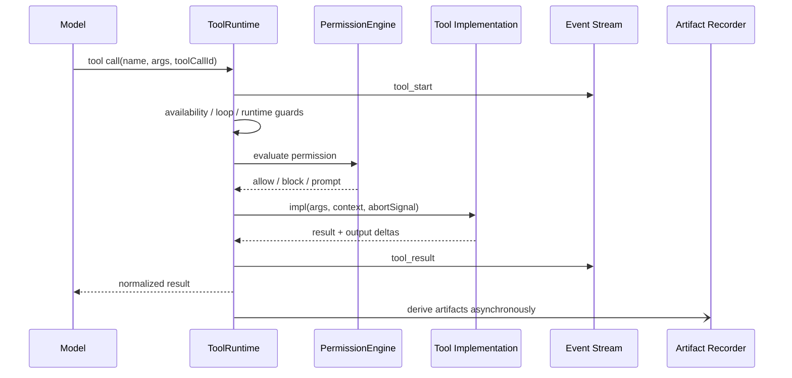
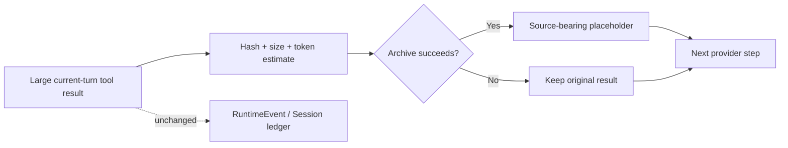
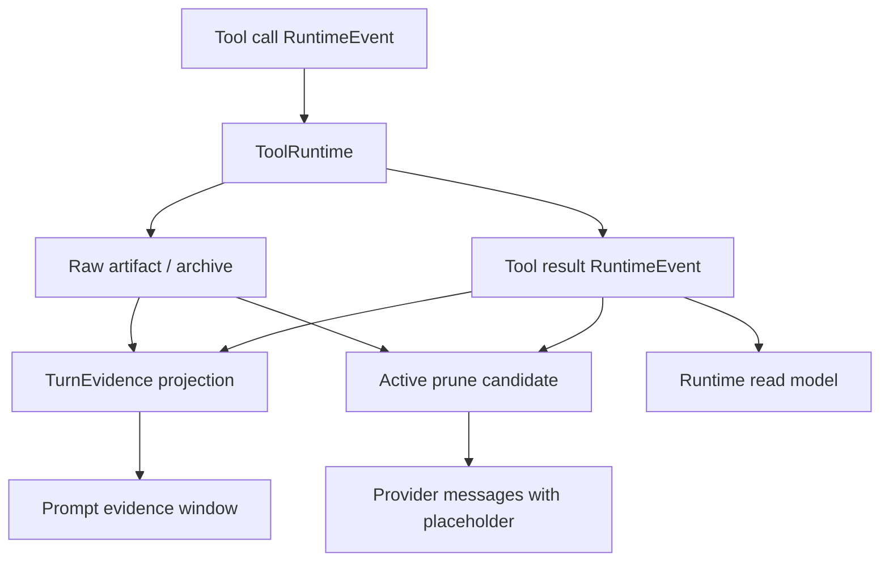

# Chapter 2: Evidence Before Compression—How Tools Leave Turn-Level Evidence

> This chapter answers one question: when a tool call can change the real world and produce enormous output, how does Maka preserve evidence of what happened without letting that result overwhelm the next model step in the same Turn? The answer is not simple truncation. It is to separate facts, raw payloads, evidence, and context—and then enforce one rule: **Prune the context, never prune the evidence.**

This chapter extends the log-first architecture from Chapter 1. RuntimeEvent remains the canonical semantic fact of agent interaction. Artifacts preserve raw payloads that need an independent lifecycle. Turn Evidence is a bounded, source-bearing projection. Active Tool Result Prune rewrites only the provider-visible messages for the next step.

The chapter is for Runtime engineers who need to understand or change tool execution, Evidence projection, and context budgets. It focuses on tool Evidence and active pruning inside one Turn; it does not fully cover stale pruning across old Turns, history compaction, individual tool APIs, or official verifier implementation.

The chapter contains two explicitly different kinds of material:

- **Current**: behavior already implemented in `ToolRuntime`, RuntimeEvent, ArtifactStore, heavy-task compact evidence, and `activeToolResultPrune`;
- **Target**: an architecture direction that converges those capabilities into a generic Turn-level Evidence model.

The Target sections are a design proposal, not a claim that every corresponding type and store has landed.

## Start with an enormous test log

Suppose the user asks Maka to fix a failing test. The model calls Bash, and the test process returns 80,000 lines of output.

That one result creates four simultaneous needs:

1. The model needs the important error to choose its next action.
2. The Runtime must record the Bash call and result so the actual execution history can be replayed.
3. The user may later ask for the full log, so the system cannot retain only a summary.
4. The next model call in the same Turn should not send all 80,000 lines to the provider again.

Keeping the result permanently in the prompt drives up cost and context pressure. Truncating or deleting it destroys the basis for later debugging, audit, or a raw-evidence request. Asking the model to write “I verified it” confuses observed fact with model judgment.

The real question is not how many characters to retain. It is:

> Which roles does one Tool Result play in the system? Which representations must be durable, which can be rebuilt, and which should exist only in the model's working set?

## One Tool Result, four representations

Maka needs four representations of a tool result instead of making one JSON object carry every responsibility.

| Representation | Question it answers | Authority | Lifecycle |
|---|---|---|---|
| Canonical Runtime Fact | What did the model call, and what did the tool return? | Interaction-semantic fact | Durable RuntimeEvent ledger |
| Raw Artifact | Where is the full payload or generated output, and can it still be verified? | Original payload | Independent storage, hashes, and access policy |
| Turn Evidence | Which public observations from this Turn should later consumers retain? | Source-bearing derived evidence | Bounded; rebuildable or regenerable |
| Model Working Context | What is the minimum the next step needs to continue? | Temporary projection | Rematerialized for each provider request |

Their relationship is:

```text
Tool execution
  → RuntimeEvent(function_call / function_response)
  → Artifact(raw payload or generated output)
  → TurnEvidence(source-bearing bounded projection)
  → Provider Messages(current working set)
```

These are not simple copies. RuntimeEvents preserve semantics. Artifacts preserve large payloads. Evidence preserves provenance, summaries, and integrity metadata. Provider Messages serve the current decision and may be pruned, compacted, or reordered.

This separation leads to an important conclusion:

> **Evidence compression may change how the model sees a fact later, but it cannot change whether the fact happened.**

## Why a Turn is the natural Evidence boundary

A tool call occurs inside a model step, but a step is too narrow: one meaningful engineering action often spans several model/tool exchanges. A Session is too broad: it may contain multiple user goals over days. A Run is closer to the execution attempt, but users, the UI, and most replay policy still understand one unit of work as a Turn.

A Turn is a practical midpoint:

- the user input establishes the goal of the work;
- every model/tool event in the Turn shares a `turnId`;
- tool calls and results, permissions, and artifacts can belong to the same unit;
- the Turn's terminal fact says whether it completed, failed, or was aborted;
- the next Turn can consume bounded Evidence from the previous one without expanding every raw output.

Turn Evidence should answer:

```text
What was this Turn trying to accomplish?
Which tools did it actually call?
Which public results did it observe?
Which artifacts did it create or change?
Which outputs were truncated, archived, or omitted?
Which canonical facts and raw payloads support these summaries?
```

It should not answer whether an official verifier is guaranteed to pass, nor should it replace Runtime terminal status. Evidence describes sourced observations. Conclusions and authoritative outcomes belong to other layers.

## Current: ToolRuntime is the side-effect boundary

`ToolRuntime` is already much more than a `tool.impl(args)` wrapper. It is the common boundary between model intent and a real execution environment.

One tool call proceeds in this order:

1. persist `tool_call` and emit `tool_start`;
2. check the identical-failure loop gate;
3. enforce tool availability for the current step;
4. evaluate permission policy and, when necessary, wait for the user;
5. enforce the per-Turn child-agent concurrency limit;
6. pause the model-stream idle watchdog;
7. run the real `tool.impl`, propagate abort, and accept output deltas;
8. normalize success or failure and persist `tool_result`;
9. record tool telemetry and RunTrace;
10. derive artifacts asynchronously;
11. return the result to AI SDK for the next model step.



Read the diagram from top to bottom. The important point is that `tool_result` has clear semantics before control returns to the model, while artifact derivation is a best-effort asynchronous side path. Telemetry and concrete storage adapters are omitted.

### Guard failures must still leave a Tool Result

An unavailable tool, denied permission, repeated identical failure, or exceeded child-agent limit does not disappear silently. `ToolRuntime` writes a synthetic error tool result so both the model and RuntimeEvent ledger know that the call was rejected and why.

This matters because a function call without a result breaks model-history pairing and prevents Evidence from distinguishing “the tool never ran” from “the execution boundary explicitly rejected it.”

### Tool output, Tool result, and Artifact are different things

- output deltas are transient progress while execution is active;
- the tool result is the structured value the model uses to decide what to do next;
- an artifact is a file, diff, or large payload worth preserving and presenting independently.

Current artifact derivation is conservative. Write may derive a file, Edit may derive a diff, and Bash only recognizes an explicit stdout redirect instead of scanning arbitrary stdout and guessing files. Recorder failure produces a generalized warning without changing the tool result; a slow recorder does not block an ordinary result from returning to the model.

This best-effort behavior protects the interactive path. It also means a normal `ArtifactRecord` currently carries stable `sessionId` and `turnId`, but not a complete `toolCallId`, `runId`, or RuntimeEvent reference. Target TurnEvidence must close this provenance gap rather than assume it is already closed.

## Current: RuntimeEvent preserves canonical Tool semantics

`AiSdkFlow` maps `tool_start` to a model-role `function_call` and `tool_result` to a tool-role `function_response`. They are paired by `toolCallId`. A function call may also carry a `stepId`, allowing signed thinking, assistant text, and tool calls to be regrouped during provider-native replay.

The ledger preserves tool-interaction facts rather than compressed Evidence:

```text
function_call(name, args, toolCallId, stepId)
function_response(name, result, isError, toolCallId)
permission request / decision
terminal fact
```

Turn Evidence should therefore not become a second canonical tool history. It should reference RuntimeEvents and provide a bounded view for retries, prompts, exports, and human inspection.

## Current: Compact Evidence exists, but remains Heavy-task scoped

`heavy-task-evidence.ts` already implements a mature compact-evidence policy:

- Bash records command, cwd, exit code, timeout, and bounded stdout/stderr;
- Read, Grep, and Glob record paths, queries, and bounded observations;
- Write and Edit record sizes, paths, and mutation summaries without bodies or raw diffs;
- Artifact evidence preserves metadata without copying artifact bodies;
- non-public or official-verifier-like content is omitted;
- prompts project only the eight most recent evidence envelopes;
- every truncated result records original, visible, and omitted bytes plus a ref kind.

Compact evidence is produced by an internal recorder around tools, not by a model-facing “proof tool.” Its name intentionally avoids the word proof:

> Compact Evidence answers “which recent public observations can help the next attempt avoid duplicate work?” It does not answer “is this enough to prove an official pass?”

The current envelope's durable identity is still centered on `taskRunId` and optional `attemptId`; `turnId`, `sessionId`, and `toolCallId` live inside `source`. That is appropriate for Headless heavy-task, but it is not yet a generic TurnEvidence primitive shared by every Runtime surface.

## Current: Active Tool Result Prune runs inside the same Turn

Stale tool-result pruning handles replay from old Turns. Active Tool Result Prune addresses a more immediate problem:

> Step 1 just produced a huge tool result. Must Step 2 immediately send it back to the provider in full?

The default Desktop context-budget policy currently enables active pruning above an estimated 2,048 tokens, starting at step 1. It runs in AI SDK `prepareStep`, between the end of one provider step and assembly of the next request.

It only considers current-Turn tool calls found in completed `options.steps`. Large results from prior-history replay are not accidentally rewritten by this path; stale history has a separate policy.

### Archive before placeholder

When an eligible tool result exceeds the threshold, Active Prune follows this protocol:

1. serialize the original result deterministically;
2. compute `bodySha256`, `originalBytes`, and estimated tokens;
3. require the host archive writer to persist the complete body;
4. construct a placeholder only after receiving a non-empty `artifactId`;
5. replace the original payload only in the messages returned by this `prepareStep`.



The diagram emphasizes two independent paths. Provider messages may be replaced; the persisted ledger is not rewritten by active pruning. Archive failure sacrifices token savings and preserves the original body.

The placeholder currently carries:

```text
artifactId
turnId
toolCallId
toolName
bodySha256
originalEstimatedTokens
originalBytes
rewriteVersion
reason = active_current_turn_tool_result_pruned_before_next_step
```

The active path runs while the next step is being assembled, so the corresponding RuntimeEvent may not yet provide a directly usable durable event ID. The host archive writer currently uses a stable source key derived from `turnId + toolCallId + body hash`. That is verifiable provenance, but it should not be described as an existing RuntimeEvent reference.

### Fail open and idempotency

Any of the following keeps the original result:

- the archive callback throws;
- the archive returns no result;
- `artifactId` is empty or blank;
- the payload is not a supported tool-result shape;
- the result does not exceed the threshold;
- the tool call is not part of the completed current steps.

A valid placeholder is recognized on later prepare passes and is not archived again. Archive artifact IDs are stable for the same body, and ArtifactStore verifies session, source kind, size, and hash before reuse.

### What Active Prune does not do

It does not:

- delete or rewrite the RuntimeEvent ledger;
- rewrite a tool result already persisted in SessionStore;
- summarize or understand the business meaning of a result;
- claim that the placeholder itself is complete evidence;
- omit a result after archive failure merely to save tokens;
- process every old-history result.

It is a provider request-shaping policy, not a data-retention policy.

## Target: a unified TurnEvidence Envelope

This section describes target architecture, not a shipped public type.

Generic TurnEvidence should be a source-bearing derived record over RuntimeEvents and Artifacts. It may be persisted for efficient replay and export, but it must remain verifiable against canonical facts and raw artifacts. It cannot become a second source of truth competing with RuntimeEvent.

A conceptual envelope could contain:

```ts
interface TurnEvidenceEnvelope {
  schemaVersion: 1
  evidenceId: string
  sessionId: string
  runId?: string
  turnId: string
  ts: number

  kind: 'tool' | 'artifact' | 'check' | 'observation'
  source: {
    runtimeEventIds?: string[]
    toolCallId?: string
    stepId?: string
    artifactIds?: string[]
  }

  visibility: 'model_visible' | 'internal' | 'restricted'
  authority: 'observation' | 'advisory' | 'authoritative'
  summary: unknown
  integrity?: {
    bodySha256?: string
    originalBytes?: number
    visibleBytes?: number
    omittedBytes?: number
    truncated?: boolean
  }
}
```

This is not a final field commitment. It expresses concepts that must remain stable: Turn identity, source references, visibility, authority, bounded summary, and integrity metadata.

### Evidence must be source-bearing

Every summary must explain where it came from. It should satisfy at least one of these conditions:

- reference function-call and function-response RuntimeEvents;
- reference a raw archive artifact with hash and size;
- reference an accepted public check event;
- explicitly state that only a bounded observation remains and the source body cannot be recovered.

A summary that says “the tool succeeded” without a tool call/result reference should not receive high authority.

### Evidence must separate visibility from authority

These dimensions cannot be merged:

- evidence may be public and model-visible while remaining only an observation;
- a self-check may be advisory rather than an official outcome;
- an official verifier artifact may be authoritative but must not leak into the model prompt;
- a mutation body may be restricted while safe metadata remains visible.

The separation allows one model to support prompt replay, human inspection, export, and safety boundaries at the same time.

### Evidence is a projection, not a proof chain

TurnEvidence should reduce repeated work and improve explainability. It should not require the model to maintain a chain of “proof IDs.” The Runtime should derive envelopes internally from tool events, artifacts, and accepted checks. The model may consume Evidence, but it does not decide whether that Evidence is authoritative.

## Target: one Source Chain for Tools, Evidence, and Prune

The converged data flow should look like this:



Read downward from `ToolRuntime`. Canonical results, raw artifacts, and Evidence preserve different levels of information. Active Prune consumes the result and archive contract and emits new provider messages; it never writes back into upstream facts.

Target convergence should close these current gaps:

1. normal tool artifacts record `runId`, `toolCallId`, and source RuntimeEvent linkage;
2. the generic part of Heavy-task compact evidence becomes a Turn-scoped envelope;
3. task-run/attempt and official-verifier fields remain domain extensions instead of polluting the generic Runtime contract;
4. an Evidence read model groups envelopes by Turn and provides bounded prompt/export views;
5. Active archive placeholders and TurnEvidence share artifact, hash, and source identity;
6. raw-evidence requests resolve and verify the source body through that shared chain rather than parsing placeholder text heuristically.

## Architectural invariants

### 1. Prune projection, never ledger

Any context-budget policy may change only the provider-visible projection. A function response already present in the RuntimeEvent ledger must never be deleted or replaced by a placeholder.

### 2. Archive before omission

The system may omit a large payload only after the complete body is durable and a verifiable artifact reference exists.

### 3. Failure keeps evidence

Archive, evidence compaction, or artifact derivation failure must not create a fake recoverable reference. Active pruning keeps the original result. Compact Evidence may be absent, but tool outcome cannot change.

### 4. Evidence must name its source

An Evidence summary must carry RuntimeEvent, tool-call, artifact, or check references. A summary with no traceable source can only be a low-authority observation.

### 5. Tool call/result pairing remains valid

Denial, exception, cancellation, and guard failure still require a matching tool result. Pruning and replay must not separate a function call/response pair.

### 6. Authority never leaks into visibility

Official or private Evidence does not enter the model prompt merely because it is authoritative. A public, model-visible summary does not become official proof.

### 7. Rewrites are idempotent and diagnosable

Placeholders must be recognizable, and repeated projection must not re-archive them. Rewrites, archive failures, and token savings must be observable.

## Failure matrix

| Failure | Current behavior | Required architectural meaning |
|---|---|---|
| Permission denied | Synthetic error tool result | The call ended explicitly; the real side effect did not occur |
| Tool implementation throws | Normalized error result and telemetry | Failure is a paired fact, not a missing event |
| Artifact derivation fails | Warning; tool result continues | A missing auxiliary artifact cannot change execution truth |
| Evidence compaction is unsafe | Omit or redact bounded Evidence | Retry quality may decrease; authority does not change |
| Active archive fails | Keep the full provider message | Correctness takes priority over token savings |
| Placeholder artifact is corrupt | Hydration returns explicit failure | Corrupt content must not masquerade as raw Evidence |
| Process stops mid-tool | Partial and operational recovery path | Success Evidence must not be synthesized |
| Official verifier Evidence is private | Exclude it from model projection | Authority and visibility remain separate |

## Observability

Active Prune already contributes these context-budget diagnostics:

```text
activePrunedToolResults
activeArchiveFailures
activeEstimatedTokensSaved
```

`ToolRuntime` also records duration, status, error class, bytes in/out, provider/model identity, and RunTrace milestones. Target TurnEvidence should make it possible to inspect per Turn:

```text
evidence envelopes by kind and authority
missing or invalid source references
raw payloads archived and recoverable
prompt-visible evidence window size
evidence truncation and redaction counts
active placeholders hydrated or unresolved
```

These metrics do not replace correctness tests. They explain why a request became smaller and whether the reduction preserved a recovery path.

## Design trade-offs

### Why not keep only RuntimeEvents?

RuntimeEvents are sufficient as semantic truth, but that does not mean every consumer should load the full result. TurnEvidence provides a bounded, redacted, authority-aware consumption format for retries and exports.

### Why not keep only Artifacts?

Artifacts preserve source bodies but do not inherently explain their meaning inside a Turn. Without tool-call, RuntimeEvent, and summary linkage, consumers receive only a directory of files.

### Why not let the model author Evidence?

The model may summarize, but it cannot independently decide whether its observation is real, public, or authoritative. An internal projector can generate more stable Evidence from accepted tool/check facts and apply shared redaction and bounds.

### Why is Active Prune more than truncation?

Generic truncation only knows that text is long. Active Prune knows the Turn, tool call, original hash, and artifact, and it preserves the original on failure. It is a source-bearing rewrite protocol.

## Current and Target boundary summary

| Capability | Current | Target |
|---|---|---|
| Canonical tool facts | RuntimeEvent function call/response | Preserve unchanged |
| Tool effect boundary | ToolRuntime | Preserve and emit richer source identity |
| Generic tool artifacts | Turn-scoped, best-effort | Explicitly link tool call and RuntimeEvent |
| Compact evidence | Heavy-task/task-run scoped | Generic TurnEvidence plus domain extensions |
| Prompt evidence | Recent bounded Heavy-task window | Generic, visibility-aware Turn window |
| Active prune | Same-Turn archive-backed message rewrite | Reuse the unified Evidence/archive source chain |
| Raw recovery | Artifact-specific readers | Unified source-ref validation and hydration |
| Official authority | Managed above Runtime by Heavy-task/verifier | Always separated from model visibility |

## Code-reading map

Read the current implementation in this order:

1. `packages/runtime/src/tool-runtime.ts`: tool execution, permission, failure, telemetry, and artifact scheduling.
2. `packages/runtime/src/tool-artifacts.ts`: conservative artifact-candidate derivation.
3. `packages/runtime/src/ai-sdk-flow.ts`: mapping tool SessionEvents to RuntimeEvents.
4. `packages/runtime/src/active-tool-result-prune.ts`: archive-backed current-Turn rewriting.
5. `packages/runtime/src/ai-sdk-backend.ts`: `prepareStep` composition, eligible tool calls, and archive wiring.
6. `packages/runtime/src/context-budget-policy.ts`: Desktop defaults and configuration.
7. `apps/desktop/src/main/tool-result-archive-artifacts.ts`: artifact persistence, reuse, and integrity checks.
8. `packages/headless/src/heavy-task-evidence.ts`: current compact-evidence normalization.
9. `packages/headless/src/task-contracts.ts`: HeavyTask evidence envelopes and authority fields.
10. `packages/headless/src/task-run-store.ts`: evidence events and projection.

Key tests:

- `packages/runtime/src/__tests__/active-tool-result-prune.test.ts`
- `packages/runtime/src/__tests__/tool-artifacts.test.ts`
- `packages/runtime/src/__tests__/tool-runtime-extraction-contract.test.ts`
- `packages/headless/src/__tests__/heavy-task-evidence.test.ts`
- `packages/headless/src/__tests__/tools.test.ts`
- `apps/desktop/src/main/__tests__/tool-result-archive-artifacts.test.ts`
- `apps/desktop/src/main/__tests__/context-budget-policy.test.ts`

## Summary

Tools are where model intent enters the real world and where Evidence begins. But a tool result should not remain in one representation forever.

Maka needs four simultaneous layers:

```text
RuntimeEvent = what happened
Artifact     = where the complete source body lives
TurnEvidence = which sourced observations remain useful
Model Context = what the next step needs now
```

The current system already contains most of the pieces: ToolRuntime's unified side-effect protocol, RuntimeEvent tool facts, ArtifactStore, Heavy-task compact evidence, and archive-backed Active Tool Result Prune. The next step is not to create another Evidence truth. It is to converge the existing pieces around `turnId` and source references.

The final thing to protect is not the completeness of every prompt but the integrity of the evidence chain. Context can become smaller, projections can change, and summaries can be regenerated. As long as canonical facts, raw payloads, and source linkage remain trustworthy, Maka can control inference cost and still answer: what exactly happened at that time?
