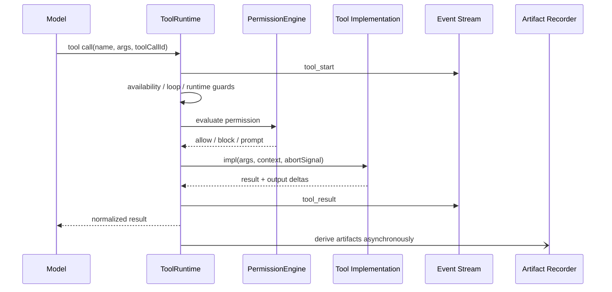
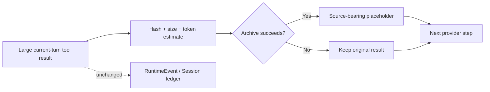
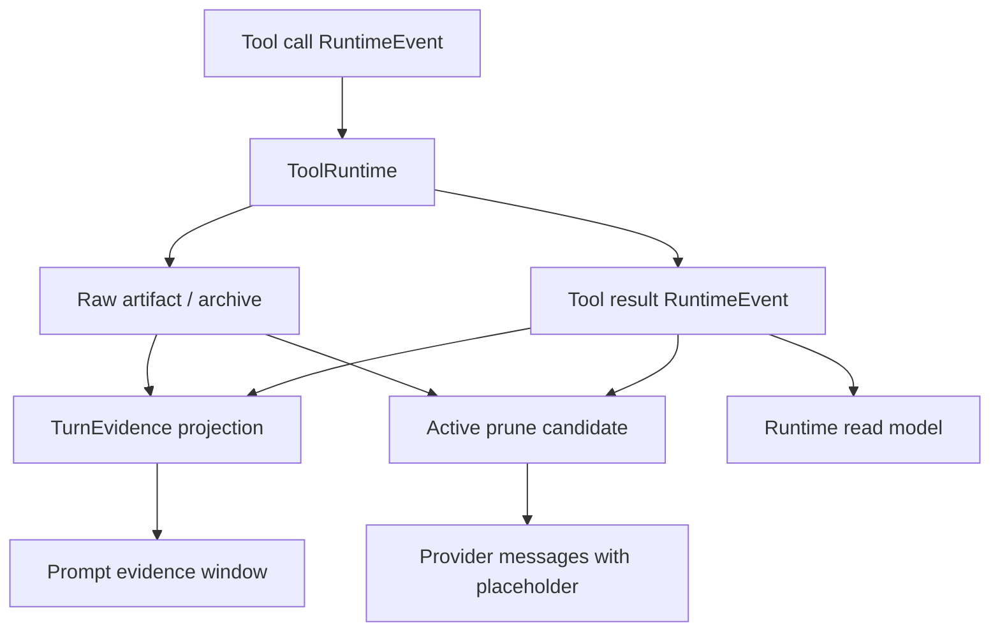

# 第二章：Evidence Before Compression——Tool 如何留下 Turn 级证据

> 本章回答一个核心问题：当一次 Tool 调用既可能改变真实世界，又可能产生巨大的输出时，Maka 如何保留“发生过什么”的证据，同时避免这些结果拖垮同一 Turn 的下一次模型推理？答案不是简单截断，而是先分清事实、原文、证据和上下文，再坚持一条原则：**Prune the context, never prune the evidence.**

本文承接第一章的 log-first 架构。RuntimeEvent 仍是 Agent 交互的 canonical semantic fact；Artifact 保存需要独立生命周期的原始载荷；Turn Evidence 是带来源的有限长投影；Active Tool Result Prune 只改写下一 step 的 provider-visible messages。

本文面向需要理解或修改工具执行、Evidence 投影与上下文预算的 Runtime 工程师。它聚焦同一 Turn 内的工具证据与 active prune，不完整展开旧 Turn 的 stale pruning、history compaction、具体工具 API 或 official verifier 实现。

本文同时包含两类内容：

- **Current**：已经存在于 `ToolRuntime`、RuntimeEvent、ArtifactStore、heavy-task compact evidence 和 `activeToolResultPrune` 中的行为；
- **Target**：把这些能力收敛成通用 Turn-level Evidence 模型的架构方向。

Target 部分是设计提案，不代表对应类型和存储已经全部落地。

## 从一份巨大的测试日志开始

假设用户让 Maka 修复一个失败的测试。模型调用 Bash，测试进程返回 80,000 行输出。

这份结果同时触发四个需求：

1. 模型需要看到关键错误，才能决定下一步。
2. Runtime 需要记录 Bash 调用和结果，才能回放真实执行历史。
3. 用户以后可能要求查看完整日志，系统不能只剩一句摘要。
4. 同一个 Turn 的下一次模型调用不应该再次携带 80,000 行原文。

如果直接把结果永久保留在 prompt 中，推理成本和上下文压力会快速增长。如果直接截断或删除，后续调试、审计和 raw evidence request 就失去依据。如果让模型自己写一段“我已经验证过”，又把观察事实和模型判断混在了一起。

真正的问题不是“截断到多少字符”，而是：

> 同一个 Tool Result 在系统里究竟扮演哪些角色？哪些必须 durable，哪些可以重建，哪些只应该短暂存在于模型工作集？

## 一个 Tool Result，四种不同的表示

Maka 需要把一次工具结果拆成四种表示，而不是让一个 JSON 对象承担所有责任。

| 表示 | 回答的问题 | 权威性 | 生命周期 |
|---|---|---|---|
| Canonical Runtime Fact | 模型调用了什么，工具返回了什么？ | 交互语义事实 | Durable RuntimeEvent ledger |
| Raw Artifact | 完整原文或生成物在哪里？是否仍可校验读取？ | 原始载荷 | 独立存储、hash 与访问策略 |
| Turn Evidence | 这个 Turn 中有哪些值得后续消费的公开观察？ | Source-bearing 派生证据 | Bounded、可重建或可重新生成 |
| Model Working Context | 下一 step 为了继续推理最少要看到什么？ | 临时投影 | 每次 provider request 重新物化 |

这四层的关系可以写成：

```text
Tool execution
  → RuntimeEvent(function_call / function_response)
  → Artifact(raw payload or generated output)
  → TurnEvidence(source-bearing bounded projection)
  → Provider Messages(current working set)
```

它们之间不是简单复制关系。RuntimeEvent 保存语义；Artifact 保存大载荷；Evidence 保存来源、摘要和完整性信息；Provider Messages 为当前决策服务，可以被裁剪、压缩或重新排序。

这一区分带来一个重要结论：

> **Evidence compression 可以改变模型以后怎样看见事实，但不能改变事实是否发生过。**

## 为什么 Turn 是自然的 Evidence 边界

Tool call 发生在 model step 内部，但 step 太细：一个有意义的工程动作往往需要多次模型与工具交替。Session 又太宽：它可能跨越多个用户目标和几天的交互。Run 更接近执行尝试，但用户、UI 和多数回放策略仍以 Turn 理解一轮工作。

Turn 提供了一个实用中点：

- 用户输入为这一轮设定目标；
- 本轮所有 model/tool events 共享 `turnId`；
- tool call/result、permission 和 artifacts 都能归属到同一轮；
- Turn terminal fact 给出这轮最终完成、失败或中止状态；
- 下一轮可以把上一轮 Evidence 作为有界工程记忆，而不必重新展开所有原始输出。

Turn Evidence 应当能够回答：

```text
这个 Turn 想完成什么？
它实际调用了哪些工具？
观察到了什么公开结果？
产生或修改了哪些 artifact？
哪些输出被截断、归档或省略？
这些摘要能指回哪些 canonical facts 和 raw payloads？
```

它不应该回答“官方 verifier 一定会通过”，也不应该替代 Runtime terminal status。Evidence 描述有来源的观察；结论和权威结果属于其他层。

## Current：ToolRuntime 是副作用边界

当前 `ToolRuntime` 已经不是一个简单的 `tool.impl(args)` 包装器。它是模型意图进入真实执行环境之前的统一边界。

一次工具调用按下面的顺序推进：

1. 持久化 `tool_call`，并发出 `tool_start`；
2. 检查相同失败调用的 loop gate；
3. 检查本 step 的 tool availability；
4. 评估 permission policy，必要时等待用户决定；
5. 检查 Turn 内子 Agent 并发上限；
6. 暂停模型 stream idle watchdog；
7. 执行真实 `tool.impl`，传播 abort signal，并允许输出 delta；
8. 归一化结果或失败，持久化 `tool_result`；
9. 记录 tool telemetry 与 RunTrace；
10. 异步派生 artifact；
11. 把结果返回给 AI SDK，进入下一 model step。



这张图从上向下读，重点是 `tool_result` 在返回模型前已经形成明确语义，而 artifact 派生是 best-effort 的异步旁路。图中省略了 telemetry 和具体存储适配。

### Guard 失败也必须留下 Tool Result

工具未加载、权限被拒绝、相同失败调用反复出现、子 Agent 超出并发上限，这些路径不会静默消失。`ToolRuntime` 会写入 synthetic error tool result，让模型和 RuntimeEvent ledger 都知道“调用被拒绝以及原因”。

这很重要：没有 result 的 function call 会破坏模型历史配对，也会让 Evidence 无法区分“工具从未执行”和“执行边界明确拒绝”。

### Tool output、Tool result 与 Artifact 不是同一件事

- output delta 是运行中的瞬时进度；
- tool result 是模型接下来采取行动所依据的结构化结果；
- artifact 是值得独立保存和展示的文件、diff 或大载荷。

当前 artifact 派生是保守的：Write 可以派生文件，Edit 可以派生 diff，Bash 只处理显式 stdout redirect，不会扫描任意 stdout 猜测文件。Recorder 失败只产生通用 warning，不会改变 tool result；慢 recorder 也不会阻塞普通工具结果返回模型。

这种 best-effort 设计保护了交互主链，但也意味着当前普通 ArtifactRecord 只稳定带有 `sessionId` 和 `turnId`，并未完整保存 `toolCallId`、`runId` 或 RuntimeEvent ref。Target TurnEvidence 需要补上这条 source linkage，而不能假设它已经存在。

## Current：RuntimeEvent 保存 Tool 的 canonical semantics

`AiSdkFlow` 将 `tool_start` 映射为 model-role `function_call`，将 `tool_result` 映射为 tool-role `function_response`。两者通过 `toolCallId` 配对；function call 还可以携带 `stepId`，使 signed thinking、assistant text 和 tool calls 在 provider-native replay 时重新组合。

这份 ledger 保存的是工具交互事实，不是压缩后的 Evidence：

```text
function_call(name, args, toolCallId, stepId)
function_response(name, result, isError, toolCallId)
permission request / decision
terminal fact
```

因此，Turn Evidence 不应该成为第二份 canonical tool history。它应该引用 RuntimeEvent，并提供为 retry、prompt、export 和人类检查准备的 bounded view。

## Current：Compact Evidence 已经存在，但仍属于 Heavy-task

当前 `heavy-task-evidence.ts` 已经实现了一套成熟的 compact evidence 规则：

- Bash 记录 command、cwd、exit code、timeout 与 bounded stdout/stderr；
- Read/Grep/Glob 记录路径、查询和 bounded observation；
- Write/Edit 只记录大小、路径和 mutation summary，不捕获 body 或 raw diff；
- Artifact evidence 保存 metadata，不复制 artifact body；
- 非公开或疑似 official-verifier 内容会被省略；
- prompt 只投影最近 8 个 evidence envelopes；
- 每个截断结果记录 original、visible、omitted bytes 与 ref kind。

Compact evidence 由工具外面的 internal recorder 产生，不是暴露给模型的“证明工具”。它的名字故意不是 proof：

> Compact Evidence 回答“最近有哪些公开观察能帮助下一轮少做重复工作”，而不是“这些信息足以证明 official pass”。

当前 envelope 的 durable identity 仍以 `taskRunId` 和可选 `attemptId` 为主；`turnId`、`sessionId` 与 `toolCallId` 位于 `source` 中。这对 Headless heavy-task 很合适，但尚未构成所有 Runtime surface 都能直接使用的通用 TurnEvidence。

## Current：Active Tool Result Prune 发生在同一 Turn 内

Stale tool-result pruning 处理旧 Turn 的 replay；Active Tool Result Prune 解决的是更紧迫的问题：

> Step 1 刚产生一个巨大 tool result，Step 2 是否必须立即把它原样再发给 provider？

当前默认 Desktop context-budget policy 会启用 active prune，阈值为估算 2,048 tokens，默认从 step 1 开始。它运行在 AI SDK `prepareStep` 中，位于一次 provider step 结束与下一 step request 组装之间。

它只处理 `options.steps` 中已经完成的当前 Turn tool calls。历史 replay 里同名的大结果不会被 active path 误改写；旧历史有独立的 stale prune 策略。

### Archive before placeholder

当一个 eligible tool result 超过阈值时，Active Prune 执行以下协议：

1. 稳定序列化原始 result；
2. 计算 `bodySha256`、`originalBytes` 和估算 tokens；
3. 要求 host archive writer 持久化完整原文；
4. 只有拿到非空 `artifactId` 后，才构造 placeholder；
5. 只在本次 `prepareStep` 返回的新 messages 中替换原始 payload。



这张图强调两条独立路径：provider messages 可以被替换，persisted ledger 不会被 active prune 改写。Archive 失败时牺牲 token 节省，保留原文。

Placeholder 当前携带：

```text
artifactId
turnId
toolCallId
toolName
bodySha256
originalEstimatedTokens
originalBytes
rewriteVersion
reason = active_current_turn_tool_result_pruned_before_next_step
```

Active path 发生在下一 step 组装时，对应 RuntimeEvent 可能尚未成为一个可直接引用的 durable event ID。因此 host archive writer 当前使用 `turnId + toolCallId + body hash` 生成稳定 source key。它是可验证的来源键，但不应该在文档里冒充已经存在的 RuntimeEvent ref。

### Fail open 与 idempotency

下面任何情况都会保留原始结果：

- archive callback 抛错；
- archive 没有返回结果；
- `artifactId` 为空或只有空白；
- payload 不是受支持的 tool-result shape；
- 结果未超过阈值；
- tool call 不属于当前 completed steps。

合法 placeholder 在后续 prepare passes 中会被识别，不会重复 archive。相同 body 的 archive artifact ID 也是稳定的，ArtifactStore 会校验 session、source kind、size 和 hash 后复用。

### Active Prune 不做什么

它不会：

- 删除或改写 RuntimeEvent ledger；
- 改写 SessionStore 中已经持久化的 tool result；
- 总结或理解 tool result 的业务语义；
- 宣称 placeholder 本身就是完整 evidence；
- 在 archive 失败时为了省 token 强行省略；
- 处理所有旧历史结果。

它是一项 provider request shaping policy，不是数据保留策略。

## Target：统一的 TurnEvidence Envelope

下面描述的是目标架构，而不是已经发布的公共类型。

通用 TurnEvidence 应该是 RuntimeEvent 与 Artifact 之上的 source-bearing derived record。它可以持久化以便高效 replay/export，也必须能够从 canonical facts 和 raw artifacts 重新验证；它不能成为与 RuntimeEvent 竞争的第二份事实源。

一个概念性 envelope 可以包含：

```ts
interface TurnEvidenceEnvelope {
  schemaVersion: 1
  evidenceId: string
  sessionId: string
  runId?: string
  turnId: string
  ts: number

  kind: 'tool' | 'artifact' | 'check' | 'observation'
  source: {
    runtimeEventIds?: string[]
    toolCallId?: string
    stepId?: string
    artifactIds?: string[]
  }

  visibility: 'model_visible' | 'internal' | 'restricted'
  authority: 'observation' | 'advisory' | 'authoritative'
  summary: unknown
  integrity?: {
    bodySha256?: string
    originalBytes?: number
    visibleBytes?: number
    omittedBytes?: number
    truncated?: boolean
  }
}
```

这不是最终字段承诺，而是表达几个必须稳定的概念：Turn identity、source refs、visibility、authority、bounded summary 和 integrity metadata。

### Evidence 必须 source-bearing

任何摘要都要能说明自己从哪里来。至少应该满足以下一种：

- 引用 function call/response RuntimeEvent；
- 引用 raw archive artifact，并带 hash/size；
- 引用 accepted public check event；
- 明确标记只有 bounded observation、原文不可恢复。

“某个工具运行成功”但没有 tool call/result ref 的摘要，不应该获得高 authority。

### Evidence 必须区分 visibility 与 authority

这两个维度不能合并：

- 某条 evidence 可以是公开且 model-visible，但只是 observation；
- self-check 可以是 advisory，而不是 official result；
- official verifier artifact 可以 authoritative，但不应该泄漏到 model prompt；
- mutation body 可以 restricted，同时保留安全 metadata。

只有明确区分，系统才能同时支持 prompt replay、human inspection、export 和安全边界。

### Evidence 是 projection，不是 proof chain

TurnEvidence 的目标是减少重复工作并提高可解释性，而不是要求模型维护一串“证明 ID”。Evidence envelope 应由 Runtime 内部从 tool events、artifacts 和 accepted checks 派生。模型可以使用它，但不负责宣布它是否权威。

## Target：让 Tool、Evidence 与 Prune 共用一条 Source Chain

统一后的数据流应该是：



从 `ToolRuntime` 向下读：canonical result、raw artifact 和 Evidence 分别保存不同层次的信息。Active Prune 消费 result 与 archive contract，输出新的 provider messages；它不回写上游事实。

Target convergence 应补齐当前的几个断点：

1. 普通 tool artifact 记录 `runId`、`toolCallId` 和 source RuntimeEvent linkage；
2. Heavy-task compact evidence 的通用部分下沉为 Turn-scoped envelope；
3. task-run/attempt、official verifier 等领域字段保留为上层扩展，而不是污染通用 Runtime contract；
4. Evidence read model 按 Turn 聚合并提供 bounded prompt/export views；
5. Active archive placeholder 与 TurnEvidence 共享 artifact/hash/source identity；
6. raw evidence request 通过统一 source chain 定位并校验原文，而不是解析 placeholder 文本猜测。

## 必须保护的架构不变量

### 1. Prune projection, never ledger

任何 context-budget 策略只能改变 provider-visible projection。RuntimeEvent ledger 中已发生的 function response 不得被删除或替换成 placeholder。

### 2. Archive before omission

只有完整原文已经持久化，并且得到可校验 artifact ref，系统才能用 placeholder 省略大 payload。

### 3. Failure keeps evidence

Archive、evidence compaction 或 artifact derivation 失败时，不能伪造一个可恢复引用。Active prune 必须保留原始 result；compact evidence 可以缺失，但不能改变 tool outcome。

### 4. Evidence must name its source

Evidence summary 必须携带 RuntimeEvent、tool call、artifact 或 check refs。无法回溯来源的摘要只能是低权威 observation。

### 5. Tool call/result pairing remains valid

拒绝、异常、取消和 guard failure 也要产生匹配的 tool result。Prune 和 replay 不能拆散 function call/response pair。

### 6. Authority never leaks into visibility

Official/private evidence 不因权威而自动进入模型 prompt；公开摘要也不因 model-visible 而变成 official proof。

### 7. Rewrites are idempotent and diagnosable

Placeholder 必须可识别，重复 projection 不得反复 archive。每次 rewrite、archive failure 和 token saving 都应该有 diagnostics。

## Failure Matrix

| Failure | Current behavior | Required architectural meaning |
|---|---|---|
| Permission denied | Synthetic error tool result | 调用明确结束，未发生真实副作用 |
| Tool implementation throws | Normalized error result + telemetry | 失败是可配对的事实，不是丢失事件 |
| Artifact derivation fails | Warning; tool result continues | 辅助 artifact 缺失不能改变执行事实 |
| Evidence compaction unsafe | Omit/redact bounded evidence | Retry 质量可能下降，authority 不改变 |
| Active archive fails | Keep full provider message | correctness 优先于 token savings |
| Placeholder artifact corrupt | Hydration returns explicit failure | 不得把损坏内容冒充 raw evidence |
| Process stops mid-tool | Partial/operational recovery path | 不得合成成功 evidence |
| Official verifier evidence is private | Exclude from model projection | authority 与 visibility 分离 |

## Observability

当前 Active Prune 已向 context-budget diagnostics 提供：

```text
activePrunedToolResults
activeArchiveFailures
activeEstimatedTokensSaved
```

ToolRuntime 还记录 duration、status、error class、bytes in/out、provider/model identity 与 RunTrace milestones。Target TurnEvidence 应进一步允许按 Turn 观察：

```text
evidence envelopes by kind and authority
source refs missing or invalid
raw payloads archived and recoverable
prompt-visible evidence window size
evidence truncation and redaction counts
active placeholders hydrated or unresolved
```

这些指标不能替代 correctness tests。它们的作用是解释一次 request 为什么变小，以及缩小过程中有没有损失恢复路径。

## 设计取舍

### 为什么不只保留 RuntimeEvent

RuntimeEvent 足以作为 semantic truth，但并不意味着每个消费者都应该读取完整 result。TurnEvidence 提供 bounded、redacted、authority-aware 的消费格式，减少 retry 和 export 重复处理大载荷。

### 为什么不只保留 Artifact

Artifact 保存原文，却不天然解释它在 Turn 中的意义。没有 tool call、RuntimeEvent 和 summary linkage，使用者只得到一堆文件。

### 为什么不让模型自己写 Evidence

模型可以总结，但不能独立决定自己的观察是否真实、公开或权威。内部 projector 能从已接受的 tool/check facts 生成更稳定的 evidence，并执行统一的 redaction 与 bounds。

### 为什么 Active Prune 不是普通 truncation

普通 truncation 只知道“文本太长”。Active Prune 知道这是哪个 Turn、哪个 tool call、原始 hash 和 artifact，并在失败时保留原文。它是 source-bearing rewrite protocol。

## Current 与 Target 的边界总结

| 能力 | Current | Target |
|---|---|---|
| Canonical tool facts | RuntimeEvent function call/response | 保持不变 |
| Tool effect boundary | ToolRuntime | 保持并输出更完整 source identity |
| Generic tool artifacts | Turn-scoped, best-effort | 与 tool call/RuntimeEvent 显式关联 |
| Compact evidence | Heavy-task/task-run scoped | 通用 TurnEvidence + 领域扩展 |
| Prompt evidence | Heavy-task recent bounded window | 通用、visibility-aware Turn window |
| Active prune | Same-turn archive-backed message rewrite | 复用统一 Evidence/archive source chain |
| Raw recovery | Artifact-specific readers | 统一按 source ref 校验与 hydrate |
| Official authority | Heavy-task/verifier 上层管理 | 始终与 model visibility 分离 |

## 代码阅读地图

Current 实现建议按以下顺序阅读：

1. `packages/runtime/src/tool-runtime.ts`：工具执行、权限、失败、telemetry 与 artifact 调度。
2. `packages/runtime/src/tool-artifacts.ts`：保守 artifact candidate 派生。
3. `packages/runtime/src/ai-sdk-flow.ts`：tool SessionEvent 到 RuntimeEvent 的映射。
4. `packages/runtime/src/active-tool-result-prune.ts`：archive-backed current-turn rewrite。
5. `packages/runtime/src/ai-sdk-backend.ts`：`prepareStep` 组合、eligible tool calls 与 archive wiring。
6. `packages/runtime/src/context-budget-policy.ts`：Desktop 默认阈值和开关。
7. `apps/desktop/src/main/tool-result-archive-artifacts.ts`：artifact persistence、复用与完整性校验。
8. `packages/headless/src/heavy-task-evidence.ts`：现有 compact evidence normalization。
9. `packages/headless/src/task-contracts.ts`：HeavyTask evidence envelope 与 authority 字段。
10. `packages/headless/src/task-run-store.ts`：evidence events 与 projection。

关键测试：

- `packages/runtime/src/__tests__/active-tool-result-prune.test.ts`
- `packages/runtime/src/__tests__/tool-artifacts.test.ts`
- `packages/runtime/src/__tests__/tool-runtime-extraction-contract.test.ts`
- `packages/headless/src/__tests__/heavy-task-evidence.test.ts`
- `packages/headless/src/__tests__/tools.test.ts`
- `apps/desktop/src/main/__tests__/tool-result-archive-artifacts.test.ts`
- `apps/desktop/src/main/__tests__/context-budget-policy.test.ts`

## 小结

Tool 是模型意图进入真实世界的边界，也是 Evidence 产生的地方。但 tool result 不能永远以同一种形态存在。

Maka 需要同时保存四层信息：

```text
RuntimeEvent = 发生过什么
Artifact     = 完整原文在哪里
TurnEvidence = 哪些有来源的观察值得继续消费
Model Context = 下一步现在需要看到什么
```

当前系统已经拥有这些能力的大部分组成：ToolRuntime 的统一副作用协议、RuntimeEvent tool facts、ArtifactStore、Heavy-task compact evidence，以及 archive-backed Active Tool Result Prune。下一步不是再造一套 Evidence truth，而是把现有能力围绕 `turnId` 和 source refs 收敛起来。

最终要保护的不是每次 prompt 的完整性，而是证据链的完整性：上下文可以变轻，投影可以变化，摘要可以重新生成；只要 canonical facts、raw payload 和 source linkage 仍然可信，Maka 就能既控制推理成本，又回答“当时究竟发生了什么”。
