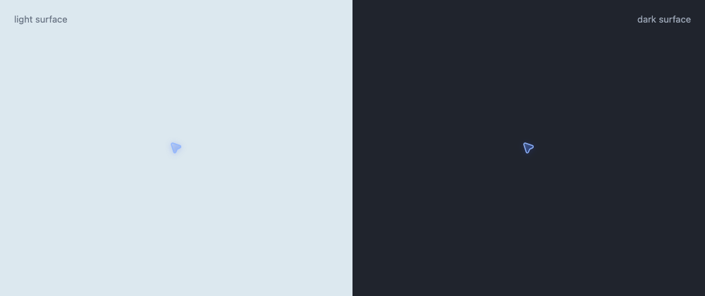
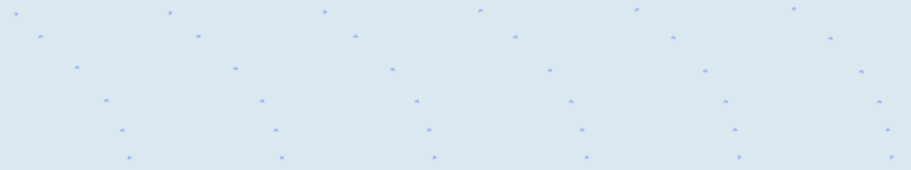

# Codex Computer Use Cursor Reverse Engineering

This document records the cursor-specific evidence used by Maka's overlay. It
keeps confirmed native facts separate from implementation inference.

## Inspected artifact

- App: `~/.codex/computer-use/Codex Computer Use.app`
- Executable: `Contents/MacOS/SkyComputerUseService`
- Bundle identifier: `com.openai.sky.CUAService`
- Signed: 2026-07-16
- SHA-256: `44320516c4c400fb5459b203498c78e4af318b0096464f16c4445a47f2b8b8f4`

## Confirmed style architecture

The current native binary contains:

- `ComputerUseCursor`
- `ComputerUseCursor.Style`
- `SoftwareCursorStyle`
- `FogCursorStyle`
- `FogCursorViewModel`
- `AgentCursor`
- `CursorView`

`SoftwareCursor` is a separate `200x230` asset and is not the soft cursor shown
by the current Fog style. `FogCursorStyle` hosts `CursorView` in an
`NSHostingView`. Its hotspot getter returns half the hosting view size, so the
action coordinate is the view center rather than the arrow tip.

## Exact AgentCursor geometry

`AgentCursor.path(in:)` builds a normalized path:

1. Move to `(0.00599w, 0.15864h)`.
2. Curve to `(0.15158w, 0.00627h)` with controls
   `(-0.02364w, 0.06456h)` and `(0.06169w, -0.02474h)`.
3. Line to `(0.87634w, 0.25652h)`.
4. Curve to `(0.88794w, 0.48095h)` with controls
   `(0.97594w, 0.29096h)` and `(0.98340w, 0.43547h)`.
5. Line to `(0.59343w, 0.62108h)`.
6. Line to `(0.45955w, 0.92925h)`.
7. Curve to `(0.24510w, 0.91717h)` with controls
   `(0.41611w, 1.02925h)` and `(0.27801w, 1.02146h)`.
8. Line back to the start and close.

The observed Retina screenshot has an approximately `29x30` physical-pixel
strong silhouette, consistent with a `14x14` logical-point path plus stroke.

## Exact MotionConfiguration.live values

| Field | Value |
|---|---:|
| clickAngle | -44 degrees |
| candidateCount | 20 |
| boundsMargin | 20 |
| startHandle | 0.41960295031576633 |
| endpointHandle | 0.15 |
| arcSize | 0.27655231880642772 |
| arcFlow | 0.5783555327868779 |
| straightPathDistanceThreshold | 10 |
| springResponseScaler | 0.9 |
| springResponseMin | 0.12 |
| springResponseMax | 2.2 |
| springDampingFraction | 0.9 |
| scootDistanceThreshold | 196 |
| scootPositionResponse | 0.24 |
| scootPositionDampingFraction | 0.84 |
| scootPositionSettleVelocity | 12 |
| scootAxisResponse | 0.07 |
| scootAxisDampingFraction | 0.82 |
| scootBaseRotationResponse | 0.09 |
| scootBaseRotationDampingFraction | 0.86 |
| scootStretchResponse | 0.095 |
| scootStretchDampingFraction | 0.72 |
| scootStretchMin | 0 |
| scootStretchPivotX | 0.5 |
| scootStretchXAmount | 0.38 |
| scootSquashYAmount | 0.18 |
| scootRotationResponse | 0.055 |
| scootRotationDampingFraction | 0.76 |
| scootRotationMax | 76 degrees |
| terminalTangentBlendStart | 0.99 |

The window stores separate animation objects for motion progress, scoot
position, base rotation, axis, stretch, and rotation offset. Style state exposes
velocity, pressed/activity/attached state, angle, X stretch, overall stretch,
pivot, stretch angle, and tilt angle.

## Window and lifecycle findings

- The virtual cursor is lazily created and retained for reuse.
- `orderOut()` hides it without clearing the controller field.
- The overlay is associated with a target window/application and can remain
  behind an unrelated foreground app. It is not a global screen-saver-level
  overlay.
- `move` accepts target point, target window ID, relative-window mode,
  next-interaction timing, animation, fade-in, and delegate flags.
- Successful virtual-cursor press still precedes the ordinary synthetic CG
  event path; the cursor is a visual interaction layer, not a click backend.

## Maka implementation boundary

Maka copies the exact glyph, hotspot convention, thresholds, and recovered
configuration constants. The binary's candidate path scoring function is
stripped, so Maka uses a deterministic 20-candidate cubic planner with the exact
handle and arc constants. This is a structural reproduction, not a claim of
instruction-for-instruction equivalence.

## Visual validation

The same built Canvas engine is rendered on both light and dark surfaces:

The contact sheet below samples one long move from the built overlay bundle. It
shows the curved path, movement-axis stretch and rotation, and terminal settle:

