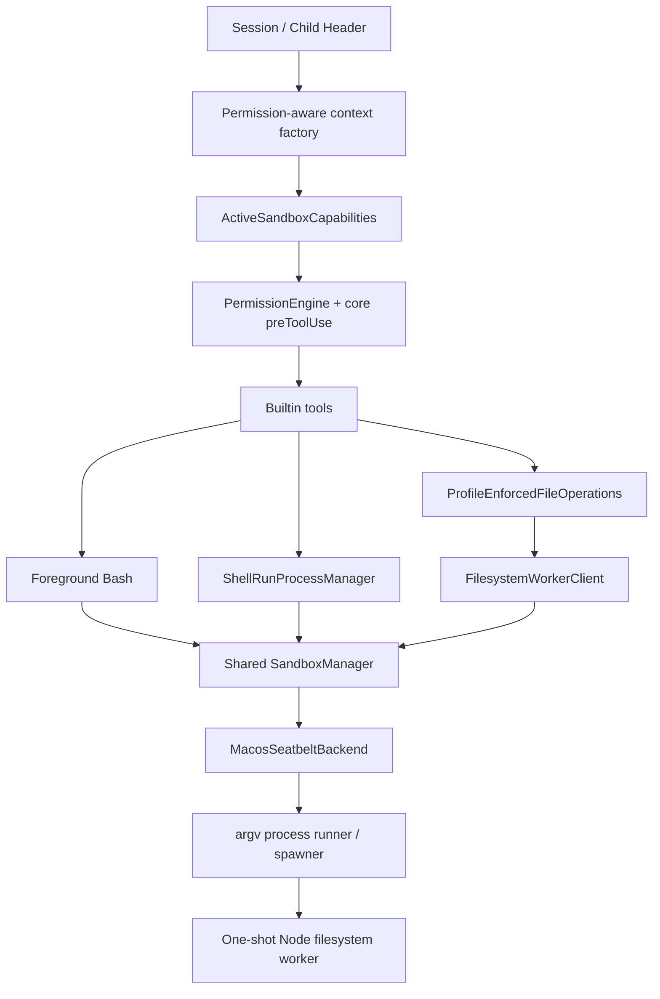

# Agent Runtime Sandbox Phase 7.6-8 Implementation Plan

本文档把 `agent-runtime-codex-sandbox-todo.md` 中已经确认的 Phase 7.6、7.7、7.8 和 Phase 8 设计拆成可执行、可测试、可独立审查的实现步骤。

状态：Phase 7.6-8 已完成实现、文档收口与最终验证。

实现基线：`feat/runtime-permission-profile-sandbox` 分支从已完成的 Phase 1-7.5 继续推进，本计划中的 Commit 1-13 均已落地。

关联文档：

- `docs/sandbox/agent-runtime-codex-sandbox-todo.md`
- `docs/sandbox/agent-runtime-codex-sandbox-status.md`

## 范围

本计划完成 macOS sandbox 安全执行主链路：

- background Bash 接入 `SandboxManager + MacosSeatbeltBackend`。
- Read / Write / Edit / Glob / Grep 的真实文件操作下沉到 one-shot sandboxed worker。
- desktop / CLI / child agent 的本地 managed runtime 不再存在 host execution fallback。
- headless / isolated executor 保持 explicit external sandbox 语义。
- `PermissionEngine` 在现有 policy matrix 前增加 sandbox capability gate。

本计划不实现：

- Linux backend。
- Windows sandbox。
- unsandboxed retry。
- managed network proxy。
- worktree / diff / write-back。
- Phase 9 model context 和完整 diagnostics UI。

## 目标架构

## 固定原则

- 本地 managed runtime 必须提供 sandbox context，不保留 legacy host fallback。
- `bypass` 仍提供有效 context，由 `SandboxManager` 明确选择 `none`。
- capability snapshot 只用于 policy；transform、launch 和 OS sandbox 是执行时权威边界。
- sandbox 必需但不可用时直接 block，不使用普通 approval 代替 unsandboxed retry。
- command、background command 和 filesystem 共用一个 process-level `SandboxManager`。
- 文件工具保留业务层 profile enforcement，并增加 OS sandbox worker 兜底。
- worker 不继承 host secrets，不运行 shell，不接受模型指定的 executable。
- 每个行为 commit 同时包含对应测试。

## Commit 1: 拆分 Command 与 File Operation 接口

Commit：`refactor(runtime): split command and file operation executors`

主要修改：

- 在 `packages/runtime/src/workspace-executor.ts` 拆分 `WorkspaceCommandExecutor` 与复合 `WorkspaceFileOperations`。
- 定义 `read()`、`write()`、`edit()`、`glob()`、`grep()` 完整 operation 输入与结果。
- 调整 `buildBuiltinTools()`，分别接收 command、file operations 和可选 background shell controller。
- 移除无参数 `buildBuiltinTools()` 自动创建 host local executor 的行为。
- 提供显式 local/test implementation，迁移现有测试。
- 更新 headless adapter 的类型引用，但不改变 external execution 语义。

验证：

- runtime typecheck。
- builtin tools、workspace executor、headless adapter 定向测试。
- 现有工具结果 shape 不变。

## Commit 2: 共享 Sandbox Context 与错误契约

Commit：`feat(runtime): add shared sandbox context and error contracts`

主要修改：

- 新增 permission-aware sandbox context factory。
- factory 统一编译 profile、workspace roots、canonical cwd 和 platform path context。
- 定义共享 `SandboxErrorMetadata` 与安全 serializer。
- 调整 command/background/filesystem 领域错误以实现公共 metadata。
- 新增 `deriveFilesystemWorkerProfile()`：restricted read/search 收窄为 read-only；write/edit 保留 active write policy。

验证：

- context factory profile 映射测试。
- operation profile narrowing 测试。
- error serializer 不输出 argv/env/content/policy。

## Commit 3: Background Bash Sandbox 核心

Commit：`feat(runtime): sandbox background shell runs`

主要修改：

- `ShellRunProcessManagerInput` 增加必需 async context provider。
- provider 返回显式 result union；`ShellRunBashInput` 删除 `cwd`。
- context canonical cwd 成为 transform、spawn 和 record 的唯一 cwd。
- 新增可注入 `ShellRunProcessSpawner`，只接受 argv，固定 `shell: false`。
- context/validation/transform/argv 全部成功后才生成 id、spawn 和创建 record。
- transform 后执行 `/usr/bin/sandbox-exec ... /bin/sh -lc <command>`。
- 同一 commit 更新所有 `ShellRunProcessManager` 构造位置和测试 fixture，确保必需 provider 接口落地后仓库仍可构建。
- 保留 live output、yield、ref、Read、Stop、timeout、abort 和 process tree termination。

验证：

- fake provider / manager / spawner 测试最终 argv。
- context、roots、transform、argv failure 均不 spawn、不创建 record。
- quick command 与 background lifecycle 回归测试。

## Commit 4: 统一 Desktop / CLI Sandbox Assembly

Commit：`refactor(runtime): unify desktop and cli sandbox assembly`

主要修改：

- 在 Commit 3 的可工作 provider 接线基础上，desktop 与 CLI 各收束为一个共享 `SandboxManager`。
- foreground、background 和后续 worker assembly 显式复用该 manager。
- provider 根据 `sessionId` 读取当前 header，规范化 cwd，并生成 context。
- session/header/cwd/profile 解析失败映射成结构化 context result。

验证：

- desktop / CLI assembly contract tests。
- ask/execute 使用 workspace-write；explore 使用 read-only；bypass 明确选择 none。

## Commit 5: Mode 切换终止 Background Runs

Commit：`fix(runtime): terminate background tasks on permission mode changes`

主要修改：

- `SessionManager.setPermissionMode()` 在更新 header 前调用 `shellRuns.terminateSession(sessionId)`。
- termination 失败时不更新 header、不 dispose 成新 backend。
- 相同 mode 的 no-op 不终止任务。

验证：

- termination 先于 header update。
- 失败时 mode 保持原值。
- active run / pending approval guard 和 deep-research label 行为不回退。

## Commit 6: Filesystem Worker Protocol 与 Operations

Commit：`feat(runtime): add filesystem worker protocol and operations`

主要修改：

- 新增 `packages/runtime/src/filesystem-worker/`。
- 定义 version 1 request/response discriminated union 与双向 schema。
- 实现复合 Read、Write、Edit、Glob、Grep operation handler。
- Edit 在 worker 内完成 resolve/read/match/write，并复用唯一 edit matcher 实现。
- 路径解析、realpath containment、symlink escape 防护下沉到 worker。
- operation error 返回结构化 response；不向 stdout 写日志。

验证：

- 每类 operation unit tests。
- invalid request/path、not found、Edit 不唯一、symlink escape。
- response 不包含 stack 或敏感参数。

## Commit 7: Worker 单文件构建与资源 Resolver

Commit：`build(runtime): bundle filesystem worker`

主要修改：

- runtime build 使用 esbuild 输出 `dist/workers/filesystem-worker.js`。
- 新增 CLI/development/packaged Electron worker path resolver。
- desktop build/package contract 将 worker 复制到 `process.resourcesPath/workers/`。
- worker bundle 缺失或无效时返回 fail-closed launch result。

验证：

- runtime build 后 bundle 存在且可以 Node 直接启动。
- CLI resolver 与 Electron development resolver 测试。
- packaged resource contract test。

## Commit 8: Sandboxed Filesystem Worker Client

Commit：`feat(runtime): add sandboxed filesystem worker client`

主要修改：

- 新增 `FilesystemWorkerClient` 与 launch spec provider。
- stdin 写入单 JSON request，stdout 读取单 JSON response。
- 最小 env allowlist；desktop 显式设置 `ELECTRON_RUN_AS_NODE=1`。
- 请求 16 MiB、响应 8 MiB、stderr tail 1 MiB、hard timeout 120 秒。
- 支持 abort、process group termination、protocol version/request id 校验。
- runtime 解析 canonical `rg` path；Grep 通过 argv + `shell: false` 执行。

验证：

- request/response overflow、invalid JSON/version/id。
- timeout、abort、worker crash、non-zero exit、stderr tail。
- host secret、`NODE_OPTIONS`、proxy 和 `RIPGREP_CONFIG_PATH` 不进入 worker env。

## Commit 9: macOS Worker Runtime Roots

Commit：`feat(runtime): allow sandbox worker runtime roots on macos`

主要修改：

- 扩展 `SandboxPathContext`：runtime readable roots 与 executable roots。
- Seatbelt policy 对 worker bundle、Node/Electron executable、app frameworks 和 canonical rg 增加只读/executable mapping。
- 路径继续通过参数化定义传给 `sandbox-exec`，不直接拼接不可信值。

验证：

- policy contract / escaping tests。
- macOS smoke：Node worker、Electron-compatible launch spec、rg child process 可在 sandbox 内启动。
- runtime roots 不获得 write 权限。

## Commit 10: File Tools 切换到 Worker

Commit：`feat(runtime): route file tools through sandboxed worker`

主要修改：

- 新增 `ProfileEnforcedFileOperations` 与 worker-backed implementation。
- Read/Write/Edit/Glob/Grep 每次 tool call 对应一个 one-shot worker。
- 保留主进程 profile precheck 和 file write lock。
- 默认 permission-aware builtin assembly 不再执行 host filesystem implementation。
- `rg` 缺失只让 Grep 返回 `grep_unavailable`。

验证：

- read-only、workspace-write、danger-full-access operation profile。
- workspace 内普通写入成功；workspace 外和 protected metadata 失败。
- Edit matcher、Glob/Grep limits、write lock 回归。
- macOS filesystem worker smoke。

## Commit 11: Child Tools Factory 与 External Headless

Commit：`feat(runtime): build child tools from active child profiles`

主要修改：

- 将静态 `childTools` 改为 async child tool factory。
- child profile 使用临时 child header 的 `definition.permissionMode`。
- child cwd/roots 继承 parent 且不能扩大。
- desktop child Read/Glob/Grep 使用 filesystem worker。
- headless/isolated 映射为 `PermissionProfile.External`；不叠加本地 Seatbelt。
- real model backend 缺少 explicit external isolation 时继续拒绝启动。

验证：

- execute parent + explore child 仍为 read-only。
- bypass parent + execute child 不继承 danger-full-access。
- external headless 不调用 local sandbox。
- child tool catalog/list 行为不回退。

## Commit 12: Core Capability Gate

Commit：`feat(core): add sandbox-aware permission capability gate`

主要修改：

- core 定义最小 `PreToolUseSandboxContext`。
- tool requirement：none、command、filesystem、external。
- `preToolUse()` 先检查 capability，再执行现有 mode x category matrix。
- unavailable 直接 block；available/not_required/external 满足对应 requirement 后继续。
- 不修改现有 destructive/privileged prompt 语义。

验证：

- explore/ask/execute/bypass 全矩阵 focused tests。
- unavailable 不产生 prompt。
- destructive 在 sandbox available 时仍 prompt。

## Commit 13: Runtime Capability Probe 与 PermissionEngine 接线

Commit：`feat(runtime): probe active sandbox capabilities`

主要修改：

- 定义 `ActiveSandboxCapabilities`，command/filesystem 独立状态。
- backend/session assembly 时 probe Seatbelt executable、backend、worker runtime/bundle/launch spec。
- PermissionEngine 根据 tool requirement 映射最小 core context。
- snapshot 只用于 turn policy；真实执行继续重新获取 context、transform 和 launch。
- capability failure 使用公共 sandbox error metadata。

验证：

- command available / filesystem unavailable 的独立状态。
- ask Write unavailable 直接 block；execute Bash unavailable 直接 block。
- snapshot available 后 launch 失败仍 fail closed，不回退 host。

## Commit 14: 文档与完整验证

Commit：`docs(sandbox): record completed macos sandbox phases`

主要修改：

- 更新本 todo 对应 checkbox 和实现结果。
- 更新 `agent-runtime-codex-sandbox-status.md`。
- 记录当前已实现与仍未实现的 Phase 9/Linux/unsandboxed retry。

完整验证：

- `@maka/core` build/typecheck/tests。
- `@maka/runtime` build/typecheck/full tests。
- CLI build/typecheck/tests。
- desktop build/typecheck/main tests。
- headless build/typecheck/tests。
- macOS Seatbelt command smoke + background Bash argv transform/lifecycle tests。
- macOS Read/Write/Edit/Glob/Grep worker smoke。
- workspace 外、protected metadata、symlink escape、network restricted。
- permission mode 切换、timeout、abort、StopBackgroundTask。
- worker packaged resource/launch smoke。

## 实际提交记录

| 计划提交 | 实际 commit | 状态 |
| --- | --- | --- |
| Commit 1 | `f84dc83d refactor(runtime): split command and file operation executors` | 已完成 |
| Commit 2 | `dfca0acb feat(runtime): add shared sandbox context and error contracts` | 已完成 |
| Commit 3 | `b364de55 feat(runtime): sandbox background shell runs` | 已完成 |
| Commit 4 | `2a8792b0 refactor(runtime): unify desktop and cli sandbox assembly` | 已完成 |
| Commit 5 | `f6a5d97d fix(runtime): terminate background tasks on permission mode changes` | 已完成 |
| Commit 6 | `42639322 feat(runtime): add filesystem worker protocol and operations` | 已完成 |
| Commit 7 | `ec2bae51 build(runtime): bundle filesystem worker` | 已完成 |
| Commit 8 | `f82af1d5 feat(runtime): add sandboxed filesystem worker client` | 已完成 |
| Commit 9 | `907a1d11 feat(runtime): allow sandbox worker runtime roots on macos` | 已完成 |
| Commit 10 | `7f6b26ff feat(runtime): route file tools through sandboxed worker` | 已完成 |
| Commit 11 | `837fcc02 feat(runtime): build child tools from active child profiles` | 已完成 |
| Commit 12 | `a874d59f feat(core): add sandbox-aware permission capability gate` | 已完成 |
| Commit 13 | `df005520 feat(runtime): probe active sandbox capabilities` | 已完成 |
| Commit 14 | `docs(sandbox): record completed macos sandbox phases` | 已完成（本提交） |

## 完成定义

以下条件全部满足后，Phase 7.6-8 才算完成：

- [x] desktop / CLI 默认 foreground 与 background Bash 均无 host fallback。
- [x] 本地文件工具真实 filesystem operation 均在 sandboxed worker 内执行。
- [x] child agent 不复用无 profile 的静态 local tools。
- [x] external headless 保持显式外部隔离，并在缺少隔离声明时 fail closed。
- [x] PermissionEngine 在 capability unavailable 时直接 block。
- [x] bypass 仍通过明确的 danger-full-access profile 选择 none。
- [x] 所有执行路径在 snapshot 过期、transform、launch、worker protocol 失败时都不降级。
- [x] 完整测试与 macOS smoke 通过，且发布资源包含 worker bundle。
