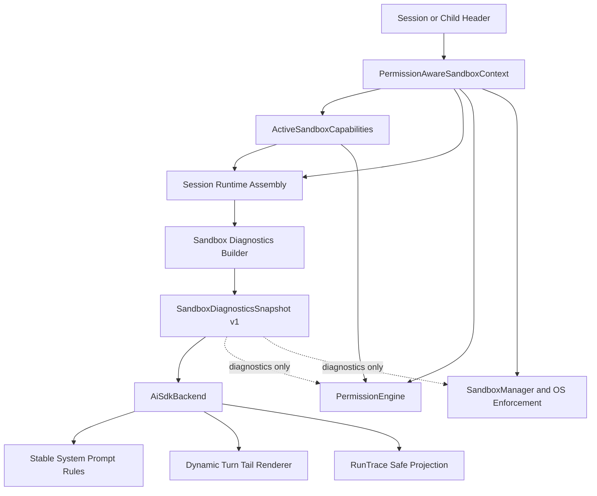

# Agent Runtime Sandbox Phase 9 Implementation Plan

本文档把 `agent-runtime-codex-sandbox-todo.md` 中已经确认的 Phase 9 设计拆成可执行、可测试、可独立审查的实现步骤。

状态：已完成实现与分层验证。

实现基线：`feat/runtime-permission-profile-sandbox` 分支已完成 Phase 1-8。command、background Bash、filesystem worker、desktop/CLI/child/headless 默认接线和 capability gate 已落地；Phase 9 只增加模型上下文与 diagnostics，不改变现有授权和 OS enforcement 语义。

关联文档：

- `docs/sandbox/agent-runtime-codex-sandbox-todo.md`
- `docs/sandbox/agent-runtime-codex-sandbox-status.md`
- `docs/sandbox/agent-runtime-codex-sandbox-phase-7-8-plan.md`

## 实现结果

- 已实现 `SandboxDiagnosticsSnapshot` v1、严格 builder validation 和无路径 RunTrace projection。
- `AiSdkBackend` 必须接收 Snapshot；稳定权限原则进入 System Prompt，动态状态进入每个 Turn 的 `<sandbox_context>` Turn Tail。
- RunTrace 已增加 `sandbox_context_resolved`，顺序固定为 `turn_started -> sandbox_context_resolved -> model_resolved`。
- sandbox tool failure 通过受限字段和枚举校验附加到现有 `tool_failed`，不会写入路径、argv、env 或原始异常。
- desktop、CLI、child 和 headless 已从各自 runtime assembly 构造 Snapshot；child 使用自己的 header，headless 使用 explicit external。
- 未增加大型 UI、renderer IPC、telemetry schema、unsandboxed retry 或 host fallback。

验证结果：runtime、core、CLI 和 headless 全量测试通过，desktop 新增 assembly contract 通过，repo typecheck 与 runtime build 通过。desktop 全量测试在当前外层沙箱中因本地监听和文件 watcher 返回 `EPERM` 而无法完成；需在允许本地端口和 watcher 的环境中补跑。

## 范围

本计划实现：

- runtime-owned `SandboxDiagnosticsSnapshot`。
- stable System Prompt sandbox authority rules。
- per-turn sandbox Turn Tail context。
- RunTrace sandbox context event。
- `tool_failed` sandbox error metadata。
- desktop、CLI、child 和 headless Snapshot assembly。
- 数据最小化、fail-closed 和分层测试。

本计划不实现：

- 新的 sandbox 设置页、权限中心或大型状态 UI。
- renderer IPC 暴露完整 RunTrace 或完整 Snapshot。
- telemetry sandbox schema。
- Linux sandbox backend。
- Windows sandbox。
- unsandboxed retry。
- managed network proxy。
- worktree / diff / write-back。

## 目标架构



虚线表示禁止作为授权输入：Snapshot 可以描述执行层状态，但不能控制 policy 或 sandbox execution。

## 固定原则

- Snapshot 是 runtime-owned、只读、版本化的诊断投影。
- Snapshot 与工具使用的 context/capabilities 必须来自同一次 session assembly。
- command 和 filesystem capability 独立表达。
- System Prompt 只包含稳定原则；动态状态只进入当前 Turn Tail。
- 每个 Turn 记录一条自包含的 `sandbox_context_resolved`。
- RunTrace 不记录 workspace path；telemetry 第一版完全不消费 Snapshot。
- 不记录 argv、env、credential、文件内容、原始 policy text 或原始 Error。
- Snapshot 缺失不能静默省略；执行层不能反向依赖 Snapshot。
- child 构建自己的 Snapshot；headless/isolated 使用 explicit external。
- 本阶段不修改现有权限 mode selector 和主要 UI。

## Snapshot v1 契约

建议在 `packages/runtime/src/sandbox/diagnostics.ts` 中定义：

```ts
interface SandboxDiagnosticsSnapshot {
  readonly schemaVersion: 1;
  readonly profile: {
    readonly name: string;
    readonly type: 'managed' | 'disabled' | 'external';
    readonly fileSystem: SandboxDiagnosticFileSystemMode;
    readonly network: 'restricted' | 'enabled' | 'unmanaged';
    readonly cwd: string;
    readonly workspaceRoots: readonly string[];
    readonly protectedMetadata: readonly string[];
  };
  readonly capabilities: {
    readonly command: SandboxDiagnosticCapability;
    readonly filesystem: SandboxDiagnosticCapability;
  };
}

interface SandboxDiagnosticCapability {
  readonly status: 'available' | 'not_required' | 'external' | 'unavailable';
  readonly backend: 'macos-seatbelt' | 'linux' | 'none';
  readonly reason?: SandboxCapabilityUnavailableReason;
}
```

实现时可以根据现有 profile 类型补齐 `disabled` 或 custom restricted 的诊断枚举，但不得用名称猜测扩大权限。无法安全归类的 managed restricted profile 应使用保守、明确的 restricted/custom 表达，而不是显示为 workspace-write。

builder 输入固定为：

```ts
interface BuildSandboxDiagnosticsSnapshotInput {
  context: PermissionAwareSandboxContext;
  capabilities: ActiveSandboxCapabilities;
}
```

builder 必须验证：

- `context.profile` 与 `capabilities.profileName` 一致。
- cwd 和 roots 已是 canonical absolute paths。
- cwd 位于允许的 session roots 语义内。
- roots 去重且 cwd 保持第一项。
- capability status、sandbox type 和 reason 组合合法。

Snapshot 不复制 `ActiveSandboxCapability.message`。

## Commit 1: Snapshot Model、Builder 与 Safe Projection

Commit：`feat(runtime): add sandbox diagnostics snapshot`

主要修改：

- 新增 `packages/runtime/src/sandbox/diagnostics.ts`。
- 定义 Snapshot v1、capability 和 filesystem summary 类型。
- 实现 `buildSandboxDiagnosticsSnapshot()`。
- 实现 profile/network/protected metadata 的确定性摘要。
- 实现 canonical roots 去重和一致性 validation。
- 实现不含路径的 `toSandboxRunTraceProjection()`。
- 从 runtime sandbox barrel 和 `packages/runtime/src/index.ts` 导出公开类型/helper。

验证：

- read-only、workspace-write、danger-full-access、disabled 和 external。
- command/filesystem 独立状态组合。
- profile/capability mismatch、非绝对路径和非法状态 fail closed。
- safe projection 不包含 cwd、roots、message、argv 或 env。

## Commit 2: Stable System Rules 与 Turn Tail Renderer

Commit：`feat(runtime): describe active sandbox context to the model`

主要修改：

- 新增稳定的 sandbox authority prompt fragment。
- 长期规则声明 runtime 权限权威、禁止指令覆盖、禁止绕过和 unsandboxed retry。
- 新增 `renderSandboxTurnTailPrompt(snapshot)`。
- renderer 输出固定 `<sandbox_context>` 文本块。
- 始终显示 canonical cwd；roots 只有 cwd 时不重复；额外 roots 做去重、数量/长度限制和单行清理。
- 分别显示 command/filesystem status、backend 和稳定 reason code。
- `AiSdkBackendInput` 增加必需的 `sandboxDiagnosticsSnapshot`。
- backend 将稳定 fragment 加入 durable system prompt，将动态 fragment 加入每个 Turn Tail。
- renderer 失败时不启动 provider request。

验证：

- system prefix 不随 profile、cwd 或 backend 变化。
- Turn Tail 随 Snapshot 变化并保持确定性格式。
- unavailable、not_required、external 和 none backend 文案明确。
- user message 中伪造 `<sandbox_context>` 不改变执行层 context 或 capabilities。
- 输出不包含内部 message、env、argv、credential 或原始异常。

## Commit 3: RunTrace Sandbox Context 与 Error Metadata

Commit：`feat(runtime): trace sandbox context and failures`

主要修改：

- `RunTracePhase` 增加 `sandbox`。
- `RunTraceEventType` 增加 `sandbox_context_resolved`。
- `RunTrace` 增加接收 safe projection 的明确方法。
- 每个 Turn 在 `turn_started` 后、`model_resolved` 前记录一次 Snapshot。
- `unavailable` 作为成功解析的诊断状态记录，不创建 context failure event。
- 在现有 `tool_failed` data 中附加 `serializeSandboxError(error)` 结果。
- 保留 RunTrace recorder failure isolation，不让 trace 写入失败影响模型或工具执行。

允许记录的 sandbox error 字段：

- `domain`
- `stage`
- `reason`
- `backend`
- `recoverable`
- `profileName`
- `requestId`

禁止记录：

- command string 或 argv。
- cwd、workspace roots 或目标文件路径。
- env、credential、文件内容和 edit payload。
- raw stack、raw policy 或未经筛选的 error message。

验证：

- 事件顺序为 `turn_started -> sandbox_context_resolved -> model_resolved`。
- 每个 Turn 都有且只有一条 context event。
- `tool_failed` 对 sandbox error 增加 metadata，对普通 error 不增加伪造字段。
- recorder throw/reject 不阻断 Turn。

## Commit 4: Desktop 与 CLI Session Assembly

Commit：`feat(runtime): wire sandbox diagnostics into local sessions`

主要修改：

- 收束本地 session assembly 返回 `tools + sandboxCapabilities + sandboxDiagnosticsSnapshot`。
- desktop 在 canonical cwd、permission-aware context 和 probe 完成后构建 Snapshot。
- CLI 使用相同 runtime builder 和 renderer，不复制 profile 解释逻辑。
- backend construction 必须显式传入 Snapshot，不保留 undefined legacy path。
- permission mode、cwd、workspace roots 或 backend 变化时通过现有 backend/session rebuild 路径重新 assembly。
- 普通 Turn 读取当前 backend Snapshot，不重复 capability probe。

验证：

- desktop/CLI ask、execute、explore、bypass contract。
- capability unavailable 时仍创建明确 unavailable Snapshot，但 policy gate 保持 block。
- 缺少 context、capabilities 或 Snapshot 时 backend 不可构造。
- system/turn-tail assembly 在 desktop 和 CLI 中语义一致。

## Commit 5: Child 与 External Runtime Assembly

Commit：`feat(runtime): scope sandbox diagnostics to each agent runtime`

主要修改：

- child backend 使用 child 自己的 permission mode、canonical cwd、roots 和 capabilities 构建 Snapshot。
- 禁止从 parent 复制或继承已经生成的 Snapshot。
- headless/isolated backend 生成 explicit external Snapshot。
- external capability 保持 `status: external`，不伪装成经过 Maka probe 的 available。
- 确保 parent profile 比 child 宽时，child model context 仍显示 child 实际权限。

验证：

- execute parent + explore child 显示 read-only child Snapshot。
- bypass parent + execute child 不显示 danger-full-access。
- child cwd/roots 不能通过 diagnostics 扩大。
- headless command/filesystem 均显示 external，不调用本地 Seatbelt probe。

## Commit 6: Phase 9 Contract Coverage 与文档收口

Commit：`test(runtime): cover sandbox diagnostics contracts`

主要修改：

- 补齐 builder、renderer、AiSdkBackend、RunTrace 和 assembly 的边界测试。
- 增加路径去重、数量上限、长度上限、CR/LF/tab 清理测试。
- 增加敏感字段 absence assertions。
- 增加 Snapshot required/fail-closed contract。
- 更新 todo 勾选、status 文档和本计划状态。

验证：

- core/runtime/CLI/desktop/headless 定向测试。
- runtime、CLI、desktop、headless 完整测试。
- typecheck/build。
- 本阶段不重复 Phase 8 的完整 macOS Seatbelt smoke matrix；执行层 smoke 在最终 macOS sandbox 验证中统一运行。

## 实施顺序与提交纪律

按 Commit 1-6 顺序实施。每个 commit：

- 只包含一个可说明的行为边界。
- 同时提交对应测试，不把所有测试留到最后。
- 不修改无关 UI、telemetry 或 Linux backend。
- 不提交当前工作区已有的无关删除或未跟踪文档。
- 通过定向验证后再进入下一 commit。

## 最终验收

Phase 9 完成时应满足：

1. 模型每个 Turn 都能看到当前真实 profile、cwd/root 语义和 command/filesystem capability。
2. System Prompt 中的长期安全原则稳定，不因 session 动态状态改变 prefix。
3. RunTrace 能区分执行前 sandbox context 与某次工具执行失败。
4. Snapshot、Turn Tail、RunTrace 和工具执行使用同一次 assembly 的状态，但 Snapshot 不参与授权。
5. desktop、CLI、child 和 headless 均没有 missing/legacy diagnostics path。
6. 不新增大型 UI，不泄露敏感执行细节，不引入 unsandboxed retry 或 host fallback。
