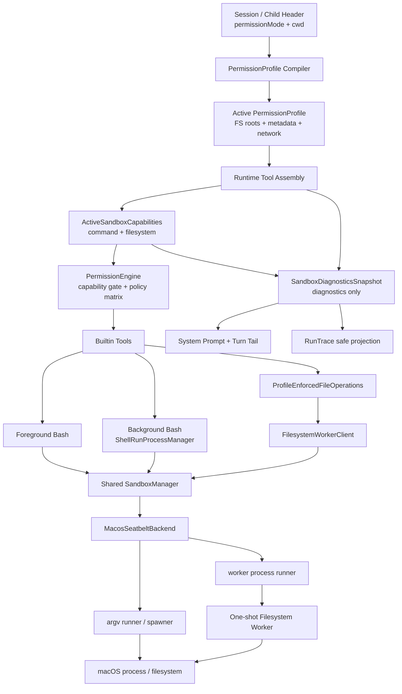

# Agent Runtime Codex-Style Sandbox 当前状态

更新时间：2026-07-12

本文档记录 Maka 当前 macOS sandbox 主线的实际实现状态。详细设计与后续阶段见：

- `docs/sandbox/agent-runtime-codex-sandbox-alignment.md`
- `docs/sandbox/agent-runtime-codex-sandbox-todo.md`
- `docs/sandbox/agent-runtime-codex-sandbox-phase-7-8-plan.md`

当前分支：`feat/runtime-permission-profile-sandbox`

## 当前结论

Phase 1-9 已完成。macOS 本地 managed runtime 已具备以下完整链路：

- `permissionMode` 编译为平台无关的 `PermissionProfile`。
- `PermissionEngine` 在原有 mode x category policy 前检查 sandbox capability。
- foreground Bash 和 background Bash 都通过同一 `SandboxManager` 进入 macOS Seatbelt。
- Read / Write / Edit / Glob / Grep 的真实文件系统操作在 one-shot sandboxed worker 内执行。
- desktop、CLI 和 child agent 使用 active session/child profile 构造默认工具。
- headless/isolated runtime 显式使用 `PermissionProfile.External`，不重复叠加本地 Seatbelt。
- sandbox context、capability、transform、launch 或 worker protocol 失败时 fail closed，不回退 host execution。
- 模型每个 Turn 都收到当前 active profile、workspace 与 capability 的动态 sandbox context。
- RunTrace 记录不含路径的 sandbox context，并为真实工具失败附加安全错误元数据。

这表示 macOS 的“权限管理 + OS sandbox 兜底 + runtime/model diagnostics”主链路已经完成。它不表示 Codex sandbox 的全部能力都已复刻；Linux backend、managed network proxy 和 unsandboxed retry 仍未实现。

当前路线不包含：

- worktree 或 workspace copy lifecycle。
- diff/write-back。
- apply patch UI。
- Windows sandbox。

`workspace-write` 仍表示直接写真实 workspace，由 PermissionProfile、业务层检查和 OS sandbox 共同限制访问边界。

## 已实现模块

### 1. 权限模型与编译

core 已实现：

- `PermissionProfile.Managed`、`Disabled`、`External`。
- read-only、workspace-write、danger-full-access 标准 profile。
- filesystem restricted/unrestricted/external_sandbox。
- network restricted/enabled。
- workspace roots、tmp roots 和 protected metadata 规则。
- 纯字符串 matcher，不在 core 内做 realpath 或文件系统 I/O。
- `explore -> read-only`。
- `ask/execute -> workspace-write`。
- `bypass -> danger-full-access`。

`ask` 与 `execute` 的差异仍由 approval policy 表达，不复制成两份 filesystem profile。

### 2. SandboxManager 与 macOS Seatbelt

runtime 已实现：

- `SandboxManager.shouldSandbox()`、`selectInitial()`、`transform()`。
- `none`、`macos-seatbelt`、预留 `linux` sandbox type。
- unsupported platform 和 backend unavailable 的 fail-closed 结果。
- `MacosSeatbeltBackend` 与 Maka-owned SBPL policy。
- workspace readable/writable roots、tmp roots、protected metadata deny-write。
- network restricted/enabled。
- worker runtime、bundle、Electron framework 和 rg 的只读/执行 roots。
- `/usr/bin/sandbox-exec` wrapper argv。

Linux 目前仍返回未实现；Windows 在需要 managed sandbox 时返回 unsupported。

### 3. Command execution

foreground Bash：

- 用户 command 先变成 `/bin/sh -lc <command>`。
- `SandboxManager` 生成最终 wrapper argv。
- `runProcessWithBoundedTail()` 使用 `spawn(program, args, { shell: false })` 执行。
- 保留 cwd、env、streaming、timeout、abort、bounded tail 和 process group termination。

background Bash：

- `ShellRunProcessManager` 使用必需的异步 session sandbox context provider。
- provider 根据 session id 读取当前 mode 和 canonical cwd。
- context/roots/transform/argv 校验通过后才分配 id、spawn 和写 durable record。
- 保留 yield、background ref、Read(ref)、StopBackgroundTask、输出 tail、timeout 和 abort。
- permission mode 切换前先终止该 session 的 background runs；终止失败则不更新 mode。

foreground、background 和 filesystem worker 共用 process-level `SandboxManager`。

### 4. Filesystem worker

Read / Write / Edit / Glob / Grep 已不再由默认本地主进程直接执行真实 filesystem operation。

已实现：

- version 1 结构化 request/response protocol。
- one-shot worker，一次进程处理一个完整 operation。
- Edit 的 resolve/read/match/write 在同一 worker invocation 内完成。
- realpath containment、symlink escape 防护和 protected metadata 保护。
- 主进程 profile precheck + worker 内 OS sandbox 双层保护。
- 主进程 file write lock 和共享 Edit matcher。
- 16 MiB request、8 MiB response、1 MiB stderr tail、120 秒 hard timeout。
- abort、process group termination、protocol/id/kind 校验。
- 最小环境变量，不继承 host secrets、proxy、`NODE_OPTIONS` 或 `RIPGREP_CONFIG_PATH`。
- runtime 单文件 worker bundle。
- CLI Node launch 与 desktop Electron run-as-node launch。
- canonical rg argv execution；rg 缺失只影响 Grep。

默认 permission-aware assembly 缺少 worker 时直接失败，不创建 host filesystem fallback。

### 5. Runtime assembly 与 child/headless

desktop 与 CLI：

- 按 session header 的 mode 和 canonical cwd 构造 permission-aware builtin tools。
- mode/cwd/backend 重建时重新生成 profile 和 capability snapshot。
- command、background shell 和 filesystem worker 复用相同 sandbox manager。

child agent：

- 使用 async child tool factory，不复用 parent 的静态本地工具实例。
- 使用实际 child header 的 permission mode 编译 profile。
- child cwd/workspace roots 继承 parent，不能扩大。
- 更高权限 parent 不会让低权限 child 继承 bypass。

headless/isolated：

- Bash 与五个文件工具声明 external sandbox requirement。
- 映射为 `PermissionProfile.External`。
- 缺少 explicit external profile 或 isolated tool executor 时拒绝启动。
- 不调用本地 Seatbelt。

### 6. Sandbox-aware PermissionEngine

core 定义：

- tool requirement：`none`、`command`、`filesystem`、`external`。
- capability status：`available`、`not_required`、`external`、`unavailable`。
- 最小 `PreToolUseSandboxContext`。

runtime 定义并探测 `ActiveSandboxCapabilities`：

- command 与 filesystem 独立报告状态。
- 检查 backend transform、wrapper executable、worker bundle/runtime 和 launch spec。
- backend 仅注册但 probe 失败时不会报告 available。
- tool requirement 不满足时在普通 approval prompt 前直接 block。
- Read/Glob/Grep 即使不需要用户审批，也必须通过 filesystem capability gate。
- capability gate 通过后继续使用原有 mode x category matrix。
- destructive、git destructive 和 privileged 的既有 prompt 语义保持不变。
- bypass 通过 danger-full-access profile 显式得到 `not_required`，不是通过缺少 context 绕过。

capability snapshot 只是 policy hint。真实执行仍会重新 transform、读取 launch spec、spawn 和校验 worker response；snapshot 过期不会导致 host fallback。

### 7. Runtime/model diagnostics

runtime 已实现：

- 版本化、只读且不参与授权的 `SandboxDiagnosticsSnapshot`。
- command 与 filesystem capability 的独立状态、backend 和稳定 reason code。
- 稳定 System Prompt 权限原则与每 Turn 动态 `<sandbox_context>`。
- canonical cwd、额外 workspace roots、filesystem/network policy 和 protected metadata 的有界展示。
- `sandbox_context_resolved` RunTrace event，以及不含 cwd/roots 的安全 projection。
- `tool_failed` 中经过枚举和长度校验的 sandbox error metadata。
- desktop、CLI、child 和 headless 各自 runtime assembly 的 Snapshot 接线。

Snapshot 只描述工具实际使用的 context/capabilities，不会反向控制 `PermissionEngine`、`SandboxManager`、executor 或 worker。第一版没有增加大型 UI、renderer IPC 或 telemetry schema。

## 当前主链路

用户选择权限模式后，Maka 会先形成明确的 filesystem/network profile。runtime 为当前 session 构造命令执行器、文件 worker、capability snapshot 和只读 diagnostics snapshot；工具调用先经过 capability gate 与现有审批矩阵，再进入对应执行边界。模型上下文和 RunTrace 消费 diagnostics snapshot，但授权与执行不依赖它。

命令路径：

1. foreground 或 background Bash 收到用户 command。
2. runtime 获取当前 session 的 canonical cwd、workspace roots 和 active profile。
3. command 被包装为 `/bin/sh -lc` argv。
4. `SandboxManager` 选择 macOS Seatbelt 并生成 `sandbox-exec` argv。
5. argv runner/spawner 以 `shell: false` 启动进程。

文件路径：

1. Read/Write/Edit/Glob/Grep 先经过主进程 profile precheck。
2. runtime 构造结构化 filesystem operation。
3. `FilesystemWorkerClient` 获取受信任 worker launch spec。
4. worker process 通过同一 `SandboxManager` 进入 Seatbelt。
5. 真实 filesystem operation 在 worker 中执行并返回结构化 response。

## 按 Codex 模块划分的完成度

| Codex 设计模块 | Maka 对应实现 | 状态 |
| --- | --- | --- |
| 用户权限入口 | `PermissionMode` 与 session header | 已完成基础版 |
| 规范权限模型 | `PermissionProfile` 与 matcher | 已完成基础版 |
| mode/profile 编译 | `compilePermissionProfile()` | 已完成基础版 |
| 审批策略 | `PermissionEngine` + mode x category matrix | 已有并接入 capability gate |
| sandbox capability | `ActiveSandboxCapabilities` | 已完成 macOS/local + external |
| sandbox 选择与 transform | `SandboxManager` | 已完成 macOS，Linux 预留 |
| macOS 平台后端 | `MacosSeatbeltBackend` | 已完成当前主线 |
| command spawn | argv runner + background argv spawner | 已完成 |
| 文件系统 helper | one-shot filesystem worker | 已完成 macOS 主线 |
| child runtime | async child tool factory | 已完成本地 managed 路径 |
| external runtime | `PermissionProfile.External` | 已完成基础语义 |
| 临时 additional permissions | 暂无 | 未实现 |
| unsandboxed retry | 暂无 | 未实现 |
| managed network proxy/allowlist | 暂无 | 未实现 |
| diagnostics/model context | `SandboxDiagnosticsSnapshot` + System Prompt/Turn Tail + RunTrace | 已完成基础版 |
| Linux backend | Phase 10 | 未实现 |
| Windows backend | 本轮无 | 不做 |

## 模块架构图

## 尚未实现

### Phase 10: Linux backend

- Linux capability detection。
- bubblewrap/seccomp helper 与 backend。
- Linux path mapping、contract tests 和 smoke tests。
- 复用现有 command argv、filesystem worker、PermissionEngine capability gate。

### 其他后续能力

- Codex-style unsandboxed retry 与明确 approval 编排。
- single-command additional permissions 与临时 profile 合并。
- managed network proxy、域名/方法策略和网络审批。
- 更完整的 remote/exec-server intent materialization。
- Windows sandbox 暂不规划。

## 验证摘要

Phase 7.6-9 已覆盖：

- runtime 全量测试。
- CLI 全量测试。
- desktop main 全量测试与静态检查。
- headless focused/full 测试。
- macOS Seatbelt command smoke，以及 background Bash argv transform/lifecycle tests。
- macOS Read/Write/Edit/Glob/Grep worker smoke。
- workspace 外写入、protected metadata、network restricted 和 symlink escape。
- timeout、abort、process tree termination、StopBackgroundTask 和 mode 切换。
- capability unavailable、external capability 和 snapshot 过期后的执行时 fail-closed。
- Snapshot builder、System Prompt/Turn Tail、RunTrace event ordering 和安全 error metadata。
- desktop、CLI、child 和 headless diagnostics assembly contract。

在 Codex 外层 sandbox 中直接运行嵌套 `sandbox-exec` 或本地监听测试会被外层环境拒绝。Phase 9 的 runtime、core、CLI 和 headless 全量测试、desktop 定向 assembly contract、repo typecheck 与 runtime build 已通过；desktop 全量测试仍需在允许本地端口和文件 watcher 的环境中补跑。

## 工作区说明

以下两个工作区脏项与本 sandbox 主线无关，本次没有暂存或修改：

- `docs/superpowers/plans/2026-06-24-runtime-ledger-backfill.md` 显示为删除。
- `docs/sandbox/agent-runtime-sandbox-executor.md` 显示为未跟踪文件。
